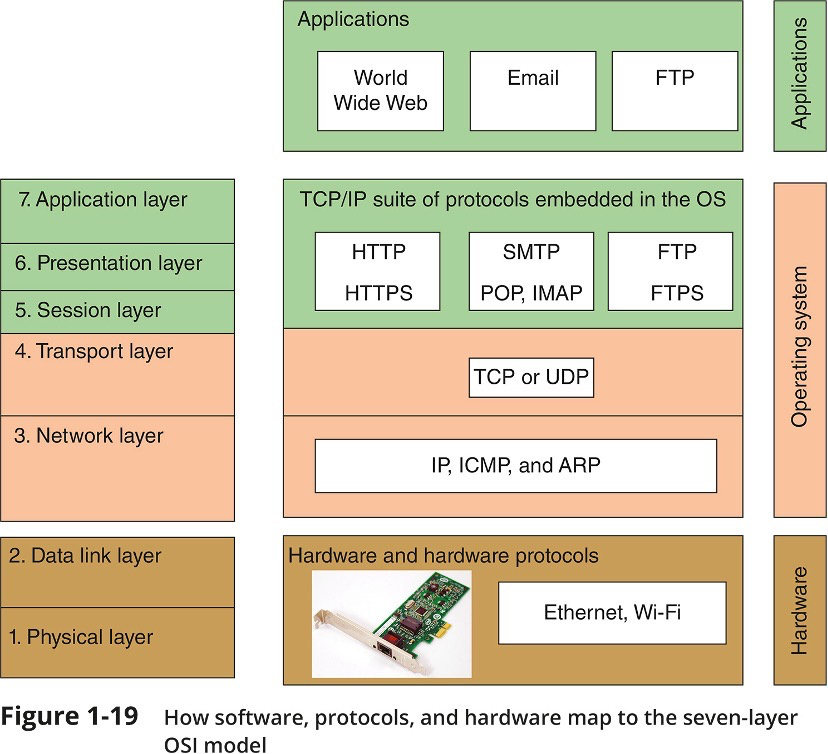

## 1. Switches make forwarding decisions based on:

A. MAC address  
B. IP address  
C. Random allocation  
D. Nothing; switches forward all frames on all ports

Answer: A. MAC address

## 2. Which of the following is a public IP address?

A. 10.110.15.1  
B. 172.24.50.240  
C. 192.168.10.38  
D. 128.14.42.70

Answer: D D. 128.14.42.70

- Class A, B, and C licensed IP addresses are available for use on the Internet
  - These are called public IP addresses
- The IANA recommends the following IP addresses be used for private networks:
  10.0.0.0 through 10.255.255.255
  172.16.0.0 through 172.31.255.255
  192.168.0.0 through 192.168.255.255

## 3. The process of adding a header to the data inherited from the layer above is called?

A. Segmenting  
B. Encapsulation  
C. Fragmenting  
D. Appending

Answer: B. Encapsulation

## 4. What physical network topology consist of all connected devices connecting to one central device, such as a switch?

A. Bus topology  
B. Ring topology  
C. Hub topology  
D. Star topology

Answer: D. Star topology

- Star topology: All devices connect to one central device (usually a switch)
- bus topology is a network setup where each computer and network device is connected to a single cable or backbone.
- Ring topology is a network configuration where device connections create a circular data path

## 5. Which of the following is not a broadcast address

A. 10.0.0.127/24  
B. 10.0.0.127/25  
C. 10.0.0.127/26  
D. 10.0.0.127/27

Answer: A. 10.0.0.127/24
The broadcast address is the last IP address in any subnet.
A. 10.0.0.127/24 adress subnet mask is 255.255.255.0) then the broadcast address for this subnet is 10.0.0.255
B. 10.0.0.127/25 subnet mask is 255.255.255.128, - the subnet IP for this subnet is 10.0.0.0 0000000, which is 10.0.0.0 - is the last IP address for this subnet is 10.0.0.01111111, which is 10.0.0.127, so the broadcast address is 10.0.0.127
C. 10.0.0.127/26 - subnet mast is 255.255.255.192 - the subnet address is 10.0.0.01 000000, that is 10.0.0.64 - the last IP address is 10.0.0.01 111111, this is 10.0.0.127
D. 10.0.0.127/27 - subnet mast is 255.255.255.224 - the first addess, that is the subnet address is 10.0.0.011 00000, which is 10.0.0.96 - the last IP address is 10.0.0.011 11111, this is 10.0.0.127

## 6. Analog signals are boosted by:

A. Switches  
B. Hubs  
C. Repeaters  
D. Amplifiers

Answer: D. Amplifiers
amplifier—Analog signals pass through an amplifier, an electronic device that increases the voltage, or strength, of the signals.

## 7. What is the name for the protocol data unit (PDU) of the data link layer

A. Packet  
B. Data  
C. Bit  
D. Frame

Answer: D. Frame

- The entire data link layer message is called a frame
- Figure: layers

    

- Packet: The entire network layer message is called a packet

## 8. Text that has been scrambled by an encryption algorithm is known as:

A. Ciphertext  
B. Cryptotext  
C. Secret text  
D. Private text

Answer: A. Ciphertext

- Encryption algorithms – scramble data into a format that cannot easily be interpreted if the signal is intercepted
- Ciphertext:
  - A key is a random string of characters woven into original data’s bits
    - It generates unique data block called **ciphertext**
    - The key is created according to a specific set of rules (algorithms)
  - Ciphertext is encrypted text transformed from plaintext using an encryption algorithm.
  - Ciphertext can't be read until it has been converted into plaintext (decrypted) with a key.
  - The decryption cipher is an algorithm that transforms the ciphertext back into plaintext.

## 9. Devices generally connect to a network via a port on their \***\*\_\_\_\*\*** (NIC)

A. Network intelligence card  
B. Network interconnection card  
C. Network and internet card  
D. Network interface card

Answer: D. Network interface card

## 10. Which of the following is a document that is sent as a request to vendors to submit a proposal for a product or service that your company wants to purchase?

A. Memorandum of understanding  
B. Statement of work  
C. Request for quote  
D. Request for proposal

Answer: D. Request for proposal
A request for proposal (RFP) is a document that solicits proposal, often made through a bidding process, by an agency or company interested in procurement of a commodity, service, or valuable asset, to potential suppliers to submit business proposals.[1] It is submitted early in the procurement cycle, either at the preliminary study, or procurement stage.

## 11. Which of the following is not one of the disadvantages of peer to peer networks?

A. They lack scalability  
B. They are not necessarily secure  
C. They are impractical for connecting large numbers of components  
D. They centralise user account logins

Answer: D. They centralise user account logins
Peer to Peer network Disavantages:

- Not scalable
- Not necessarily secure
- Not practical for large installations

## 12. The trailer of the ethernet frame:

A. Signals to the receiving node that the bytes following are the actual frame  
B. Provides the MAC address of the. Source and destination nodes  
C. Specifies the transport layer protocol carried in the frame  
D. Ensures that the data received by the destination exactly matches the data issued from the source

Answer: D. Ensures that the data received by the destination exactly matches the data issued from the source

- The data link layer puts control information in a data link layer header and at the end of the packet in a trailer
- Ethernet adds both a header and a trailer to the payload
  - This creates a frame around the payload
- The frame ends with a frame check sequence (FCS), which is a 32-bit cyclic redundancy check used to detect any in-transit corruption of data.

## 13. Which of the following method used by a switch results in the fewest errors?

A. Cut through  
B. Fragment free  
C. Store-and-forward  
D. Token based

Answer: C. Store-and-forward

- switching methodology
  - Cut-Through mode, which has two forms:
    - Fragment-free switching
    - Fast-forward switching
  - Store-and-Forward mode
- <a href="https://www.networkacademy.io/ccna/ethernet/store-and-forward-vs-cut-through-switching">Switching modes: Store-and-Forward vs Cut-Through</a>

## 14. In networking, a socket referee to a combination of **\_\_** and **\_**.

A. Domain name, IP address  
B. IP address, port number  
C. IP address, MAC address  
D. MAC address, port number

Answer: B. IP address, port number

- A socket consists of host’s IP address and the port number of an application running on the host
  - A colon separates the two values
  - Example - 10.43.3.87:23

## 15. What does a statement of work document do?

A. It documents in detail the work that must be completed for a particular object, and includes specifies such as task, deliverables, standards, payments schedule, and work timeline.  
B. It documents the intentions of two or more parties to enter into a binding agreement, or contract and is sometimes used between an informal handshake and the legally binding signatures on contracts  
C. It is a legally binding contract or part of a contract that defines in plain languages and in measurable terms, the aspects of a service provided to a customer, such as the service provided by ISP.  
D. It is a contract that defines the terms of future contracts between parties, such as payment terms or arbitration arrangements

Answer: A

## 16. What is the name of the GUI front end that is available for the Nmap utility?

A. GUINmap  
B. Zenmap  
C. IMap  
D. VizMap

Answer: B. Zenmap

- Network mapping - the process of discovering and identifying the devices on a network
  - Nmap – one of the most popular tools used for network mapping
  - Zenmap – Nmap’s GUI option

## 17. Which of the following is a routing protocol?

A. OSPF  
B. IPv4  
C. IPv6  
D. TCP

Answer: A. OSPF

## 18. How is traffic from multiple VLANs distinguished?

A. A VLAN identifier is sent in a seperate packet and frame  
B. A VLAN identifier is added to the packet  
C. A VLAN identifier is added to the frame  
D. A VLAN identifier is added to the application data

Answer: C. A VLAN identifier is added to the frame

## 19. Which method of transmission allows signals to travel in both directions over a medium but in only one direction at a time?

A. Full duplex  
B. Half duplex  
C. Simplex  
D. Semi duplex

Answer: B. Half duplex

- Full-duplex – Signals travel in both directions over a medium simultaneously
- Half-duplex – Signals may travel in both directions but only in one direction at a time
- Simplex – Signals may travel in only one direction and is sometimes called one-way or unidirectional, communication

## 20. A standard network switch operates at what layer of the OSI model?

A. Layer 1  
B. Layer 2  
C. Layer 3  
D. Layer 4

Answer: B. Layer 2

- A network switch is a physical device that operates at the Data Link layer of the Open Systems Interconnection (OSI) model -- Layer 2.
- It takes in packets sent by devices that are connected to its physical ports, and forwards them to the devices the packets are intended to reach.

## 21. What is the default subnet mask for a class B network?

A. 255.0.0.0  
B. 255.255.0.0  
C. 255.255.255.0  
D. 255.255.255.255

Answer: B

## 22. Which of the following is an EGP (Exterior Gateway Protocol)

A. BGP  
B. IS-IS  
C. RIP  
D. IPv6

Answer; A. BGP

## 23. According to the standard, each Ethernet frame will carry at most **\_\_**bytes of data.

A. 384  
B. 1500  
C. 65536  
D. 120000

Answer: B. 1500

- The data portion of an Ethernet frame may contain from 46 to 1500 bytes

## 24. An IPv6 address consists of how many bits?​

A. 32  
B. 48  
C. 96  
D. 128

Answer: D. 128

- IPv4 addresses have 32 bits and are written as four decimal numbers called octets
- IPv6 addresses have 128 bits and are written as eight blocks of hexadecimal number

## 25. What type of diagram is a graphical representation of a network's wire infrastructure?

A. Network diagram  
B. Wiring diagram  
C. Topology map  
D. System diagram

Answer: B. Wiring diagram

- Network diagrams are graphical representations of a network’s devices and connections
- A wiring diagram is a simple visual representation of the physical connections and physical layout of an electrical system or circuit.

## 26. There are **\_\_\_**different port numbers

A. 256  
B. 8192  
C. 65536  
D. About 4.3 billion

Answer: C. 65536

## 27. Which of these is not a main step in the network troubleshooting process?

A. Identify the problem  
B. Establish a theory of the probable cause  
C. Test the theory to determine cause  
D. Train staff in the use of software and equipment

Answer: . Train staff in the use of software and equipment

## 28. Which of the following statements about CSMA/CD is false?

A. Nodes listen to make sure that the wire is free before attempting to transmit.  
B. If a collision is detected, nodes stop transmitting and broadcast a jam signal  
C. Nodes wait a random back off time before attempting to resubmit  
D. Nodes with high priority may retransmit immediately

Answer: A. Nodes listen to make sure that the wire is free before attempting to transmit.

- Carrier Sense Multiple Access / Collision Detection
- CSMA/CD is used for controlling access to the shared medium

## 29. Layer 1 of the OSI model is known as the \_\_\_\_ layer.

A. Transmission  
B. Physical  
C. Transport  
D. Presentation

Answer: B. Physical

## 30. Which of the following types of networks is generally geographically largest?

A. WAN  
B. MAN  
C. LAN  
D. PAN

Answer: A. WAN

- A WAN (wide area network) is a group of LANs that spread over a wide geographical area
- A MAN (metropolitan area network) is a group of connected LANs in the same geographical area
  - Also known as a campus area network (CAN)
- MANs and WANs often use different transmission methods and media than LANs
- PAN (personal area network) is a much smaller network of personal devices
  - A network of personal devices such as your smartphone and your computer

## 31. What is the default subnet mask for A class A network?

A. 255.0.0.0  
B. 255.255.0.0  
C. 255.255.255.0  
D. 255.255.255.255

Answer: A. 255.0.0.0

## 32. At what layer of the OSI model do the IP, ICMP, and ARP protocols operate?

A. Application  
B. Session  
C. Transport  
D. Network

Answer: D. Network

- The principal protocol used by Network layer is IP (Internet Protocol)
- IP relies on several routing protocols to find the best route for a packet to take to reach destination
  - ICMP and ARP are examples
- Internet Protocol (IP) is the method or protocol by which data is sent from one computer to another on the internet.
- Internet Protocols are a set of rules that governs the communication and exchange of data over the internet.
  - Both the sender and receiver should follow the same protocols in order to communicate the data.
- ICMP: The Internet Control Message Protocol (ICMP) is a network layer protocol used by network devices to diagnose network communication issues.
- ARP: The Address Resolution Protocol (ARP) is a communication protocol used for discovering the link layer address, such as a MAC address, associated with a given internet layer address, typically an IPv4 address.

## 33. Hubs make forwarding decisions based on:

A. MAC address  
B. IP address  
C. Random allocation  
D. Nothing; hubs forward all frames on all ports

Answer: D. Nothing; hubs forward all frames on all ports

- Hubs broadcast incoming traffic on all ports, whereas bridges and switches only route traffic towards their addressed destinations.

## 34. ARP is used to associate \_**\_ and **\_\_\_\*\*\*\*

A. MAC addresses, IP addresses  
B. MAC addresses, port numbers  
C. IP addresses, port numbers  
D. Port numbers, domain names

Answer: A. MAC addresses, IP addresses

## 35. Which OSI layer is divided into LLC and MAC sub layers?

A. Data link  
B. Physical  
C. Network  
D. Transport

Answer: A. Data link

- Data link layer – Two Sub-layers
  - Logical link Control (LLC) : (IEEE 802.2)
    - The Logical Link Control (LLC) sublayer remains relatively independent of the physical equipment
    - Provides an interface between the MAC layer and the Network layer independent of the hardware
  - Media Access Control (MAC): (part of IEEE 802.3)
    - The MAC sub-layer is concerned with the physical components that will be used to communicate the information
    - Which computer can access the network when multiple computers are trying to access it simultaneously
    - Physical addressing (MAC addresses) and access control methods.

## 36. Tone generators are used to determine:

A. Cable characteristics  
B. Where the wired pair terminates  
C. Level of noise  
D. Attenuation

Answer: B. Where the wired pair terminates

## 37. Which of the following is a valid class C IP address for a host?

A. 193.255.101.18  
B. 200.258.243.201  
C. 215.12.63.0  
D. 225.192.159.23

Answer：A. 193.255.101.18

- a host address is the IP address of the machine
- Class A address range - first byte: 0 - 127
- Class B address range - first byte: 128 - 191
- Class C address range - first byte: 192 - 223
  B. 200.258.243.201 258 exceeds 255, this is invalid IP address
  D. 225.192.159.23 225 not in class C address range
  C. 215.12.63.0, this is class C address. .0 means not for host.

## 38. Which of the following options is not a likely source of electromagnetic interference?

A. Power lines  
B. Motors  
C. Fibre optic cables  
D. Microwaves

Answer: C. Fibre optic cables

## 39. Which of the following is not performed by TCP?

A. Three way handshake  
B. Sequencing  
C. Acknowledgements  
D. Packet fragmentation

Answer: D. Packet fragmentation
Fragmenting the packets allows the stream of data to be broken into smaller packets that can be sent simultaneously over multiple ports to the destination.

## 40. Which tool could you use to identify the path that a packet takes between routers?

A. Tracet  
B. Net stat  
C. Ping  
D. Ipconfig

- Traceroute is a tool to trace the path of an IP packet as it traverses routers locally or globally.
- The ping utility sends out a signal called an echo request to another device (request for a response)
- The ipconfig command shows current TCP/IP addressing and domain name information on a Windows computer

## 41. Which cloud computing category would you choose if you only needed to access to hardware and network services, but were planning to install your own OS and application?

A. IaaS  
B. PaaS  
C. SaaS  
D. TaaS

Answer: A. IaaS

- IaaS: Infrastructure as a service (IaaS) is a type of cloud computing service that offers essential compute, storage, and networking resources on demand
- PaaS: Platform as a service (PaaS) or application platform as a service (aPaaS) or platform-based service is a category of cloud computing services
- SaaS: Software as a service (SaaS /sæs/) is a software licensing and delivery model in which software is licensed on a subscription basis and is centrally hosted.

## 42. A change coordinator functions as what type of manager?

A. Project manager  
B. Inventory manager  
C. Human Resources manager  
Time manager

Answer: A. Project manager

## 43. **\_\_**refers to the loss of signal's strength as it travels away from the source.

A. Attenuation  
B. Latency  
C. Jitter  
D. Noise

Answer: A. Attenuation

- Attenuation is the loss of a signal’s strength as it travels away from source
- Latency is the delay between signal transmission and receipt
  - Latency may cause network transmission errors
- Noise is any undesirable influence degrading or distorting signal
  - Noise is measured in dB (decibels)

## 44. What range of ports is referred to as the "well-known" range of ports?

A. 0-1023  
B. 512-1023  
C. 1024-49151  
D. 49152-65535

Answer: A. 0-1023

- Port numbers are divided into three types:
  - Well-known ports - 0 to 1023
  - Registered ports - 1024 to 49151
  - Dynamic and private ports - 49152 to 65535

## 45. Which class of IP addresses is used for multicasting?

A. Class C  
B. Class D  
C. Class E  
D. Class M

Answer: B. Class D

- A multicast address is a specific type of IP address labeling a network location that is used to multicast data packets within a network.
- The traditional system involved class A, B, C and D IP addresses. Class D was intended to accommodate multicast address allocation.
- The IP address that defines a multicast group is a Class D address (224.0. 0.0 to 239.255. 255.255).

## 46. Routers make forward decisions based on:

A. MAC address  
B. IP address  
C. Random allocation  
D. Nothing; routers forward all frames on all ports

Answer: B. IP address

- Routers can access IP packets carried to them in frames, so they can make forwarding decisions based on the IP destination address they find

## 47. Which layer of the OSI model is responsible for defining the format of logical addresses?

A. Data link  
B. Network  
C. Transport  
D. Application

Answer: B. Network

- The network layer implements logical addressing for data packets to distinguish between the source and destination networks

## 48. Frame relay is a **\_\_** layer protocol, generally used for \_\_\_\_.

A. Data link, WANs  
B. Data link, LANs  
C. Physical, WANs  
D. Physical, LANs

Answer: A. Data link, WANs

- Frame Relay is a standardized wide area network (WAN) technology that specifies the physical and data link layers of digital telecommunications channels using a packet switching methodology.

## 49. In the fibre optic terminology, MMF stand for?

A. Mixed-mode fibre  
B. Multi-mode fibre  
C. Maximum-mode fibre  
D. Minimum-mode fibre

Answer: B. Multi-mode fibre

- ulti-mode optical fiber is a type of optical fiber mostly used for communication over short distances, such as within a building or on a campus.

## 50. What type of documentation tool is a website that can be edited by users, allowing them to add files and photos and links between pages?

A. Wiki  
B. Spreadsheet  
C. Workgroup  
D. Co-op

Answer: A. Wiki

## 51. A loop back IP address begins with what number?

A. 254  
B. 127  
C. 169  
D. 192

Answer:

- The IP address 127.0. 0.1 is called a loopback address. Packets sent to this address never reach the network but are looped through the network interface card only. This can be used for diagnostic purposes to verify that the internal path through the TCP/IP protocols is working.

## 52. The preamble of the Ethernet frame:

A. Signals to the receiving node that the bytes following are the actual frame  
B. Provides the MAC address of the source and destination nodes  
C. Specifies the transport layer protocol carried in the frame  
D. Ensures that the data the destination exactly matches the data issued from the source.

Answer: A. Signals to the receiving node that the bytes following are the actual frame

## 53. In the fibre optic terminology, SMF stand for?

A. Single-mode fibre  
B. Short-mode fibre  
C. Semi-mode fibre  
D. Simple-mode fibre

Answer: A. Single-mode fibre

## 54. Which method of transmission allows signals to travel in both directions over a medium simultaneously?

A. Half duplex  
B. Total duplex  
C. Full duplex  
D. Multiplex

Answer: C. Full duplex

## 55. DNS exists at the **\_** layer

A. Network  
B. Transport  
C. Presentation  
D. Application

Answer: D. Application

- A few examples of application layer protocols are
  - Hypertext Transfer Protocol (HTTP),
  - File Transfer Protocol (FTP),
  - Post Office Protocol (POP),
  - Simple Mail Transfer Protocol (SMTP), and
  - Domain Name System (DNS).

## 56. Select the layer of the OSI model that is responsible for reformatting, compressing, and/or encrypting data in a way that the application on the receiving end can read:​

A. Application  
B. Presentation  
C. Session  
D. Transport

Answer： B. Presentation  
The presentation layer is responsible for reformatting, compressing, and/or encrypting data in a way that the receiving application can read

## 57. A port that can carry traffic for multiple VLANs is known as a(n) \_ port

A. Access  
B. Trunk  
C. Multi  
D. Traffic

Answer： B. Trunk

- Each port on a switch that supports VLANs is configured as one of two types of VLAN ports:
  - Access port – connects the switch to a host
  - Trunk port – connects the switch to a networking device such as a router or another switch and manages traffic from multiple VLANs

## 58. \_\_ is the process of a wireless device gaining Internet access through an AP (access point)

A. Association  
B. Synchronisation  
C. Connection  
D. Activation

Answer: A. Association

## 59. TCP and UDP are **\_\_\_** layer protocols

A. Transport  
B. Transmission  
C. Networks  
D. Application

Answer: A. Transport

## 60. **\_\_\_** is any undesirable influence degrading or distorting a signal

A. Attenuation  
B. Latency  
C. Jitter  
D. Noise

Answer: D. Noise

## 61. A type of topology where switch 1 connects to 4 workstations, and to switch 2. Switch 2 connects to 3 workstations and both switch 1 & 3. Switch 3 connects to 3 workstations and to switch 2.

A. Bus  
B. Star-bus  
C. Chain-bus  
D. Chain

Answer: A. Bus

## 62. Which of the following statements is true?

A. VLANs are logical broadcast domains  
B. VLANs are defined at the transport layer  
C. All switches support the creation of VLANs  
D. VLANs use access ports to exchange VLAN information

Answer: A. VLANs are logical broadcast domains

- A virtual local area network (VLAN) is any broadcast domain that is partitioned and isolated in a computer network at the data link layer (OSI layer 2).
- No, not all switches support VLAN tagging.
- Access ports – These switch ports belong to carry the traffic of only one VLAN.
- Trunk ports – These switch ports belong to and carry the traffic of more than one VLAN.

## 63. Application layer protocols fall into two categories: those that provide services to user; and those that provide utility services to \***\*\_\_\_\_\*\***

A. System  
B. Network  
C. Packet  
D. NIC

Answer: A. System

## 64. The number of usable host addresses on a /29 subnet is:

A. 2  
B. 4  
C. 6  
D. 8

Answer: C. 6

## 65. 220.33.219.11 is a **\_\_\_** address

A. Class A  
B. Class B  
C. Class C  
D. Class D

Answer: C. Class C

## 66. What command below can be used to display ​a complete summary of all network interfaces in a Windows computer?

A. Ipconfig/a  
B. Ipconfig/all  
C. Ipconfig/list  
D. Ipconfig/show

Answer: B. Ipconfig/all

## 67. What is the highest layer at which HTTP, FTP, and Telnet protocols operate?

A. Layer 5  
B. Layer 6  
C. Layer 7  
D. Layer 8

Answer: C. Layer 7

## 68. Where is a demarc located in relation to the structured cabling of an enterprise environment?

A. In the Main Distribution Frame (MDF)  
B. At the Intermediate Distribution Frame (IDF)  
C. In the work area  
D. Between the MDF and the IDF

Answer: A. In the Main Distribution Frame (MDF)

## 69. What component of the enterprise level structured cabling serves as the location where an incoming network interface enters a building and connects with the building's backbone cabling?

A. Network interface device  
B. Main distribution frame  
C. Intermediate distribution frame  
D. Entrance facility

Answer: D. Entrance facility

- **EF (entrance facility)** – location where the incoming network (such as Internet) connects with the school or corporate network
- Demarc (demarcation point)\*\* – the device that marks where a telecommunications service provider’s network ends and the organisation’s network begins

## 70. The subnet mask 255.255.255.128 is equivalent to \_\_\_\_\_\_\_\_\_\_\_\_\_\_\_\_\_ in CIDR notation

A. /24  
B. /25  
C. /26  
D. /27

Answer: B. /25

## 71. The WLAN architecture in which wireless nodes transmit directly to each other is referred to as an **\_\_\_** WLAN

A. Infrastructure  
B. Arbitrary  
C. Extensible  
D. Ad hoc

Answer: D. Ad hoc

- ad hoc topology – a small number of nodes closely positioned transmit directly to each other without an intervening connectivity device

## 72. What is the smallest subnet that will accomodate 40 host?

A. /24  
B. /25  
C. /26  
D. /27

Answer: C. /26

## 73. Routing protocols are used to:

A. Determine the best path through a network  
B. Determine the formatting of logical addresses  
C. Determining the formatting of packet headers  
D. Determine whether a router is functioning correctly

Answer: A. Determine the best path through a network

## 74. Wireless signals may be subject to reflection, which refers to signals:

A. Bouncing back to the source  
B. Splitting into secondary waves  
C. Diffusing in multiple different directions  
D. Being absorbed by obstacles

Answer: A. Bouncing back to the source

## 75. What is the maximum segment length for twisted pair cables?

A. 10m  
B. 30m  
C. 100m  
D. 300m

Answer: C. 100m

## 76. A topology that combines together various other topologies is known as a **\_\_\_** topology

A. Combination  
B. Multiplex  
C. Hybrid  
D. Complex

Answer: C. Hybrid

## 77. In IPv6 normally the first **\_\_\_** bits identify the network

A. 32  
B. 48  
C. 64  
D. 96

Answer: C. 64

## 78. What statement regarding main distribution frame or main distribution facilities is accurate?

A. The MDF and entrance facility are always in seperate rooms  
B. The MDF refers to the racks holding network equipment in an organisation  
C. The MDF provides intermediate connection between the IDF and end-user equipment on each floor  
D. The MDF is the centralised point of interconnection for an organisation's LAN or WAN

Answer: D. The MDF is the centralised point of interconnection for an organisation's LAN or WAN

- MDF (main distribution frame) – the centralised point of interconnection for an organisation’s LAN or WAN (also called MC or main cross connect)

## 79. What is the default subnet mask for a class C network

A. 255.0.0.0  
B. 255.255.0.0  
C. 255.255.255.0  
D. 255.255.255.255

Answer: C. 255.255.255.0

## 80. The header of an Ethernet frame

A. Signals to the receiving node that the bytes following are the actual frame  
B. Provides the MAC address of the source and destination nodes  
C. Specifies the transport layer protocol carried in the frame  
D. Ensures that the data the destination exactly matches the data issued from the source

Answer: B. Provides the MAC address of the source and destination nodes

## 81. What statement correctly identifies the purpose of a software patch

A. A software patch is a correction, improvement, or enhancement to software  
B. A software patch is a major change to a software package that enhances the functionality and features of the software while correcting bugs and vulnerabilities  
C. A software patch involves the process of reverting to a previous version of software after attempting to upgrade it  
D. A software patch is a container for new software, and must be installed on relevant devices and incorporated with network resources.

Answer: A. A software patch is a correction, improvement, or enhancement to software

## 82. In cloud computing terminology IaaS refers to

A. Infrastructure as a Service  
B. Internet as a service  
C. Integration as a Service  
D. Internationalisation as a Service

Answer: A. Infrastructure as a Service

## 83. Which of the following describes the broadcast address on IPv4 network

A. All host bits set to 1  
B. All host bits set to 0  
C. Final octet is always 255  
D. Router defined - can be anything

Answer: A. All host bits set to 1

- Host bits are the portion of an IP address that identify a specific host in a subnet.
- An IP address is 32 bits long and made up of two components,
  - a network portion and a host portion.
  - The network address is used to identify the network and is common to all the devices attached to the network.
  - The host (or node) address is used to identify a particular device attached to the network.
- Network Classes

  - Class A

    - The first octet denotes the network address,
    - and the last three octets are the host portion.
    - Any IP address whose first octet is between 1 and 126 is a Class A address.
    - Notice that 0 is reserved as a part of the default address,
    - and 127 is reserved for internal loopback testing.

  - Class B
    - The first two octets denote the network address,
    - and the last two octets are the host portion.
    - Any address whose first octet is in the range 128 to 191 is a Class B address.
  - Class C
    - The first three octets denote the network address,
    - and the last octet is the host portion.
    - The first octet range of 192 to 223 is a Class C address.
  - Class D
    - Used for multicast.
    - Multicast IP addresses have their first octets in the range 224 to 239.
  - Class E
    - Reserved for future use
    - and includes the range of addresses with a first octet from 240 to 255.

## 84. Which of these routing protocols is not used within an autonomous system

A. BGP  
B. IS-IS  
C. OSPF  
D. RIP

Answer: A. BGP

## 85. Which of the following is false

A. Bridging tables associate interfaces (ports) and MAC addresses  
B. Bridging tables are used by switches  
C. Bridging tables are used by hubs  
D. Bridging tables are initially empty and are created by learning from traffic on the network

Answer: C. Bridging tables are used by hubs

## 86. Ethernet exists at which layers of the OSI model?

a. Layer 1 & 2  
b. Layer 2 & 3  
c. Layer 3 & 4  
d. Layer 4 & 5

Answer: a. Layer 1 & 2

- How to remember all the names of the layers
  - Please | Physical Layer
  - Do | Data Link Layer
  - Not | Network Layer
  - Tell (the) | Transport Layer
  - Secret | Session Layer
  - Password (to) | Presentation Layer
  - Anyone | Application Layer

## 87. In IPv4, a subnet mask is used to determine **\_\_**.

a. the network portion of an IP address  
b. the host portion of an IP address  
c. the destination MAC address  
d. the source MAC address

Answer: a. the network portion of an IP address

## 88. IP is \***\*\_\_\*\*** and **\_\_\_\_**.

a. unreliable, connectionless  
b. reliable, connectionless  
c. unreliable, connection-oriented  
d. reliable, connection-oriented

answer: a. unreliable, connectionless

- IP is connectionless because it treats each packet of information independently. It is unreliable because it does not guarantee delivery

## 89. Which of the following is not a wireless technology used to connect PAN devices?

a. bluetooth  
b. infrared (IR)  
c. near-field communication (NFC)  
d. Wi-Max

Answer: d. Wi-Max

## 90. Ethernet uses **\_\_\_** transmission.

a. broadband  
b. baseband  
c. wideband  
d. narrowband

Answer: b. baseband

- Ethernet networks use baseband transmissions
- Baseband:
  - Baseband transmissions typically use digital signaling over a single wire;
  - the transmissions themselves take the form of either electrical pulses or light.
  - The digital signal used in baseband transmission occupies the entire bandwidth of the network media to transmit a single data signal.
  - Baseband communication is bidirectional, allowing computers to both send and receive data using a single cable.
  - However, the sending and receiving cannot occur on the same wire at the same time.
  - Using baseband transmissions, it is possible to transmit multiple signals on a single cable by using a process known as multiplexing.
- Broadband:
  - broadband uses analog signals in the form of optical or electromagnetic waves over multiple transmission frequencies.
  - For signals to be both sent and received, the transmission media must be split into two channels.
  - Alternatively, two cables can be used: one to send and one to receive transmissions.

# 91. What kind of document serves as a legally binding contract or part of a contract that defines, in plain language and in measurable terms, the aspects of a service provided to a customer?

a. statement of work  
b. memorandum of understanding  
c. service-level agreement  
d. master service agreement

Answer: c. service-level agreement

## 92. Which subnet mask below is equivalent to /24 in CIDR notation?

a. 255.0.0.0  
b. 255.255.0.0  
c. 255.255.255.0  
d. 255.255.255.24

Answer: c. 255.255.255.0

## 93. The 1000Base-T Ethernet standard specifies a maximum throughput of:

a. 1000 bps (kilobit)  
b. 1000 Kbps (megabit)  
c. 1000 Mbps (gigabit)  
d. 1000 Gbps (terabit)

Answer: c. 1000 Mbps (gigabit)

- 1,000 refers to the transmission speed of 1,000 Mbps
- while "base” refers to baseband signaling, which means that only Ethernet signals are being carried on this medium
- “T” refers to the twisted pair cables

- Throughput is the measure of how much data is actually transmitted during given time period

## 94. Which of the following is an advantage of fibre-optic cable over copper cable?

a. less expensive  
b. able to carry signals for longer distances  
c. easier to install  
d. can plug directly into most workstations

Answer: b. able to carry signals for longer distances

## 95. What are the last two parts of a host name known as?

a. top level domain  
b. fully qualified domain name (FQDN)  
c. domain name  
d. host qualifier

Answer: c. domain name

- The last two parts of a host name such as mycompany.com are called the domain name.

## 96. The major difference between IPv4 and IPv6 is that:

a. IPv6 is a Transport layer protocol  
b. IPv6 can carry more types of data than IPv4  
c. IPv6 has a much larger address space  
d. IPv6 uses domain names directly, rather than numeric addresses

Answer: c. IPv6 has a much larger address space

## 97. The TLD (top-level domain) in http://www.google.com is:

a. http  
b. www  
c. google  
d. com

Answer: d. com

## 98. The subnet mask 255.0.0.0 is equivalent to \_\_\_\_\_\_\_\_.

a. /8  
b. /16  
c. /24  
d. /255

Answer: a. /8

## 99. What utility is used to verify that TCP/IP installed, bound to the NIC, configured correctly, and communicating with the network?

a. arp  
b. ifconfig  
c. ping  
d. route

Answer: c. ping

## 100. Which of the following is the most widely used networking medium for modern Ethernet LANs?

a. twisted pair cable  
b. coaxial cable  
c. fibre-optics  
d. infrared

Answer: a. twisted pair cable

## 101. UDP is preferable to TCP for:

a. live video or audio  
b. email  
c. downloading files  
d. secure applications

Answer: a. live video or audio

## 102. What do the first 24 bits of a MAC address represent?

a. Organizationally Unique Identifier  
b. device ID  
c. extension ID  
d. network ID

Answer: a. Organizationally Unique Identifier

- Traditional MAC addresses contain two parts
  - The first 24 bits are known as the OUI (Organizationally Unique Identifier) or manufacturer-ID
    - This part is assigned by the IEEE
  - The last 24 bits make up the extension identifier or device ID
    - Manufacturer’s assign each NIC a unique device ID

## 103. A port number, which identifies an application on a host, exists at what level of the OSI model?

a. Application  
b. Transport  
c. Network  
d. Data lin

Answer: b. Transport

- Transport layer port numbers are used to find applications

# 104. \_\_\_\_ extend collision domains.

a. hubs and repeaters  
b. only repeaters  
c. only hubs  
d. hubs, repeaters, and switches

Answer: c. only hubs

- hubs do not segment a network, they just connect network segments.
- All the devices connected to a hub are in a single collision and single broadcast domain.
- A collision domain is, as the name implies, the part of a network where packet collisions can occur
- A collision occurs when two devices send a packet at the same time on the shared network segment.
- Collisions are often in a hub environment, because each port on a hub is in the same collision domain.
- By contrast, each port on a bridge, a switch or a router is in a separate collision domain.

## 105. The **\_\_\_** layer is responsible for breaking down application layer data and ensuring it crosses the network reliably.

a. Network  
b. Transport  
c. Data link  
d. Presentation

Answer: d. Presentation

## 106. Wireless signals may be subject to diffraction, which refers to signals:

a. bouncing back to the source
b. splitting into secondary waves
c. diffusing in multiple different directions
d. being absorbed by obstacles

Answer: b. splitting into secondary waves

## 107. Wireless signals may be subject to scattering, which refers to signals:

a. bouncing back to the source  
b. splitting into secondary waves  
c. diffusing in multiple different directions  
d. being absorbed by obstacles

Answer: c. diffusing in multiple different directions

## 108. The smallest network is a **\_\_\_**, which is a network of personal devices, such as the network you use when you sync your mobile phone and your computer.

a. PAN (Personal Area Network)  
b. LAN (Local Area Network)  
c. SAN (Small Area Network)  
d. MAN (Mobile Area Network)

Answer: a. PAN (Personal Area Network)

## 109 The segment is the protocol data unit (PDU) for:

a. TCP  
b. UDP  
c. Network layer
d. Data link layer

Answer: a. TCP

## 110. The data field in an Ethernet frame must be at least \_\_\_ bytes long.

a. 12  
b. 46  
c. 384  
d. 1500

Answer: b. 46

## 111. \_\_\_\_ extend broadcast domains.

a. hubs and repeaters  
b. only repeaters  
c. only hubs  
d. hubs, repeaters, and switches

Answer: d. hubs, repeaters, and switches

- A Broadcast domain is a type of Domain wherein traffic flows all over the network.
- Broadcast domain refers to a logical set of reachable computer systems without using a router.
- The broadcast domain mostly uses a switched environment to broadcast, so no collision occurs.
- Switches will never break in the broadcast domain.
- All ports on a switch or a hub likely to be in the same broadcast domain.
- all port on a router are in the distinct broadcast domains, and routers never broadcast from one Domain to another.

## 112. Which tool could you use to identify which application is using a particular port number?

a. netstat  
b. ipconfig  
c. ping  
d. tracert

Answer: netstat

- Netstat
  - Displays active TCP connections, ports on which the computer is listening, Ethernet statistics, the IP routing table, IPv4 statistics (for the IP, ICMP, TCP, and UDP protocols), and IPv6 statistics (for the IPv6, ICMPv6, TCP over IPv6, and UDP over IPv6 protocols).

## 113. The \_\_\_ layer describes how data between applications is synced and recovered if messages don't arrive intact at the receiving application.

a. Synchronization  
b. Application  
c. Session  
d. Data link

Answer: c. Session

- The session layer describes how data between applications is synched and recovered if messages don’t arrive intact at the receiving application

## 114. The protocol data unit (PDU) for the Network layer is the **\_**.

a. packet  
b. frame  
c. segment  
d. payload

Answer: a. packet

## 115. In Asymmetric Digital Subscriber Line (ADSL), "asymmetric" indicates that:

a. maximum downstream throughput differs from maximum upstream throughput  
b. downstream data link protocol differs from upstream data link protocol  
c. downstream physical connection differs from upstream physical connection  
d. nothing; it is purely a marketing term

Answer: a. maximum downstream throughput differs from maximum upstream throughput

## 116. Compare and contrast public key and private key encryption.

- Private Key:
  - In the Private key, the same key (secret key) is used for encryption and decryption. In this key is symmetric because the only key is copied or shared by another party to decrypt the cipher text. It is faster than public-key cryptography.
- In a Public key, two keys are used one key is used for encryption and another key is used for decryption. One key (public key) is used to encrypt the plain text to convert it into cipher text and another key (private key) is used by the receiver to decrypt the cipher text to read the message.

<table><thead><tr><th>S.NO</th><th>Private Key</th><th>Public Key</th></tr></thead><tbody><tr><th>1.</th><td>The private key is faster than the public key.</td><td>It is slower than a private key.</td></tr><tr><th>2.</th><td>In this, the same key (secret key) and algorithm are used to encrypt and decrypt the message.</td><td>In public-key cryptography, two keys are used, one key is used for encryption, and the other is used for decryption.</td></tr><tr><th>3.</th><td>In private key cryptography, the key is kept a secret.</td><td>In public-key cryptography, one of the two keys is kept a secret.</td></tr><tr><th>4.</th><td>The private key is <strong>Symmetrical</strong> because there is only one key that is called a secret key.</td><td>The public key is <strong>Asymmetrical</strong> because there are two types of keys: private and public keys.</td></tr><tr><th>5.</th><td>In this cryptography, the sender and receiver need to share the same key.</td><td>In this cryptography, the sender and receiver do not need to share the same key.</td></tr><tr><th>6.</th><td>In this cryptography, the key is private.</td><td>In this cryptography, the public key can be public and a private key is private.</td></tr><tr><th>7.</th><td>It is an efficient technology.</td><td>It is an inefficient technology.</td></tr><tr><th>8.</th><td>It is used for large amounts of text.</td><td>It is used for only short messages.</td></tr><tr><th>9.</th><td>There is the possibility of losing the key that renders the systems void.</td><td>There is less possibility of key loss, as the key is held publicly.</td></tr><tr><th>10.</th><td>The private key is to be shared between two parties.</td><td>The public key can be used by anyone.</td></tr><tr><th>11.</th><td>The Performance testing checks the reliability, scalability, and speed of the system.</td><td>The Load testing checks the sustainability of the system.</td></tr><tr><th>12.</th><td>The private key is used in algorithms such as AES 128, AES 192 and AES 256.</td><td>The public key is used in algorithms such as RSA, DSA, etc.</td></tr><tr><th>13.</th><td>The private key is kept secret.</td><td>The public key is widely distributed.</td></tr><tr><th>14.</th><td>It is used to protect disk drives and other data storage devices.</td><td>It is used to secure web sessions and emails.</td></tr><tr><th>15.</th><td>The recipient’s private key decrypts the message.</td><td>The recipient’s public key encrypts the message.</td></tr><tr><th>16.</th><td>If the private key is the locking key, then the system can be used to verify documents sent by the holder of the private key.</td><td>If the public key is the locking key, then it can be used to send private communication.</td></tr></tbody></table>

## 117. What are the roles of root servers and TLD servers in resolving DNS requests?

- The DNS Root Server extracts the Top Level Domain (TLD) from the user’s query. The root nameserver responds by directing the recursive resolver to a TLD nameserver, based on the extension of that domain (.com, .net, .org, etc.).
- A TLD nameserver maintains information for all the domain names that share a common domain extension, such as .com, .net, .org etc.
- If a web client was querying a resolver for facebook.com, after receiving a response from a root nameserver, the recursive resolver would then send a query to a .com TLD nameserver, which would respond by providing details about the authoritative nameserver for that domain.

## 118. In an office with standard networking infrastructure, **\_\_** cabling runs from the IDF to the wall jack, and a **\_\_** cable connects a workstation to a wall jack.

- horizotal cabling runs from the IDF to the wall jack.
- a patch cable connects a workstation to a wall jack.
- Backbone cabling will usually connect entrance facilities, equipment rooms, and so on in your building. Horizontal cabling, on the other hand, will cover individual work areas and outlets on the building’s floors.

## 119. Describe the steps taken by a switch to build its bridging table.

- A switch is a multi-input, multi-output device that transfers packets from an input to one or more outputs.
- The bridge table is initially empty. It is filled by bridge as it starts receiving frames from nodes(computers) attached in the network segments.
- If address entry is not found in the table for the frame received;the frame is broadcast to all the ports of the bridge;the destination network node responds and hence route is created. In general, if bridge receives the frame from the node on the network, it will check the table and find out destination MAC address. Based on this MAC address bridge will decide wthether to filter, flood or copy the frame onto corresponding network segment.

## 120. What is the purpose of ARP?

APR: Address Resolution Protocol

- to discover the MAC address of a host or node on the local network
- to o maintain a database that maps IP addresses to MAC addresses on the local network
- The purpose of ARP is to resolve addresses by finding the MAC address that corresponds to an IP address.

## 121. Both an IP address and port number are needed to communicate to an application on a remote server. What is the purpose of the IP address, and what is the purpose of the port number?

- The purpose of an IP address is to handle the connection between devices that send and receive information across a network.
- IP addresses are the identifier that allows information to be sent between devices on a network
- The purpose of an internet protocol address (IP address) is to assign each device on the internet a unique location.

- Port number
  - Transport layer port numbers are used to find applications
  - Port numbers identify a particular application or service on a system.
- An IP address identifies a machine in an IP network and determines the destination of a data packet, while port numbers identify particular applications or services on a system.

## 122. Briefly explain the steps of the CSMA/CA process used by Wi-Fi.

- CSMA/CA is used in wireless networks to prevent collisions by checking whether the channel is idle before sending a packet.
- Collision Avoidance (CSMA/CA) avoids collisions by listening for a transmission signal before sending data. If a signal is detected, the sender starts a counter with a random value and then waits. Once this counter runs down, the sender will try again. This process repeats until the sender can send the data. The part where the transmission waits to send is Collision Avoidance in action.

- Once the line is clear, the station sends out a set of test data, and if no collisions are detected, it then sends the full payload of data. After the transmission completes, the receiver sends an acknowledgment telling the sender that it has received all the data. If the sender does not receive an acknowledgment from the receiver, it will then start transmitting the data all over again. CSMA/CA is used mostly in wireless networks. This is because wireless networks often have multiple stations that can see an access point, but not one another.

## 123. What data is stored in a routing table?

- A routing table is a database that holds information about where hosts are located and the most efficient way to reach them
- Routing tables contain IP addresses and network masks that identify a network that a host or another router belongs to
  - Network ID: The network-ID features the destination corresponding with the route.
  - Subnet Mask: The mask employed to match a network ID to the destination IP address.
  - Next Hop: The specific IP address over which the packet is transmitted (forwarded).
  - Outgoing Interface: An outgoing interface is the interface where the packet has to go in order to reach down the destination network.
  - Metric: Most common usage of the metric is indicating the minimal number of hops (i.e. routers crossed) to reach the network ID.
  -

## 124. A \_\_\_\_\_\_\_\_\_\_\_\_\_\_\_\_ documents the intentions of two or more parties to enter into a contract, while a \_\_\_\_\_\_\_\_\_\_\_\_\_\_\_\_\_ documents, in detail, the work that must be completed for a particular project.

## 125. What is a VPN?

- VPN (virtual private network)
- A VPN is a network connection encrypted from end to end that creates a private connection to a remote network

## 126. List two (2) advantages and two (2) disadvantages of fibre-optic cable compared to UTP.

- Advantages:

  - Greater Bandwidth & Faster Speed: Fiber optic cable can support extremely high bandwidth and greater speeds. The sheer amount of information that can be transmitted per element of optical fiber cable is its most significant advantage.
  - Cheap: Miles of fiber optic cable can be made much cheaper than equivalent lengths of UTP copper wire.
  - Distance: Easily one of the greatest advantages over UTP copper is the distance that fiber optics can provide for data transmissions.
  - Smaller Diameter & Lighter Weight: Fiber Optic cable is much thinner and can be manufactured to smaller diameters than copper wire.

- Disadvantages:
  - Specialized Technology: Fiber optics are considered a unique technology in the cabling world and in return requires specialized training, much more expensive tools, more specific installation techniques and in return higher labor and material costs to implement.
  - The POE advantage: UTP certainly has the advantage over fiber optics when it comes to Power Over Ethernet due to the inability of the fiber to carry an electrical signal.

## 127. Briefly explain the steps of the CSMA/CD process used by Ethernet

- Carrier Sense Multiple Access / Collision Detection
- CSMA/CD, a MAC process protocol, first senses for any transmissions from the other stations in the channel and starts transmitting only when the channel is clear to transmit. As soon as a station detects a collision, it stops transmission and sends a jam signal. It then waits for some time period before retransmitting.

## 128. Describe war driving and war chalking.

- War driving – a hacker searches for unprotected wireless networks by driving around with a laptop configured to receive and capture wireless data transmissions
- War chalking – hackers draw symbols with chalk on the sidewalk or wall near a vulnerable AP to make it known to other hackers

## 129. List four (4) different routing metrics.

What is the purpose of the TTL field in an IP packet header? How is it dealt with by routers?

- Routing metrics are properties of a route used by routers to determine the best path to a destination:
  - Hop count
  - Theoretical bandwidth and actual throughput
  - Delay, or latency, on a potential path
  - Load, or the traffic or processing burden
  - MTU (maximum transmission unit), or the largest IP packet size in bytes allowable without fragmentation
  - Routing cost, or a value assigned to a particular route
  - Reliability of a potential path
  - Topology of a network
  - Briefly describe VLANs and why they are used.

## 130. List each layer of the OSI model and its corresponding PDU (protocol data unit).

- In Layer 1, PDU is a bit, in Layer 2 it is a frame, in Layer 3 it is a packet and in Layer 4 it is a segment. In Layer 5 and above, PDU is referred to as data.

- in Layer 4, the PDU of the Transport Layer is referred to as a segment based on TCP (Transmission Control Protocol) and with UDP (User Datagram Protocol) PDU is referred to as a datagram.

- Layer 3, the PDU of the Network Layer is referred to as a packet.
- Layer 2, the PDU of the Data Link Layer is referred to as a frame.
- Layer 1, the PDU of the Physical Layer is referred to as bit (1s or 0s).
-

- Layer 1, Physical layer, Bit
- Layer 2, Data Link Layer, Frame
- Layer 3, Network layer, Packet
- Layer 4, Transport layer, Segment
- Layer 5, Session layer, Data
- Layer 6, Presentation layer, Data
- Layer 7, Application layer, Data

- Please Do Not Teel Secret Password Anyone.

## 131. What advantages do Client-Server networks have over Peer-to-Peer networks?

- In Client-Server Network, Centralized server is used to store the data because its management is centralized.In Client-Server Network, Server respond the services which is request by Client.
- Peer-to-Peer Network: This model does not differentiate the clients and the servers, In this each and every node is itself client and server. In Peer-to-Peer Network, Each and every node can do both request and respond for the services.
  Compare and contrast the features and purpose of TCP and UDP.
- Peer-to-Peer Network Advantages

  - Simple configuration
  - Less expensive compared to other network models

- Peer-to-Peer Network Disavantages
  - Not scalable
  - Not necessarily secure
  - Not practical for large installations

## 132. List two (2) advantages of virtualisation, and two (2) disadvantages.

- network virtualization is the process of combining hardware and software network resources and network functionality into a single, software-based administrative entity, a virtual network.
- Network Virtualization is a process of logically grouping physical networks and making them operate as single or multiple independent networks called Virtual Networks.
- Reasons for using VLANs include the following:

  - Identify groups of devices whose data should be given priority handling
  - Isolate connections with heavy or unpredictable traffic patterns
  - Isolate groups of devices that rely on legacy protocols incompatible with the majority of the network’s traffic
  - Separate groups of users who need special security or network functions
  - Configure temporary networks
  - Reduce the cost of networking equipment
