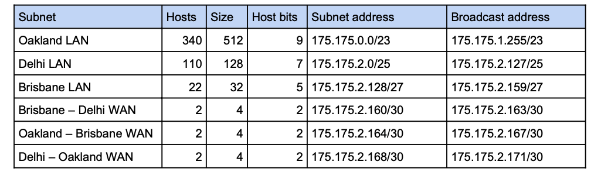

p6-3# Prac 2

## RTT

- round trip time

## tracert

- command
- Tracert london.edu

- Figure

    

- The latency time increases significantly as the messagese start to cross the ocean
- By what percentage dose the RTT increase after the jump compared with before it?
- To calculate the percentage for this jump, you would select a time from just after the jump (229, for example) and divide it by a time from just before the jump (such as 39), then multiply by 100 percent: 229/39×100=587%.
- In this case, the sample data would yield a 587 percent increase.
- It takes nearly six times as long for a message to go round-trip across the Atlantic from the United States to London, England (the location of this first European router) as it does for a message to travel round trip between two servers that are both located on the U.S. East Coast (this local computer, and the last U.S. router in the route).

# Prac 3 - Binary

## Converting binary to decimal


## Converting decimal to binary

### Subtraction method


### Remainder method


## 1. Fill out the seven layers of the OSI model

- Layer 1 - Please - Physical Layer
- Layer 2 - Do - Data Link Layer
- Layer 3 - Not - Network Layer
- Layer 4 - Tell - Transport Layer
- Layer 5 - Secret - Session Layer
- Layer 6 - Password - Presentation Layer
- Layer 7 - Anyone - Application Layer

## 2. Explaining Logical link Control (LLC) and Media Access Control (MAC) sublayers

- Data link layer – Two Sub-layers
  - Logical link Control (LLC) : (IEEE 802.2)
    - The Logical Link Control (LLC) sublayer remains relatively independent of the physical equipment
    - Provides an interface between the MAC layer and the Network layer independent of the hardware
  - Media Access Control (MAC): (part of IEEE 802.3)
    - The MAC sub-layer is concerned with the physical components that will be used to communicate the information
    - Which computer can access the network when multiple computers are trying to access it simultaneously
    - Physical addressing (MAC addresses) and access control methods.

## Switches separate networks into multiple collision domains.

## Routers separate networks into multiple broadcat domains.

## Backbone cabling

- Cables or wireless links that provide interconnecion between the entrance facility and MDF, and between MDF and IDSs.

## Horizontal cabling

- connects workstations to the closest data room and to switches housed in the rooom.

## Patch cable

- A relatively short length of cabling with connectors at both ends.

## Demarc

- Dmarcation point
- The device that marks where a telecommunications service provider's network ends and organization's network begins.

## MDF

- MDF (main distribution frame) – the centralised point of interconnection for an organisation’s LAN or WAN (also called MC or main cross connect)

## Patch Panel

- a panel of data receptors which can be mounted to a wall or a rack
- A patch panel provides a central termination point when many patch cables converge in a single location

## IDF

- IDF (intermediate distribution frame) – provides an intermediate connection between the MDF and end-user equipment on each floor and in each building

# Prac 4 The Weighted Decision Matrix

### A weighted decision matrix (WDM) is a decision making tool that is used to compare similar items and pick the option that is best suited to the situation.

- The weighted decision matrix basically gives each product a score that changes, based on how the product meets the requirements of the specific situation.
- Step 1 - Identify Requirements

# Prac 5

## private address

192.168.0.0 – 192.168.255.255 (65,536 IP addresses)
172.16.0.0 – 172.31.255.255 (1,048,576 IP addresses)
10.0.0.0 – 10.255.255.255 (16,777,216 IP addresses)

## IP class

- Class A
  - The first octet denotes the network address,
  - and the last three octets are the host portion.
  - Any IP address whose first octet is between 1 and 126 is a Class A address.
  - Notice that 0 is reserved as a part of the default address,
  - and 127 is reserved for internal loopback testing.
- Class B
  - The first two octets denote the network address,
  - and the last two octets are the host portion.
  - Any address whose first octet is in the range 128 to 191 is a Class B address.
- Class C
  - The first three octets denote the network address,
  - and the last octet is the host portion.
  - The first octet range of 192 to 223 is a Class C address.
- Class D
  - Used for multicast.
  - Multicast IP addresses have their first octets in the range 224 to 239.
- Class E
  - Reserved for future use
  - and includes the range of addresses with a first octet from 240 to 255.

### 3. True or false: In order to communicate across the internet, two nodes need to know each other’s MAC address.

False. A device must know the destination MAC address to communicate locally through Ethernet or traced
on a network that it's still connected to.

### 6. What is the purpose of port numbers? How many port numbers are there?

1 - Port numbers are used to identify specific applications or services on a computer, and they allow data to be delivered to the correct destination when it is received over the internet or a local network.
2 - The number of port numbers available depends on the transport protocol being used. There are 65,535 port numbers, but not all are used every day. Restricted port numbers or well-known port numbers are reserved by prominent companies and range from 0 to 1023.

### 7.

- There are four addressing methods:
  - Data link layer MAC (Media Access Control) address is 48 bits, written as six hex numbers separated by colons
    - It is also called a physical address
    - MAC addresses are embedded on every NIC in the world
  - Network layer IP (Internet Address) address can be used to find any computer in the world
    - IPv4 addresses have 32 bits and are written as four decimal numbers called octets
    - IPv6 addresses have 128 bits and are written as eight blocks of hexadecimal number
  - Transport layer port numbers are used to find applications
  - Application layer FQDNs, computer names, and host names
    - Fully qualified domain name (FQDN) – a unique character-based name

## Rols of the DNS servers

- a) Root server
  - Root DNS servers hold information used to locate top-level domain (TLD) servers
  - Root servers are DNS nameservers that operate in the root zone. These servers can directly answer queries for records stored or cached within the root zone, and they can also refer otherrequests to the appropriate Top-Level Domain (TLD) server.
- b) TLD server
  - TLD servers in facilitating the DNS lookup process by providing the DNS records that enable the mapping of domain names to their corresponding IP addresses.
  - A TLD nameserver maintains information for all the domain names that share a common domain extension, such as .com, . net, or whatever comes after the last dot in a url. For example, a .com TLD nameserver contains information for every website that ends in '.com'
- c) Authoritative server
  - Authoritative name server is the authority on computer names and their IP addresses for computers in their domains.
  - Authoritative server - Authoritative DNS nameservers are responsible for providing answers to recursive DNS nameservers about where specific websites can be found.

## www.google.com

- www: hostname
- google.com: domain name
- .com: top-level domain (TLD)

## What happens when you ping 127.0.01

- Answer: 127.0.0.1 is the local circular address. If this address cannot be pinged, it indicates that the local TCP/IP protocol is not working properly.
- The IP address 127.0.0.1 is a special-purpose IPv4 address and is called the localhost or loopback address. All computers use this address as their own, but it doesn't let computers communicate with other devices as a real IP address does.
- There are two reasons which prevent your computer from getting replies from 127.0.0.1. They are provided below.
  - TCP/IP suit installed on your laptop is corrupted
  - Ethernet adapter is not working

## 11. What command-line tool can you use to quickly determine your computer’s IP address?

- ipconfig

## 12. Try the following on the command line. What address do you get in each case? Why are they different?a)

- nslookup, which stands for "name server lookup", finds information about a named domain.
- nslookup is a command-line tool to discover the IP address or DNS record of a specific domain name.
- The primary purpose of nslookup is to retrieve detailed information about the specified domain.
- The following command send a lookup request for the IP address.

```shell
nslookup google.com
```

- a) nslookup google.com
  - The output of this command will likely be the IP address of a Google server, because the "nslookup" command is used to query DNS servers to obtain the IP address of a specific domain name.
- b) nslookup google.com 8.8.8.8
  - Same as above, but in this case the "nslookup" command is explicitly specifying the DNS server to use for the query, which is the Google Public DNS server at "8.8.8.8". This means that the query will be forwarded to the Google Public DNS server, which will provide the IP address of a Google server in response.
- c) nslookup google.com 1.1.1.1
  - Same as above, However, in this case the "nslookup" command is specifying a different DNS server to use for the query, which is the Cloudflare DNS server at "1.1.1.1".
- The different outputs for these commands are due to the different DNS servers that are being used for the queries. Each DNS server may have different DNS records for the same domain name, and may provide different IP addresses in response to the same query.

# Prac 06 subnetting

- A router uses a subnet mask to determine the network portion of an address.
- CIDR or slash notation
  - CIDR (Classless Interdomain Routing) notation takes the network ID or a host’s IP address and follows it with a forward slash (/) followed by the number of bits that are used for the network ID
  - in slash notation the number is how many ones are in the binary form of the mask
  - For example, 11111111.11111111.11111111.11000000 is 255.255.255.192 or /26.
- Given a subnet mask and an IP address, the router will AND the bits together to work out the network address.

    

## Given a class A, B, or C network we can reassign (or “borrow”) host bits as subnet bits.

- Suppose we have N network bits, and borrow S bits to create subnets, this leaves H = 32 – N – S bits for hosts. (N + S + H must always equal 32.)
- Two addresses are usually reserved in a subnet, the subnet address, where all the host bits are 0, and the broadcast address, where all the host bits are 1.

    

- Exameple

  - Suppose we have a building with four departments, and want to therefore create four subnets. We have the 200.200.200.0/24 block to split up.
  - We need to choose S so that we get four: 2S = 4, so S = 2.
  - We know that N = 24, because we started with a /24 network.
    - Therefore H = 32 – 24 – 2 = 6,
    - and hence each subnet consists of 26 = 64 addresses,
    - of which 62 are usable.
  - We’ve borrowed 2 bits from hosts, so the subnet mask for our subnets is /26 (24 + 2) or 255.255.255.192 (note that 256 – 64 = 192).

    

- Easier way to work out the subnet and broadcast addresses

  - Subnet 0 starts at 200.200.200.0 and the subnet size is 64,
  - so the next subnet begins at 200.200.200.64.
  - The broadcast always precedes the subnet address of the next subnet,
    - so subnet 0 has a broadcast address of 200.200.200.63.
  - The usable addresses are all those between the subnet address and broadcast address,

    - so these are 200.200.200.1 to 200.200.200.63.

    

## Part 3 - Subnetting a Class B block

- Suppose we’re an organisation with a class B block available, let’s say 155.155.0.0/16. We have branches in multiple cities, and want to split this address space into subnets to allocate to separate branches. We want each branch to have enough addresses for 2000 hosts. How should we subnet in this case?

  - A subnet size can only be a power of 2, so we need to find the next largest power of two: 211 = 2048.
  - This means we need to leave 11 host bits (H = 11).
  - We start with a class B block, so N = 16, and we know N + S + H = 32, so a little bit of algebra gives us S = 5,
    - so we’re borrowing 5 bits for subnetting.
  - In slash notation, our subnet mask will be /21 (16 + 5), which in octet notation is 11111111.11111111.11111000.00000000 = 255.255.248.0.

    

  - When working out subnetting for subnets of size more than 256, it can be simpler to think in terms of the number of class C blocks. Notice that 2048 = 8 × 256, so each of our subnets is equivalent 8 class C blocks. The subnet mask is 255.255.248.0, and 248 = 256 – 8. Each of our subnets begins at an address where the third octet is a multiple of 8.

# Prac 7 Subneeting 2

## VLSM

- VLSM (Variable Length Subnet Mask) allows subnets to be further subdivided into smaller and smaller groupings until each subnet is about the same size as the necessary IP address space
- VLSM (variable length subnet masks) allow us to create subnets of varying sizes from one block of addresses.
- Example, Suppose we have the above network, and we are given the class B block 175.175.0.0/16 to use. How should we create our subnets?

    

- The simplest approach is to arrange the required subnets in descending order of size and then create the subnets beginning at the start of our class B block.

  - To determine the necessary size, we consider the next power of 2 larger than the number of hosts. Even if the number of hosts is already a power of 2, we need to use the next largest size, as we can’t use the first or last addresses as host addresses.

    

  - determine the addresses for each of the router interfaces

    - For router interfaces on a LAN or WLAN, generally the first usable host address will be allocated.
    - For WANs, the interface of one router will receive the first usable address, and the other router will receive the second usable address.
    - For the WANs, we will allocate the first address to whichever router appears higher in the diagram, and if they are the same height, the leftmost router.

      

## Superneeting

- Supernetting (aka address or route summarisation)

  - allows us to combine nearby subnet addresses into a single address to reduce the size of routing tables,
  - or to create a larger network out of contiguous class B blocks.

    

- To determine the supernet address and mask, we need to look at the binary for the dissimilar octet for each of the networks we’ll be combining.

    

- We take the common bits and fill the rest with zeros to obtain **01000**000 = 64, so our supernet address is 223.101.64.0.
- Because we have 5 common bits among the dissimilar octets, and 16 common bits from the two similar octets, the mask is 16 + 5 = 21.
- So overall our supernet is 223.101.64.0/21.

# Prac 8 Wireless and VlANS

## What is the difference between an ad hoc WLAN and an infrastructure WLAN?

- In infrastructure mode, all devices on a wireless network communicate with each other through an access point (wireless router).
- In ad hoc mode, a computer with a wireless network adapter communicates directly with a printer equipped with a wireless print server.

## Compare and contrast CSMA/CD, used by Ethernet, and CSMA/CA, used by Wi-Fi.

- CSMA/CA

  - Carrier Sense Multiple Access with Collision Avoidance
  - Use CSMA/CA procedures to access a shared medium
  - CSMA/CA uses ACK messages to confirm successful transmission
  - if there is activity then brief cause then check for transmissions again
  - If there is no activity then brief cause and sends transmission -> Transmission complete.

  - Algorithm

    - When a frame is ready, the transmitting station checks whether the channel is idle or busy.
    - If the channel is not clear, the node starts to wait for a random amount of time before checking to see if it is clear.
    - If the channel is idle, the station waits for an Inter-frame gap (IFG) amount of time and then sends the frame.
    - It sets a timer after sending the frame.
    - The station then waits for acknowledgement from the receiver. If it receives the acknowledgement before expiry of timer, it marks a successful transmission.
    - Otherwise, it waits for a back-off time period and restarts the algorithm.

  - CMSA/CA prevents collision.
  - As it waits for acknowledgements, data is not lost unnecessarily and it avoids wasteful transmission.
  - CSMA/CA is very much suited for wireless transmissions.
  -

- CSMA/CD

  - Carrier Sense Multiple Access / Collision Detection
  - Algorithm
    - The transmitting station examines if the channel is idle or busy when a frame is ready.
    - If the channel is congested, the station will wait till it becomes available.
    - If the channel is empty, the station begins transmitting and watches the channel for collisions
    - The station initiates the collision resolution procedure if a collision is detected.
    - Although CSMA/CS detects collisions, it does not have a mechanism to reduce the number of collisions. Hence, it is not appropriate for large networks, as the performance degrades exponentially when more stations are added.

- Difference between CSMA/CA and CSMA/CD?

<table class="table table-bordered"><thead><tr><th style="text-align: center;">Key<br></th><th style="text-align: center;">CSMA/CA<br></th><th style="text-align: center;">CSMA/CD<br></th></tr></thead><tbody><tr><td style="text-align: center; vertical-align: middle;">Effectiveness<br></td><td>CSMA/CA is effective before a collision.<br></td><td>CSMA/CD is effective after a collision.<br></td></tr><tr><td style="text-align: center; vertical-align: middle;">Network Type<br></td><td>CSMA/CA is generally used in wireless networks.<br></td><td>CSMA/CD is generally used in wired networks.<br></td></tr><tr><td style="text-align: center; vertical-align: middle;">Recovery Time<br></td><td>CSMA/CA minimizes the risk of collision.<br></td><td>CSMA/CD reduces the recovery time.<br></td></tr><tr><td style="vertical-align: middle; text-align: center;"><div style="text-align: center;">Conflict Management</div></td><td>CSMA/CA initially transmits the intent to send the data. Once an acknowledgment is received, the sender sends the data.<br></td><td>CSMA/CD resends the data frame in case a conflict occurs during transmission.<br></td></tr><tr><td style="vertical-align: middle; text-align: center;"><div style="text-align: center;">IEEE Standards</div></td><td>CSMA/CA is part of the IEEE 802.11 standard.<br></td><td>CSMA/CD is part of the IEEE 802.3 standard.<br></td></tr><tr><td style="vertical-align: middle; text-align: center;"><div style="text-align: center;">Efficiency</div></td><td>CSMA/CA is similar in efficiency as CSMA.<br></td><td>CSMA/CD is more efficient than CSMA.<br></td></tr></tbody></table>

## What are war driving and war chalking?

War driving – a hacker searches for unprotected wireless networks by driving around with a laptop configured to receive and capture wireless data transmissions
War chalking – hackers draw symbols with chalk on the sidewalk or wall near a vulnerable AP to make it known to other hackers.

## Explain geofencing.

A geofence is “A virtual boundary around a real-world geographic area. The use of a geofence is called geofencing, and one example of use involves a location-aware device such as a smartphone user entering or exiting a geofence, triggering an alert to the device’s user.”

## What is the different between WPA and WPS attacks? Explain.

- WPA attack
- involves an interception of the network keys communicated between stations and APs
- Also called WPA cracking
- WPS attack
- involves cracking a PIN in order to access an APs settings
- The pin can be easily cracked through a brute force attack

## What are criteria when deciding where to install an access point?

- Consider the following when deciding where to install an AP:
  - Distance
  - Type and number of obstacles
  - Coverage
  - Interference

## VLAN

- a. VLANs divide networks into multiple broadcast domains. T
- b. Packets must be routed to move between VLANs. F
- c. Frames receive an 802.1Q tag to distinguish between VLANs. T
- d. TCP must be configured to work correctly over VLANs. F
- e. Both managed and unmanaged switches can create VLANs. F

## Which ports are used to carry frames from multiple VLANs?

- d Trunk

# prac 9 WANs

## What makes WANs different to LANs and MANs?

- WAN (wide area network) traverses a significant distance and usually supports very high data throughput.
- LAN (local area network) is a group of computers and network devices connected together, usually within the same building.
- MAN (metropolitan area network) is a larger network that usually spans several buildings in the same city or town.
- WAN and LAN differences:
  - ● LANs connect nodes; WANs connect networks spread over wide geographic area
  - ● Differ at Layers 1 and 2 access methods, topologies, media
  - ● Both LANs and WANs use the same protocols from Layer 3 and higher
  - ● LANs are typically privately owned
  - ● WANs are typically owned and operated by telcos, also known as NSPs (network
  - service providers)
    - ○ Examples include AT&T, Verizon, Spectrum, and Comcast

## For connectivity, what do Symmetrical and Asymmetrical Mean?

- Bandwidth is asymmetrical (asynchronous) which means download speeds are faster than upload speeds
- Bandwidth is symmetrical (synchronous) which means download and upload speeds are about the same

## What is Digital Subscriber Line (DSL)? How many types are there? List them and explain.

- DSL (digital subscriber line) is a WAN connection method that operates over the PSTN
- (public switched telephone network)
- ● DSL supports multiple data and voice channels over a single line
  - ○ It requires repeaters for longer distances
  - ○ The distance between the customer and CO affect actual throughput
- ● DSL uses advanced data modulation techniques
- ● A DSL connection might use a modulation technique based on amplitude or phase
- modulation to alter the waves at higher frequencies to carry data Different types of DSL:
- ● ADSL (asymmetric DSL) – faster download speeds than upload speeds
- ● VDSL (very high bit rate DSL or variable DSL) – faster than ADSL and is also asymmetric
- ● SDSL (symmetric DSL) – has equal download and upload speeds maxing out around 2 Mbps

## Explain Geosynchronous earth orbiting satellites.

- GEO (geosynchronous earth orbit) satellites orbit at the same rate the Earth turns

## How many cellular technology generations are there? List each of them and explain. There are 5 cellular technology generations.

- ● 1G (first generation) were analog
- ● 2G (second generation) used digital transmission up to 240Kbps
- ● 3G (third generation) supported data rates up to 384Kbps. Data communications use packet switching
- ● 4G (fourth generation) services are characterized by an all-IP network for data and
- voice. Specifies throughputs of 100 Mbps to 1 Gbps speeds
- ● 5G (fifth generation) services require minimum speeds of 1 Gbps and max out at 20 Gbps and upload speeds of 10 Gbps

# Prac 10 Network Risk Management

## Explain the term “social engineering”. Have you ever experienced it? What happened?

- Social engineering is a strategy to gain a user’s password Common types of social engineering:
  - a. Phishing
  - b. Baiting
  - c. Quid pro quo
  - d. Tailgating
  - e. Piggybacking
  - f. Shoulder surfing
- One of my close friends has experienced someone getting her bank account password over the phone. I am not sure it was social engineering. She was applying a credit card at China CITIC bank online. After several minutes, she got a phone call from someone. A man in the call claimed that the call came from China CITIC bank, and requested her bank account password to finish the credit card application. My friend provided password without considering a lot. After 10 minutes, she thought it is very strange and log in her account to check balance. She found all her money was gone. it is about 30000 SGD.

## What are Denial of Service (DoS) and Distributed DoS attacks? Are these serious attacks? Explain your answer.

- A DoS (denial-of-service) attack occurs when an intruder issues a flood of broadcast ping messages preventing legitimate users from accessing normal network resources.
- There are several DoS subtypes:
  - ● Distributed DoS (DDoS) attack – are orchestrated through several sources, called zombies
  - ● DRDoS (distributed reflection DoS) attack – a DDoS attack is a type of DDoS attack that is bounced off uninfected computers, called reflectors, before being directed at target
- Some are serious attacks. PDoS attack damages a device’s firmware beyond repair
- Some are not serious attacks. Friendly DoS attack – an unintentional DoS attack has no malicious intent

## What is the different between virus and worm?

- Virus – a program that replicates itself with the intent to infect more computers
- Worm – a programs that runs independently and travels between computers and across networks

## Explain Ransomware.

- Ransomware – a program that locks a user’s data or computer system until a ransom is paid.

## 5. Explain how Pen (penetration) testing works.

- Pen (penetration) testing uses variable tools to find network vulnerabilities and attempts to exploit them

## Device hardening refers to

- steps to secure a device from network- or software-supported attacks

## What are the symptoms of malware? Explain

- Malware is a generalised term that refers to many kinds of malicious software.
- ● Virus – a program that replicates itself with the intent to infect more computers
- ● Trojan horse (Trojan) – a program that disguises itself as something useful, but actually harms your system
- ● Worm – a programs that runs independently and travels between computers and across networks
- ● Bot – a program that runs automatically without requiring a person to start or stop it
- ● Ransomware – a program that locks a user’s data or computer system until a ransom is paid

## What are your thoughts on Bring Your Own Device (BYOD) practice? E.g., do you think it is a safe practice? explain your answer.

- BYOD (bring your own device) allows people to bring their smartphones, laptops, or other technology into a facility for the purpose of performing work or school responsibilities
- It is not a safe practice.
- A BYOD model offers convenience and flexibility, but it also creates security concerns. The following is risk.
- ● Data theft. If you let your employees use their own devices unchecked, it’s likely that some of the personal applications they use may not be as stringent with their security requirements. If an account they have for personal use is hacked, it could ultimately end up exposing corporate data and confidential information.
- ● Malware. Employees use personal devices to download various types of information and files, such as PDFs and applications. If an employee isn’t carefully distinguishing between valuable corporate data and data used for personal purposes, this could compromise security.
