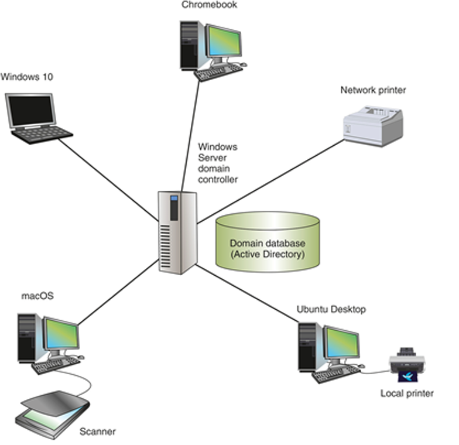
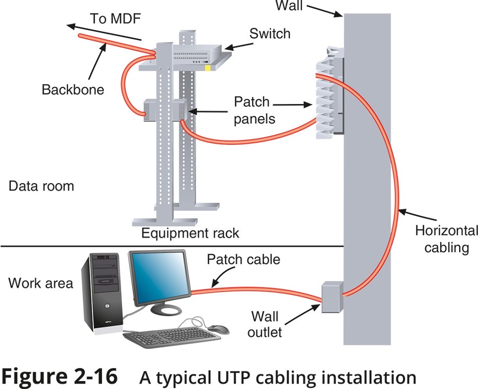
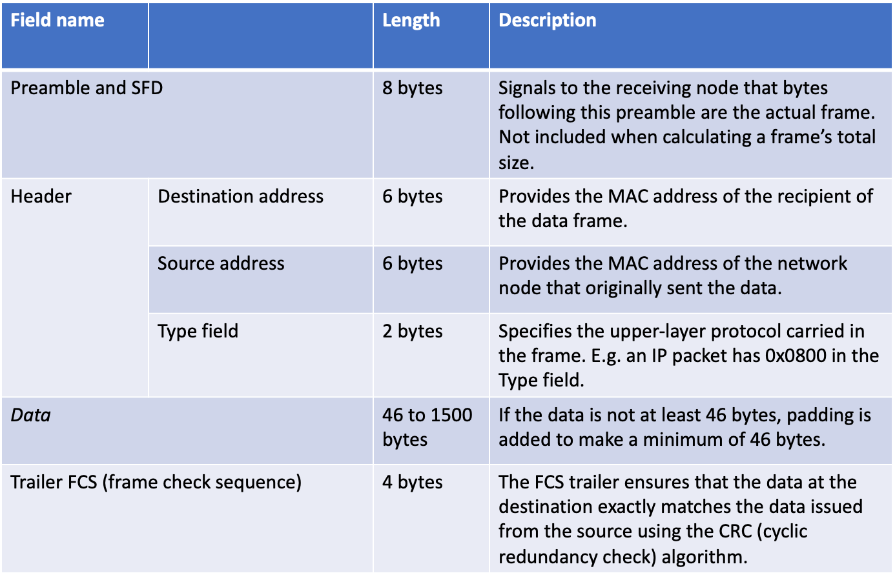

# 1-2 Network Models

## Network Models

- Topology describes how parts of a whole work together
- Physical topology mostly refers to a network’s hardware and how computers, other devices, and cables work together to form the physical network
- Logical topology refers to how software controls access to network resources
  - It includes how users and software initially gain access to the network
- A network operating system (NOS) controls access to the entire network
  - A NOS is required by client-server models

## Peer-to-Peer Network Model

- In a peer-to-peer (P2P) network model the OS of each computer on the network is responsible for controlling access to its resources
  - There is no centralised control
- Computers, called nodes or hosts, form a logical group of computers and users
  - Each computer controls its own administration, resources, and security
- Advantages
  - Simple configuration
  - Less expensive compared to other network models
- Disadvantages
  - Not scalable
  - Not necessarily secure
  - Not practical for large installations
- Figure 1-1
  - In a peer-to-peer network, no computer has more authority than another; each computer controls its own resources and communicates directly with other computers​
    

## Client-Server Network Model

- Resources are managed by the NOS via a centralised directory database
- A Windows domain is a logical group of computers that a Windows Server can control
- **Active Directory (AD)**
  - is the centralised directory database that contains user account information and security for the entire group of computers
  - A user can sign on to the network from any computer on the network and gain access to the resources that AD allows
    - This process is managed by **Active Directory Domain Services (AD DS)**
  - A computer making a request from another is called the **client**
- Figure 1-2

  - Client-Server Network Model
    - A Windows domain uses the client-server model to control access to the network, where security on each computer or device is controlled by a centralised database on a domain controller
      

## Client-Server Applications

- The NOS is responsible for:
  - Managing client data and other resources
  - Ensuring authorised user access
  - Controlling user file access
  - Restricting user network access
  - Dictating computer communication rules
  - Supplying applications and data files to clients
- Servers that have a NOS installed require:

  - More memory, processing power, and storage capacity
  - Equipped with special hardware to provide network management functions

- **Network services** are the resources a network makes available to its users
  - It includes applications and the data provided by these applications
- In **client-server applications**:

  - A client computer requests data or a service from a second computer, called the **server**

- Figure 1-3, Client-Server Applications
  - A web browser (client application) requests a web page from a web server (server application); the web server returns the requested data to the client
    

## Network Services and Their Protocols

- **Protocols** are methods and rules for communication between networked devices
- Two primary network protocols:
  - **TCP (Transmission Control Protocol)**
  - **IP (Internet Protocol)**
- Popular client-server applications include:
  - Web service
  - Email services
  - DNS service
  - FTP service
  - Database services
  - Remote access service
- Figure 1-5, **SMTP, POP3, IMAP4**
  - **SMTP** is used to send email to a recipient’s email server, and **POP3** or **IMAP4** is used by the client to receive email
    

# 1-3 NETWORK Hardware

## LANs and Their Hardware

- A **LAN (local area network)** is usually contained in a small space
- A **switch** receives incoming data from one of its ports and redirects it to another port or multiple ports
  - Will send the data to its intended destination
- The physical topology used by this network is called a **star topology**
  - All devices connect to one central device (usually a switch)
- A **NIC (network interface card)** is a network port used to attach a device to a network
  - Also called a **network adapter**
- A LAN can have several switches
- A **backbone** is a central conduit that connects the segments (pieces) of a network
- Figure 1-7, Network Hardware
  - This LAN has five computers, a network printer, a local printer, a scanner, and a switch, and uses a star topology
    
- Figure 1-11, LANs and Their Hardware

  - This local network has three switches and is using a hybrid topology
    

- Router

  - A **router** is a device that manages traffic between two or more networks
  - Can help find the best path for traffic to get from one network to another
  - Routers can be used in small home networks to connect the home LAN to the Internet
    - Called a SOHO (small office-home office) network
  - Industrial-grade routers can have several network ports, one for each network it connects to
  - Difference between router and switch:
    - A router is like a gateway between networks and belongs to two or more local networks
    - A switch belongs only to its local network
  - Figure 1-14

    - (a) A router stands between the LAN and the Internet, connecting the two networks;
    - (b) Home networks often use a combo device that works as both a switch and a router

    

## MANs and WANs

- A **WAN (wide area network)** is a group of LANs that spread over a wide geographical area
- A **MAN (metropolitan area network)** is a group of connected LANs in the same geographical area
  - Also known as a **campus area network (CAN)**
- MANs and WANs often use different transmission methods and media than LANs
- PAN (personal area network) is a much smaller network of personal devices
  - A network of personal devices such as your smartphone and your computer
- Other network types:
  - BAN (body area network)
  - SAN (storage area network)
  - WLAN (wireless local area network)
- Figure 1-17
  - A WAN connects two LANS in different geographical areas
    

# 1-4 Network Diagrams

## Network Diagrams

- Network diagrams are graphical representations of a network’s devices and connections
  - They may show physical layout, logical topology, IP address reserves, names of major network devices, and types of transmission media
- Network mapping - the process of discovering and identifying the devices on a network
  - Nmap – one of the most popular tools used for network mapping
  - Zenmap – Nmap’s GUI option
- Cisco Systems set the standard for diagram symbols used to represent network devices
  

  

## Labelling and Naming Conventions

- Tips for labelling and naming conventions:

  - Use names that are as descriptive as possible
  - Only include fields that are essential in identifying the device
  - Don’t overcomplicate the name with useless or redundant information
  - Use established naming conventions
  - Think big-picture-down-to-details

- Tips for labelling and naming conventions:

  - Consider any security risks from details included in your naming convention
  - Use colour-coded cables and use cable tags to identify each cable’s purpose
  - Label the ports and jacks that cables connect to
  - Where labels won’t fit on the device, draw a simple diagram of each device that indicates how each port is used
  - Use labels that are durable and are designed to stick to plastic and metal

  

  

# 2-1 OSI

## The Open Systems Interconnection Model (OSI Model)

## The Seven-Layer OSI Model

  

  

## Layer 7: Application Layer

- The **application layer** describes the interface between two applications, on separate computers
- Application layer protocols are used by programs that fall into two categories:
  - Provide services to a user, such as a browser and Web server
  - Utility programs that provide services to the system, such as SNMP (Simple Network Management Protocol) programs that monitor and gather information about network traffic
- Payload is the data that is passed between applications or utility programs and the OS

## Layer 6: Presentation Layer

- The presentation layer is responsible for reformatting, compressing, and/or encrypting data in a way that the receiving application can read
- Example:
  - An email message can be encrypted at the Presentation layer by the email client or by the OS

## Layer 5: Session Layer

- The session layer describes how data between applications is synched and recovered if messages don’t arrive intact at the receiving application
- The application, presentation, and session layers are intertwined
  - It is often difficult to distinguish between them
- Most tasks are performed by the OS when an application makes an API call to the OS
  - An API (application programming interface) call is the method an application uses when it makes a request of the OS

## Layer 4: Transport Layer

- The transport layer is responsible for transporting Application layer payloads from one application to another
- Two main Transport layer protocols are:
- **TCP (Transmission Control Protocol)**
  - makes a connection with the end host, checks whether data was received; called a connection-oriented protocol
- **UDP (User Datagram Protocol)**

  - does not guarantee delivery by first connecting and checking whether data is received; called a connectionless protocol

- Protocols add control information in an area at the beginning of the payload (called **header**)
- **Encapsulation** is the process of adding a header to the data inherited from the layer above
  The Transport layer header addresses the receiving application by a number called a port
- If a message is too large, TCP divides it into smaller messages called **segments**
  - In UDP, the message is called a datagram

## Layer 3: Network Layer

- The network layer is responsible for moving messages from one node to another until they reach the destination host.
- The principal protocol used by this layer is **IP (Internet Protocol)**
- IP adds its own network layer header to the segment or datagram
  - The entire network layer message is called a **packet**
- An **IP address** is an address assigned to each node on a network
  - The network layer uses it to uniquely identify each host
- IP relies on several routing protocols to find the best route for a packet to take to reach destination
  - ICMP and ARP are examples
- Network layer protocol will divide large packets into smaller packets in a process called **fragmentation**

## Layer 2: Data Link Layer

- Layers 2 and 1 are responsible for interfacing with physical hardware on the local network
  - Protocols at these layers are programmed into firmware of a computer’s NIC and other hardware
- Type of networking hardware or technology used on a network determine the data link layer protocol used
  - Ethernet and Wi-Fi are examples
- The data link layer puts control information in a data link layer header and at the end of the packet in a trailer
  - The entire data link layer message is called a frame
- A **MAC (Media Access Control) address** is also called a physical address, hardware address, or data link layer address
  - It is embedded on every network adapter

## Layer 1: Physical Layer

- The physical layer is responsible for sending bits via a wired or wireless transmission
- Bits can be transmitted as:
  - Wavelengths in the air
  - Voltage on a copper wire
  - Light (via fibre-optic cabling)

## Protocol Data Unit or PDU

- Protocol data unit (PDU) is the technical name for a group of bits as it moves from one layer to the next and from one LAN to the next
  - Technicians loosely call this group of bits a message or a transmission

## Summary of How the Layers Work Together

- Figure 1-30
  

# 2-2 Physical Transmission

## Transmission Basics

- Transmission techniques in use on today’s network are complex and varied
- This section covers:
  - Measurements that indicate network efficiency
  - Obstacles to good network performance

## Frequency, Bandwidth, and Throughput

- Frequency is typically measured in MHz or GHz, which indicates the number of times in a second that an electrical signal can change states
- Bandwidth is the amount of data that could be theoretically transmitted during a given period of time
- Throughput is the measure of how much data is actually transmitted during given time period
- New technologies such as modulation (sending data over an analogue signal) and encoding (converting data into a digital signal for transmission) offer methods for increasing theoretical bandwidth and effective data throughput given the same maximum frequency

## Transmission Flaws

- Noise is any undesirable influence degrading or distorting signal
  - Noise is measured in dB (decibels)
- Two common sources of noise include the following:
  - EMI (electromagnetic interference) is caused by motors, power lines, televisions, copiers, fluorescent lights, etc…
    - One type of EMI is RFI (radio frequency interference)
- Cross-talk occurs when the signal on one wire infringes on adjacent wire signal
  - Alien cross-talk occurs between two cables
  - Near end cross-talk (NEXT) occurs near source
  - Far end cross-talk (FEXT) occurs at the far end
- Attenuation is the loss of a signal’s strength as it travels away from source
- Signals can be boosted using a repeater, which regenerates a digital signal in its original form without noise previously accumulated
- Latency is the delay between signal transmission and receipt
  - Latency may cause network transmission errors
- The length of the cable affects latency, as does the existence of any intervening device
- RTT (round trip time) is the time for packet to go from sender to receiver, then back from receiver to sender
- If packets experience varying amounts of delay they can arrive out of order
  - A problem commonly called jitter or PDV (packet delay variation)

## Duplex, Half-Duplex, and Simplex

- NIC settings include the direction in which signals travel over the media and the number of signals that can traverse the media at any given time
  - These two settings are combined to create different methods of communication
- Full-duplex – Signals travel in both directions over a medium simultaneously
- Half-duplex – Signals may travel in both directions but only in one direction at a time
- Simplex – Signals may travel in only one direction and is sometimes called one-way or unidirectional, communication
- In Windows, use Device Manager to configure a NIC, including speed and duplex settings

  

## Multiplexing

- Multiplexing is a form of transmission that allows multiple signals to travel simultaneously over one medium
- To carry multiple signals, the medium’s channel is logically separated into multiple smaller channels, or subchannels
- Multiplexer (mux) is a device that combines many channel signals
  - It is required at the transmitting end of the channel
  - A demultiplexer (demux) separates the combined signals on the receiving end
  - Three types of multiplexing are used on copper lines:
    - TDM (Time division multiplexing) divides a channel into multiple time intervals
    - STDM (statistical time division multiplexing) assigns slots to nodes according to priority and need
    - FDM (Frequency Division Multiplexing) assigns different frequency band for each communications subchannel
- Three types of multiplexing are used on fiber-optic cable
  - WDM (Wavelength Division Multiplexing) carries multiple light signals simultaneously by dividing a light beam into different wavelengths or colors
  - DWDM (Dense Wavelength Division Multiplexing) increases the number of channels provided by normal WDM
  - CWDM (Coarse Wavelength Division Multiplexing) lowers cost by spacing frequency bands wider apart to allow for cheaper transceiver equipment

# Safety and Troubleshooting Network Problems

## Safety Procedures and Policies

- Network and computer technicians need to know how to protect themselves
  - As wells as protect sensitive electronic components
- This section takes a look at some best practices for safety

## Emergency Procedures

- Know the best escape route or emergency exit
- Fire Suppression Systems - have a fire suppression system in the data center that includes:
  - Emergency alert system
  - Portable fire extinguishers
  - Emergency power-off switch
- Ask yourself: Does the security system allow access during a failure (fail open) or deny access during the failure (fail close)?
- An SDS (safety data sheet) explains how to properly handle substances such as chemical solvents and how to dispose of them
- - Includes information such as identification, first-aid measures, fire-fighting measures, accidental release measures, handling and storage guidelines, exposure controls, and physical and chemical properties
- Electrical and tool safety is generally regulated by OSHA (Occupational Safety and Health Administration)
- OSHA guidelines when using power tools:
  - Wear PPE (personal protective equipment)
  - Keep all tools in good condition and properly store tools not in use
  - Use the right tool for the job and operate the tool according to the manufacturer’s instructions
  - Watch out for trip hazards, so you and others don’t stumble on a tool or cord
- Lifting Heavy Objects - follow these guidelines:
  - Decide which side of object to face so load is most balanced
  - Stand close to the object with your feet apart
  - Keep your back straight, bend knees and grip load
  - Lift with your legs, arms, and shoulders (not your back or stomach)
  - Keep the load close to your body and avoid twisting your body while you’re holding it
  - To put the object down, keep your back as straight as possible and lower object by bending your knees
- Protecting Against Static Electricity
  - Computer components are grounded inside a computer case
  - Grounding means that a device is connected directly to the earth
- Sensitive electronic components can be damaged by ESD (electrostatic discharge)
- Static electricity can cause two types of damage:
  - Catastrophic failure - destroyed beyond use
  - Upset failure - shorten the life of a component
- Before touching a component, ground yourself by:
  - Wearing an ESD strap around your wrist that clips onto the chassis or computer case
  - Touching the case before touching any component inside the case
  - Storing a component inside an antistatic bag
- In addition to protecting against ESD, always shut down and unplug a computer before working inside it

## Troubleshooting Network Problems

- Troubleshooting steps used by most expert networking troubleshooters:

1. Identify problem

- Gather information
- Identify symptoms
- Question users
- Determine if anything has changed

2. Establish theory of probable cause

- Question the obvious

3. Test theory to determine cause

- If theory confirmed, determine next steps
- If theory not confirmed, establish new theory or escalate

4. Establish action plan
5. Implement solution or escalate the problem
6. Verify full functionality

- Implement preventative measures if applicable

7. Document findings, actions, outcomes

  

# Infrastructure

## Components of Structured Cabling

- ANSI/TIA-568 Commercial Building Wiring Standard
  - Also known as structured cabling
- The wiring standard describes the best way to install networking media to maximise performance and minimise upkeep
- The principles apply no matter what type of media, transmission technology, or networking speeds are involved
- Structured cabling is based on a hierarchical design and assumes a network is based on the star topology

## From the Demarc to a Workstation

  
- Entrance Facility in Building A:
  - **EF (entrance facility)** – location where the incoming network (such as Internet) connects with the school or corporate network
  - **Demarc (demarcation point)** – the device that marks where a telecommunications service provider’s network ends and the organisation’s network begins
- Entrance Facility in Building A:

- MDF (main distribution frame) – the centralised point of interconnection for an organisation’s LAN or WAN (also called MC or main cross connect)
- Data room – an enclosed space that hold network equipment (also called data closet, data centre, equipment room, or telecommunications room)
- Rack – holds various network equipment
- Patch panel – a panel of data receptors which can be mounted to a wall or a rack

  - A patch panel provides a central termination point when many patch cables converge in a single location

  

  

  

- Entrance Facility in Building A (continued):

  - VoIP telephone equipment – **VoIP (Voice over IP)** is the use of any network to carry voice signals using TCP/IP protocols
  - In one or more data rooms you might find the following:
    - VoIP gateway
    - VoIP PBX
    - VoIP endpoints

- Data Room in Building B:
  - **IDF (intermediate distribution frame)** – provides an intermediate connection between the MDF and end-user equipment on each floor and in each building
- Work Areas in All Three Buildings:

  - Work area – encompasses workstations, printers, and other network devices
  - Wall jacks – the ANSI/TIA standard calls for each wall jack to contain at least one voice and one data outlet

   

   

- Rack Systems

  - Racks come in two-post and four-post varieties (though six-post racks are also available)
  - Racks may be wall- or ceiling-mounted, freestanding on the floor, or bolted to the floor
  - Consider the following when purchasing racks:
    - Height – rack height is measured in rack units (RU or U) with the industry standard being 42U tall
    - Width – equipment racks come in a standard 19-inch frame (19 inches wide)
    - Depth – rack depths vary between manufacturers
  - In data centres containing multiple rows of racks, a hot aisle/cold aisle layout pulls cool air from vents in the floor or from low-lying wall vents into rows of racks (see Figure 2-14)

       

       

# Cabling

##

- Types of Cables

  - Patch cable – a relatively short length of cabling with connectors at both ends
  - Horizontal cabling – connects workstations to the closest data room and to switches housed in the room
  - Backbone cabling – consists of cables or wireless links that provide interconnection between the entrance facility and MDF and between MDF and IDFs
  - Many network problems are the result of poor cable installations

    - Pay close attention to the quality of cable connections and cable management

- Horizontak cabling from a switch in a dataroom to workstations
  
- A typical cabling installation
  

- Cable Management
  - Termination – when terminating twisted-pair cabling, don’t leave more than 1 inch of exposed cable before a termination
  - Bend radius – do not exceed the cable’s prescribed bend radius, which is the radius of the maximum arc into which you can loop a cable without impairing data transmission
  - Continuity – use a cable tester to verify that each cable segment transmits data reliably
  - Loosely cinch cables
  - Cable coverings and conduits – avoid laying cables across a floor and use cord covers if they must be exposed
  - EMI sources – install cable at least 3 feet away from fluorescent lights or other sources of EMI (electromagnetic interference)
  - Plenum cabling – if running cable in the plenum (the area above the ceiling tile or below subflooring), make sure the cable sheath is plenum-rated
  - Grounding - pay attention to grounding requirements
  - Slack in cable runs
  - Cable trays - use cable management devices such as cable trays, braided sleeving, and furniture grommets
  - Patch panels - use patch panels to organise and connect lines
  - Company standards and inventory
  - Documentation
    - Keep your cable plant documentation accessible
    - Label every data jack or port, patch panel and connector
    - Use color-coded cables for different purposes
    - Update your documentation as you make changes to the network

# Ethernet

## Ethernet

- Ethernet is the most important data link layer standard
  - It is capable of running on a variety of network media
  - Ethernet offers excellent throughput at a reasonable cost
  - It is the most popular network technology used on modern LANs
- Ethernet II is the current standard
- Ethernet adds both a header and a trailer to the payload
  - This creates a frame around the payload
- The header and FCS make up the 18-byte “frame” around the data
- The data portion of an Ethernet frame may contain from 46 to 1500 bytes
- MTU (maximum transmission unit) is the largest size that routers in a message’s path will allow at the Network Layer
  

## Ethernet and the OSI Model

- Ethernet operates in two areas of the OSI model:
- the lower half of the data link layer, known as the MAC sub layer
  and the physical layer
  

## Data link layer – Two Sub-layers

- **Logical link Control (LLC)** : (IEEE 802.2)

  - The Logical Link Control (LLC) sublayer remains relatively independent of the physical equipment
  - Provides an interface between the MAC layer and the Network layer independent of the hardware

- Media Access Control (MAC): (part of IEEE 802.3)
  - The MAC sub-layer is concerned with the physical components that will be used to communicate the information
  - Which computer can access the network when multiple computers are trying to access it simultaneously
  - Physical addressing (MAC addresses) and access control methods.

## Ethernet Frames

  

  

  

## Types of Ethernet

- 10-Mbps Ethernet
- 100 Mbps Fast Ethernet
- Gigabit Ethernet
- 10 Gigabit Ethernet

- 10BASE5, 10BASE2, and 10BASE-T Ethernet are now considered Legacy Ethernet

## IEEE Ethernet Standards

- IEEE 802 Committee Standards:
  - 802.1 - Standards introduction
  - 802.2 - Logical Link Control (LLC)
  - 802.3 - Ethernet
  - 802.4 - Token Bus - 75 ohm CATV coax or Fibre
  - 802.5 - Token Ring
  - 802.6 - MAN (Metropolitan Area Network) - similar to FDDI
  - 802.7 - Broadband
  - 802.8 - Fibre Optics
  - 802.9 - Integrated Voice and Data
  - 802.10 - LAN Security
  - 802.11 - Wireless
  - 802.12 - 100 VG AnyLAN
  - 802.15 - Bluetooth
  - 802.16 - WiMax

## Ethernet performs three functions:

- Transmitting and receiving data frames

  - Uses CSMA/CD (non-deterministic)
  - Carrier Sense Multiple Access / Collision Detection

- Decoding data frames and checking them for valid MAC addresses

  - before passing them to the upper layers of the OSI model

- Detecting errors within data frames or on the network
  - Note that Ethernet performs error detection but NOT error correction
  - Any frame with an incorrect checksum is an error
  - Also, any frame under 64 bytes in length is an error

## Ethernet

- Ethernet was originally designed to work on networks with a shared medium
  - physical bus topology
  - star topology created with a hub
- If multiple nodes attempt to communicate at the same time, the signals will interfere
  - called a **collision**
- **CSMA/CD** is used for controlling access to the shared medium

# 10-1 Network Risks

## Security Risks

- Hacker originally meant someone who masters the inner workings of computer hardware and software in an effort to better understand them

  - Today, hacker is used to describe an individual who gains unauthorised access to systems

- Hackers are categorised according to their intent and the prior approval of the organisations whose networks they’re hacking

  - White hat hacker is an IT security expert hired by organisations to identify security vulnerabilities
    - They are sometimes called an ethical hacker
  - Black hat hackers are groups or individuals that cause damage, steal data, or compromise privacy
  - Gray hat hackers abide by a code of ethics all their own
    - They might engage in illegal activity, but their intent is to educate and assist

- **Vulnerability** is a weakness of a system, process, or architecture
- **Exploit** is the act of taking advantage of a vulnerability
- **Zero-day exploit or zero-day attack** is one that takes advantage of a software vulnerability
  - The vulnerability is exploited before the software developer is aware of the vulnerability
- Keep in mind that malicious and determined intruders may use one technique
  - Which then allows them to use a second technique, which then supports a third technique, and so on

## People Risks

- More than half of all security breaches are caused by human errors, ignorance, and omissions
- Social engineering is a strategy to gain a user’s password
- Common types of social engineering:

  - Phishing
  - Baiting
  - Quid pro quo
  - Tailgating
  - Piggybacking
  - Shoulder surfing

- The most important defense against social engineering is employee training
- An insider threat is someone trusted by an organisation who may have or develop malicious intent
- Measures to reduce insider threat risks:
  - Perform background checks for new hires
  - Enforce the principle of least privilege, meaning employees are given minimal access to do their job
  - Design checks and balances on employee behavior
  - Deploy a DLP (data loss prevention) solution that identifies sensitive data and prevents it from being copied or transmitted off the network

## Technology Risks

- A DoS (denial-of-service) attack occurs when an intruder issues a flood of broadcast ping messages preventing legitimate users from accessing normal network resources
- There are several DoS subtypes:

  - Distributed DoS (DDoS) attack – are orchestrated through several sources, called zombies
  - DRDoS (distributed reflection DoS) attack – a DDoS attack is a type of DDoS attack that is bounced off uninfected computers, called reflectors, before being directed at target

     

- Amplified DRDoS attack – can be amplified when conducted using small, simple requests that trigger very large responses from the target
- PDoS (permanent DoS) attack – A PDoS attack damages a device’s firmware beyond repair
- Friendly DoS attack – an unintentional DoS attack has no malicious intent
- Figure 10-8, A SYN coordinated through several malware-infected, zombie computers.
  

- Other technology risks are related to weaknesses of wireless transmissions, authentication vulnerabilities, lack of encryption, or flaws in software design
- Other types of attacks and vulnerabilities include the following:

  - On-path attack – relies on intercepted transmissions and can take several forms (previously called a MitM (man-in-the-middle) attack)
  - Deauth (deauthentication) attack – the attacker sends faked deauthentication frames to the AP, the client, or both, to trigger the deauthentication process and knock one or more clients off the wireless network

- Insecure protocols and services – certain TCP/IP protocols are inherently insecure
- DNS poisoning (DNS spoofing) – by altering DNS records on a DNS server, an attacker can redirect Internet traffic from a legitimate to a phishing website
- Back doors – security flaws that allow unauthorised users to gain access to the system

## Malware Risks

- Malicious software refers to any program designed to intrude upon or harm system, resources
  - Examples include viruses, Trojan horses, worms, bots, and ransomware
- Malware is a generalised term that refers to many kinds of malicious software, as described in the following list:

  - Virus – a program that replicates itself with the intent to infect more computers
  - Trojan horse (Trojan) – a program that disguises itself as something useful, but actually harms your system
  - Worm – a programs that runs independently and travels between computers and across networks
  - Bot – a program that runs automatically without requiring a person to start or stop it
  - Ransomware – a program that locks a user’s data or computer system until a ransom is paid
    

- Malware characteristics include the following:
  - Encryption – some malware is encrypted to prevent detection
  - Stealth – some malware disguises itself as legitimate programs
  - Polymorphism – changes its characteristics every time it’s transferred to a new system
  - Time dependence – some malware is programmed to activate on a particular date
    - Logic bombs are programs designed to start when certain conditions are met
  - Malware can exhibit more than one of the above characteristics

# 10-2 Risk Management

## Risk Assessment and Management

Effective risk management happens at two layers, as follows:

- A security risk assessment evaluates threats to and vulnerabilities of the network
- A business risk assessment evaluates the impact of potential threats on business processes
- A **business process** is a series of steps that accomplishes a defined goal
- A **vendor risk assessment** (third-party risk assessment) evaluates security and compliance risks related to suppliers and vendors a company does business with
- A **posture assessment** is a thorough examination of each aspect of the network to determine how it might be compromised
- A **security audit** is an assessment performed by a company that has been accredited by an agency that sets network security standards

## Attack Simulations

- During a posture assessment, you might use some of the methods a hacker uses to identify cracks in security architecture
- There are three types of attack simulations:
  - A vulnerability assessment is used to identify vulnerabilities in a network
  - There are two types of assessments:
    - Authenticated – the attacker is given same access as a trusted user would have
    - Unauthenticated – the attacker begins on the perimeter of the network, looking for vulnerabilities that do not require trusted user privileges
- Pen (penetration) testing uses variable tools to find network vulnerabilities and attempts to exploit them
- During a red team-blue team exercise, the red team conducts the attack, and the blue team attempts to defend the network

- Figure 10-17 Working againt each other, the red team and the blue team collaboratively improve the organization's security posture.
  

## Scanning Tools

- Scanning tools can be used to discover crucial information such as:
  - Every available host
  - Services, including applications and versions, running on every host
  - Software configurations
  - Open, closed, and filtered ports on every host
  - Existence, type, placement, and configuration of firewalls
  - Software configurations
  - Unencrypted or poorly encrypted sensitive data
- Three popular scanning tools include the following
  - NMAP – designed to scan large networks quickly and provide information about a network and its hosts
  - Nessus – performs more sophisticated scans than NMAP
  - Metasploit – combines known scanning and exploit techniques to explore potentially new attack routes
  - Figure 10-18 Metasploit detected a SOHO router's administrative username and password
    

## Honeypots and Honeynets

- A honeypot is a decoy system that is purposefully vulnerable
  - It is designed to fool hackers and gain information about their behaviour
  - A honeypot might be given an enticing name, such as one that indicates a name server or a storage location for confidential data
- A honeynet is a network of honeypots

## Physical Security

- Physical access to critical components must be restricted and controlled
  - Only trusted networking staff should have access to secure computer/data rooms
- Preventative measures such as locked doors can make it more difficult for unauthorised people to get into these areas
- Important to have good detection measures in place for those times when someone is able to breach a secured perimeter

## Prevention Methods

- Access control technologies include the following:
- Keypad or cipher lock - cipher locks are physical or electronic locks requiring a code to open the door
- Access badge – many organisations provide electronic access badges called smart cards
  Biometrics – a device scans an individual’s unique physical characteristics
- Access control technologies include the following:
  - Access control vestibule – creates a confined space between two locked doors
  - Locking rack and locking cabinet – restrict physical access to servers, routers, switches, and firewalls installed on the rack to prevent an intruder from making configuration changes to these devices
  - Smart locker – allows controlled access to equipment, computers, packages, hardware in need of repair, or written account credentials stored for emergency access
- Figure 10-21 Badge access security system
  

## Detection Methods

- Methods of detecting physical intrusions:
  - Motion detection
  - Cameras
  - Tamper detection – sensors that detect physical penetration, temperature extremes, input voltage variations, input frequency variations, or certain kinds of radiation
  - Asset tags – monitor the movement and condition of equipment, inventory, and people
    

# Device Hardening

## Device Hardening

- Device hardening includes steps to secure a device from network- or software-supported attacks
- There are many layers of defence you can implement

## Updates and Security Patches

- Updates to applications, OSs, and device firmware fix bugs, add new features, and close security gaps
- Process of properly managing and applying security patches includes:
  - Discovery
  - Standardisation
  - Defense in depth
  - Vulnerability reporting
  - Implementation
  - Assessment
  - Risk mitigation

## Administrative Credentials

- Many devices are managed through remote access connections
  - Using SSH keys is more secure than using passwords
  - A securely encrypted key is more difficult to crack
- Many devices offer the option to configure several administrative accounts with varying levels of access
- Some user accounts are given privileged access
- Security precautions that might be taken for these accounts include the following:
  - Limited use
  - Limited location
  - Limited duration
  - Limited access
  - Limited privacy

## Services and Protocols

- Insecure services and protocols should be disabled in a system whenever possible
- To protect devices, follow these guidelines:
  - Reduce access paths
  - Choose secure protocols
  - Reduce start-up processes
  - Disable unneeded services
  - Declutter software
  - Streamline the network
  - Close unused ports

## Passwords

- Hashing means to transform data through an algorithm that reduces the amount of space needed for the data
- SHA (Secure Hash Algorithm) is the most commonly used hashing algorithm
  - Its primary advantage is its resistance to collisions
- Versions of SHA:
  - SHA-0
  - SHA-1
  - SHA-2
  - SHA-3
- SHA-2 and SHA-3 are often implemented together for increased security
- Figure 10-34 Encryption can be undone, hashing cannot.
  

## Anti-Malware Software

- Malware generally leaves evidence of itself
  - Some malware can be detected only via anti-malware software
- Symptoms of malware:
  - Unexplained increases in file size
  - Significant, unexplained system performance decline
  - Unusual error messages
  - Significant, unexpected system memory loss
  - Periodic, unexpected rebooting
  - Fluctuations in display quality
- When implementing anti-malware software, one of your most important decisions is where to install software
- Some scenarios include the following:
  - Host-based
  - Server-based
  - Network-based
  - Cloud-based
- You must balance protection with performance impact

## Asset Disposal

- Mining data from discarded devices can yield significant insights into a company’s operations, proprietary systems, and sensitive data
- Your company is legally responsible for the data contained on devices even after you stop using them
- In many cases, companies will hire professional disposal services that adequately sanitise or destroy devices so no data can be recovered
- These services often provide a CEED (Certificate of Electronic Equipment Destruction), which serves as legal protection should data later be recovered from your devices

## Security Policies for Users

- A security policy for network users identifies security goals, risks, authority levels, designated security coordinator, and team members, responsibilities of each team member and employee
- A user security policy should not state which hardware, software, architecture, and protocols will be used to ensure security
- An example would be setting a network-wide security policy that prompts users to change their passwords every three months

## Security Policy Goals

- Typical goals for security policies include the following:
  - Ensure authorised users have appropriate resource access
  - Prevent unauthorised user access
  - Protect sensitive data from unauthorised access
  - Prevent accidental hardware and software damage
  - Prevent intentional hardware or software damage
  - Create a secure environment in which the network and systems can withstand, respond to, and recover from threat
  - Communicate each employees’ responsibilities
  - Have employees sign a consent to monitoring form

## BYOD (Bring Your Own Device)

- BYOD (bring your own device) refers to the practice of allowing people to bring their smartphones, laptops, or other technology into a facility for the purpose of performing work or school responsibilities
- Variations include:
  - BYOA (bring your own application)
  - BYOC (bring your own cloud)
  - BYOT (bring your own technology)
  - CYOD (choose your own device)
- Part of a BYOD policy might include on-boarding and off-boarding procedures
  - These configurations can be handled automatically by MDM (mobile device management) software

## AUP (Acceptable Use Policy)

- An AUP (acceptable use policy) explains to users what they can and cannot do while accessing a network’s resources
  - It also explains penalties for violations
- Some restrictions might include the following:
  - Use company resources to fulfill job obligations and not for personal tasks
  - Be aware that activities on the network can be and are monitored
  - Immediately report any suspected compromise of confidential data
  - Always sign off or lock a device
  - Don’t do anything illegal using company devices
  - Don’t try to circumvent network security restrictions

## NDA (Non-Disclosure Agreement)

- An NDA (non-disclosure agreement) is a document that defines what confidential and private means to the organisation
- If you work in an environment such as a hospital, a security policy should classify information in degrees of sensitivity that correspond to how strictly its access is regulated

## Password Policy

- Tips for making and keeping passwords secure include the following:
  - Change default passwords
  - Avoid personal information
  - Avoid real words
  - Long is strong
  - Increase complexity
  - Don’t use sticky notes
  - Update passwords
  - Don’t reuse passwords
  - Use a password manager
- Figure 10-3-2
  

## Privileged User Agreement

- A PUA (privileged user agreement) addresses specific concerns related to privileged access given to administrators and certain support staff
- It outlines guidelines, rules, restrictions, and consequences of violations
- When accessing a privileged account, the user should only stay signed into the account as long as is necessary to perform needed tasks and then sign off
- Privilege users need more frequent training and reminders to avoid falling for social engineering attacks of various types
- Privileged accounts may be monitored through a PAM (privileged account management) tool

## Anti-Malware Policy

- An anti-malware policy provides rules for using anti-malware software and policies for installing programs, sharing files, using external storage
- Suggestions for anti-malware policy guidelines:
  - Every computer should be equipped with malware detection and cleaning software
  - Users should not be allowed to alter or disable the anti-malware software
  - Users should know what to do in case their anti-malware program detects malware
- Suggestions for anti-malware policy guidelines:
  - An anti-malware team should focus on maintaining the anti-malware measures
  - Users should be prohibited from installing any unauthorised software on their systems
  - System wide alerts should be issued to network users notifying them of a serious malware threat and advising them how to prevent infection
