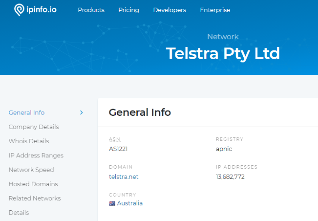
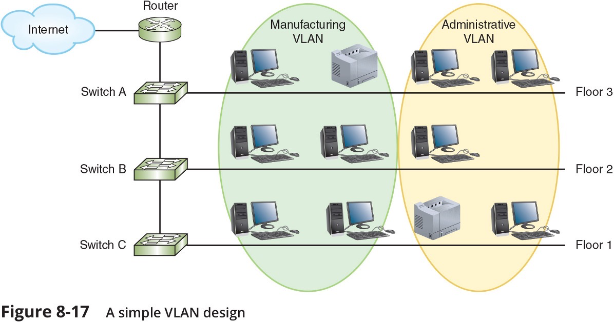
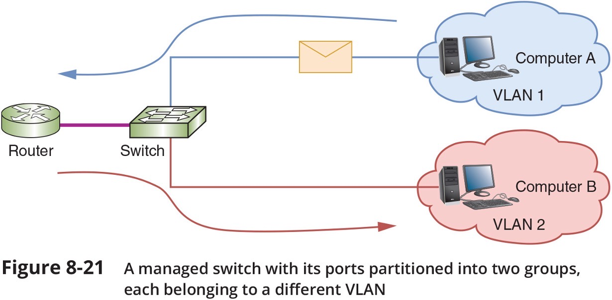

# 1-2 Network Models

## Network Models

- Topology describes how parts of a whole work together
- Physical topology mostly refers to a network’s hardware and how computers, other devices, and cables work together to form the physical network
- Logical topology refers to how software controls access to network resources
  - It includes how users and software initially gain access to the network
- A network operating system (NOS) controls access to the entire network
  - A NOS is required by client-server models

## Peer-to-Peer Network Model

- In a peer-to-peer (P2P) network model the OS of each computer on the network is responsible for controlling access to its resources
  - There is no centralised control
- Computers, called nodes or hosts, form a logical group of computers and users
  - Each computer controls its own administration, resources, and security
- Advantages
  - Simple configuration
  - Less expensive compared to other network models
- Disadvantages
  - Not scalable
  - Not necessarily secure
  - Not practical for large installations
- Figure 1-1
  - In a peer-to-peer network, no computer has more authority than another; each computer controls its own resources and communicates directly with other computers​
    

## Client-Server Network Model

- Resources are managed by the NOS via a centralised directory database
- A Windows domain is a logical group of computers that a Windows Server can control
- **Active Directory (AD)**
  - is the centralised directory database that contains user account information and security for the entire group of computers
  - A user can sign on to the network from any computer on the network and gain access to the resources that AD allows
    - This process is managed by **Active Directory Domain Services (AD DS)**
  - A computer making a request from another is called the **client**
- Figure 1-2

  - Client-Server Network Model
    - A Windows domain uses the client-server model to control access to the network, where security on each computer or device is controlled by a centralised database on a domain controller
      

## Client-Server Applications

- The NOS is responsible for:
  - Managing client data and other resources
  - Ensuring authorised user access
  - Controlling user file access
  - Restricting user network access
  - Dictating computer communication rules
  - Supplying applications and data files to clients
- Servers that have a NOS installed require:

  - More memory, processing power, and storage capacity
  - Equipped with special hardware to provide network management functions

- **Network services** are the resources a network makes available to its users
  - It includes applications and the data provided by these applications
- In **client-server applications**:

  - A client computer requests data or a service from a second computer, called the **server**

- Figure 1-3, Client-Server Applications
  - A web browser (client application) requests a web page from a web server (server application); the web server returns the requested data to the client
    

## Network Services and Their Protocols

- **Protocols** are methods and rules for communication between networked devices
- Two primary network protocols:
  - **TCP (Transmission Control Protocol)**
  - **IP (Internet Protocol)**
- Popular client-server applications include:
  - Web service
  - Email services
  - DNS service
  - FTP service
  - Database services
  - Remote access service
- Figure 1-5, **SMTP, POP3, IMAP4**
  - **SMTP** is used to send email to a recipient’s email server, and **POP3** or **IMAP4** is used by the client to receive email
    

# 1-3 NETWORK Hardware

## LANs and Their Hardware

- A **LAN (local area network)** is usually contained in a small space
- A **switch** receives incoming data from one of its ports and redirects it to another port or multiple ports
  - Will send the data to its intended destination
- The physical topology used by this network is called a **star topology**
  - All devices connect to one central device (usually a switch)
- A **NIC (network interface card)** is a network port used to attach a device to a network
  - Also called a **network adapter**
- A LAN can have several switches
- A **backbone** is a central conduit that connects the segments (pieces) of a network
- Figure 1-7, Network Hardware
  - This LAN has five computers, a network printer, a local printer, a scanner, and a switch, and uses a star topology
    
- Figure 1-11, LANs and Their Hardware

  - This local network has three switches and is using a hybrid topology
    

- Router

  - A **router** is a device that manages traffic between two or more networks
  - Can help find the best path for traffic to get from one network to another
  - Routers can be used in small home networks to connect the home LAN to the Internet
    - Called a SOHO (small office-home office) network
  - Industrial-grade routers can have several network ports, one for each network it connects to
  - Difference between router and switch:
    - A router is like a gateway between networks and belongs to two or more local networks
    - A switch belongs only to its local network
  - Figure 1-14

    - (a) A router stands between the LAN and the Internet, connecting the two networks;
    - (b) Home networks often use a combo device that works as both a switch and a router

    

## MANs and WANs

- A **WAN (wide area network)** is a group of LANs that spread over a wide geographical area
- A **MAN (metropolitan area network)** is a group of connected LANs in the same geographical area
  - Also known as a **campus area network (CAN)**
- MANs and WANs often use different transmission methods and media than LANs
- PAN (personal area network) is a much smaller network of personal devices
  - A network of personal devices such as your smartphone and your computer
- Other network types:
  - BAN (body area network)
  - SAN (storage area network)
  - WLAN (wireless local area network)
- Figure 1-17
  - A WAN connects two LANS in different geographical areas
    

# 1-4 Network Diagrams

## Network Diagrams

- Network diagrams are graphical representations of a network’s devices and connections
  - They may show physical layout, logical topology, IP address reserves, names of major network devices, and types of transmission media
- Network mapping - the process of discovering and identifying the devices on a network
  - Nmap – one of the most popular tools used for network mapping
  - Zenmap – Nmap’s GUI option
- Cisco Systems set the standard for diagram symbols used to represent network devices
  

  

## Labelling and Naming Conventions

- Tips for labelling and naming conventions:

  - Use names that are as descriptive as possible
  - Only include fields that are essential in identifying the device
  - Don’t overcomplicate the name with useless or redundant information
  - Use established naming conventions
  - Think big-picture-down-to-details

- Tips for labelling and naming conventions:

  - Consider any security risks from details included in your naming convention
  - Use colour-coded cables and use cable tags to identify each cable’s purpose
  - Label the ports and jacks that cables connect to
  - Where labels won’t fit on the device, draw a simple diagram of each device that indicates how each port is used
  - Use labels that are durable and are designed to stick to plastic and metal

  

  

# 2-1 OSI

## The Open Systems Interconnection Model (OSI Model)

## The Seven-Layer OSI Model

  

  

## Layer 7: Application Layer

- The **application layer** describes the interface between two applications, on separate computers
- Application layer protocols are used by programs that fall into two categories:
  - Provide services to a user, such as a browser and Web server
  - Utility programs that provide services to the system, such as SNMP (Simple Network Management Protocol) programs that monitor and gather information about network traffic
- Payload is the data that is passed between applications or utility programs and the OS

## Layer 6: Presentation Layer

- The presentation layer is responsible for reformatting, compressing, and/or encrypting data in a way that the receiving application can read
- Example:
  - An email message can be encrypted at the Presentation layer by the email client or by the OS

## Layer 5: Session Layer

- The session layer describes how data between applications is synched and recovered if messages don’t arrive intact at the receiving application
- The application, presentation, and session layers are intertwined
  - It is often difficult to distinguish between them
- Most tasks are performed by the OS when an application makes an API call to the OS
  - An API (application programming interface) call is the method an application uses when it makes a request of the OS

## Layer 4: Transport Layer

- The transport layer is responsible for transporting Application layer payloads from one application to another
- Two main Transport layer protocols are:
- **TCP (Transmission Control Protocol)**
  - makes a connection with the end host, checks whether data was received; called a connection-oriented protocol
- **UDP (User Datagram Protocol)**

  - does not guarantee delivery by first connecting and checking whether data is received; called a connectionless protocol

- Protocols add control information in an area at the beginning of the payload (called **header**)
- **Encapsulation** is the process of adding a header to the data inherited from the layer above
  The Transport layer header addresses the receiving application by a number called a port
- If a message is too large, TCP divides it into smaller messages called **segments**
  - In UDP, the message is called a datagram

## Layer 3: Network Layer

- The network layer is responsible for moving messages from one node to another until they reach the destination host.
- The principal protocol used by this layer is **IP (Internet Protocol)**
- IP adds its own network layer header to the segment or datagram
  - The entire network layer message is called a **packet**
- An **IP address** is an address assigned to each node on a network
  - The network layer uses it to uniquely identify each host
- IP relies on several routing protocols to find the best route for a packet to take to reach destination
  - ICMP and ARP are examples
- Network layer protocol will divide large packets into smaller packets in a process called **fragmentation**

## Layer 2: Data Link Layer

- Layers 2 and 1 are responsible for interfacing with physical hardware on the local network
  - Protocols at these layers are programmed into firmware of a computer’s NIC and other hardware
- Type of networking hardware or technology used on a network determine the data link layer protocol used
  - Ethernet and Wi-Fi are examples
- The data link layer puts control information in a data link layer header and at the end of the packet in a trailer
  - The entire data link layer message is called a frame
- A **MAC (Media Access Control) address** is also called a physical address, hardware address, or data link layer address
  - It is embedded on every network adapter

## Layer 1: Physical Layer

- The physical layer is responsible for sending bits via a wired or wireless transmission
- Bits can be transmitted as:
  - Wavelengths in the air
  - Voltage on a copper wire
  - Light (via fibre-optic cabling)

## Protocol Data Unit or PDU

- Protocol data unit (PDU) is the technical name for a group of bits as it moves from one layer to the next and from one LAN to the next
  - Technicians loosely call this group of bits a message or a transmission

## Summary of How the Layers Work Together

- Figure 1-30
  

# 2-2 Physical Transmission

## Transmission Basics

- Transmission techniques in use on today’s network are complex and varied
- This section covers:
  - Measurements that indicate network efficiency
  - Obstacles to good network performance

## Frequency, Bandwidth, and Throughput

- Frequency is typically measured in MHz or GHz, which indicates the number of times in a second that an electrical signal can change states
- Bandwidth is the amount of data that could be theoretically transmitted during a given period of time
- Throughput is the measure of how much data is actually transmitted during given time period
- New technologies such as modulation (sending data over an analogue signal) and encoding (converting data into a digital signal for transmission) offer methods for increasing theoretical bandwidth and effective data throughput given the same maximum frequency

## Transmission Flaws

- Noise is any undesirable influence degrading or distorting signal
  - Noise is measured in dB (decibels)
- Two common sources of noise include the following:
  - EMI (electromagnetic interference) is caused by motors, power lines, televisions, copiers, fluorescent lights, etc…
    - One type of EMI is RFI (radio frequency interference)
- Cross-talk occurs when the signal on one wire infringes on adjacent wire signal
  - Alien cross-talk occurs between two cables
  - Near end cross-talk (NEXT) occurs near source
  - Far end cross-talk (FEXT) occurs at the far end
- Attenuation is the loss of a signal’s strength as it travels away from source
- Signals can be boosted using a repeater, which regenerates a digital signal in its original form without noise previously accumulated
- Latency is the delay between signal transmission and receipt
  - Latency may cause network transmission errors
- The length of the cable affects latency, as does the existence of any intervening device
- RTT (round trip time) is the time for packet to go from sender to receiver, then back from receiver to sender
- If packets experience varying amounts of delay they can arrive out of order
  - A problem commonly called jitter or PDV (packet delay variation)

## Duplex, Half-Duplex, and Simplex

- NIC settings include the direction in which signals travel over the media and the number of signals that can traverse the media at any given time
  - These two settings are combined to create different methods of communication
- Full-duplex – Signals travel in both directions over a medium simultaneously
- Half-duplex – Signals may travel in both directions but only in one direction at a time
- Simplex – Signals may travel in only one direction and is sometimes called one-way or unidirectional, communication
- In Windows, use Device Manager to configure a NIC, including speed and duplex settings

  

## Multiplexing

- Multiplexing is a form of transmission that allows multiple signals to travel simultaneously over one medium
- To carry multiple signals, the medium’s channel is logically separated into multiple smaller channels, or subchannels
- Multiplexer (mux) is a device that combines many channel signals
  - It is required at the transmitting end of the channel
  - A demultiplexer (demux) separates the combined signals on the receiving end
  - Three types of multiplexing are used on copper lines:
    - TDM (Time division multiplexing) divides a channel into multiple time intervals
    - STDM (statistical time division multiplexing) assigns slots to nodes according to priority and need
    - FDM (Frequency Division Multiplexing) assigns different frequency band for each communications subchannel
- Three types of multiplexing are used on fiber-optic cable
  - WDM (Wavelength Division Multiplexing) carries multiple light signals simultaneously by dividing a light beam into different wavelengths or colors
  - DWDM (Dense Wavelength Division Multiplexing) increases the number of channels provided by normal WDM
  - CWDM (Coarse Wavelength Division Multiplexing) lowers cost by spacing frequency bands wider apart to allow for cheaper transceiver equipment

# Safety and Troubleshooting Network Problems

## Safety Procedures and Policies

- Network and computer technicians need to know how to protect themselves
  - As wells as protect sensitive electronic components
- This section takes a look at some best practices for safety

## Emergency Procedures

- Know the best escape route or emergency exit
- Fire Suppression Systems - have a fire suppression system in the data center that includes:
  - Emergency alert system
  - Portable fire extinguishers
  - Emergency power-off switch
- Ask yourself: Does the security system allow access during a failure (fail open) or deny access during the failure (fail close)?
- An SDS (safety data sheet) explains how to properly handle substances such as chemical solvents and how to dispose of them
- - Includes information such as identification, first-aid measures, fire-fighting measures, accidental release measures, handling and storage guidelines, exposure controls, and physical and chemical properties
- Electrical and tool safety is generally regulated by OSHA (Occupational Safety and Health Administration)
- OSHA guidelines when using power tools:
  - Wear PPE (personal protective equipment)
  - Keep all tools in good condition and properly store tools not in use
  - Use the right tool for the job and operate the tool according to the manufacturer’s instructions
  - Watch out for trip hazards, so you and others don’t stumble on a tool or cord
- Lifting Heavy Objects - follow these guidelines:
  - Decide which side of object to face so load is most balanced
  - Stand close to the object with your feet apart
  - Keep your back straight, bend knees and grip load
  - Lift with your legs, arms, and shoulders (not your back or stomach)
  - Keep the load close to your body and avoid twisting your body while you’re holding it
  - To put the object down, keep your back as straight as possible and lower object by bending your knees
- Protecting Against Static Electricity
  - Computer components are grounded inside a computer case
  - Grounding means that a device is connected directly to the earth
- Sensitive electronic components can be damaged by ESD (electrostatic discharge)
- Static electricity can cause two types of damage:
  - Catastrophic failure - destroyed beyond use
  - Upset failure - shorten the life of a component
- Before touching a component, ground yourself by:
  - Wearing an ESD strap around your wrist that clips onto the chassis or computer case
  - Touching the case before touching any component inside the case
  - Storing a component inside an antistatic bag
- In addition to protecting against ESD, always shut down and unplug a computer before working inside it

## Troubleshooting Network Problems

- Troubleshooting steps used by most expert networking troubleshooters:

1. Identify problem

- Gather information
- Identify symptoms
- Question users
- Determine if anything has changed

2. Establish theory of probable cause

- Question the obvious

3. Test theory to determine cause

- If theory confirmed, determine next steps
- If theory not confirmed, establish new theory or escalate

4. Establish action plan
5. Implement solution or escalate the problem
6. Verify full functionality

- Implement preventative measures if applicable

7. Document findings, actions, outcomes

  

# Infrastructure

## Components of Structured Cabling

- ANSI/TIA-568 Commercial Building Wiring Standard
  - Also known as structured cabling
- The wiring standard describes the best way to install networking media to maximise performance and minimise upkeep
- The principles apply no matter what type of media, transmission technology, or networking speeds are involved
- Structured cabling is based on a hierarchical design and assumes a network is based on the star topology

## From the Demarc to a Workstation

  
- Entrance Facility in Building A:
  - **EF (entrance facility)** – location where the incoming network (such as Internet) connects with the school or corporate network
  - **Demarc (demarcation point)** – the device that marks where a telecommunications service provider’s network ends and the organisation’s network begins
- Entrance Facility in Building A:

- MDF (main distribution frame) – the centralised point of interconnection for an organisation’s LAN or WAN (also called MC or main cross connect)
- Data room – an enclosed space that hold network equipment (also called data closet, data centre, equipment room, or telecommunications room)
- Rack – holds various network equipment
- Patch panel – a panel of data receptors which can be mounted to a wall or a rack

  - A patch panel provides a central termination point when many patch cables converge in a single location

  

  

  

- Entrance Facility in Building A (continued):

  - VoIP telephone equipment – **VoIP (Voice over IP)** is the use of any network to carry voice signals using TCP/IP protocols
  - In one or more data rooms you might find the following:
    - VoIP gateway
    - VoIP PBX
    - VoIP endpoints

- Data Room in Building B:
  - **IDF (intermediate distribution frame)** – provides an intermediate connection between the MDF and end-user equipment on each floor and in each building
- Work Areas in All Three Buildings:

  - Work area – encompasses workstations, printers, and other network devices
  - Wall jacks – the ANSI/TIA standard calls for each wall jack to contain at least one voice and one data outlet

   

   

- Rack Systems

  - Racks come in two-post and four-post varieties (though six-post racks are also available)
  - Racks may be wall- or ceiling-mounted, freestanding on the floor, or bolted to the floor
  - Consider the following when purchasing racks:
    - Height – rack height is measured in rack units (RU or U) with the industry standard being 42U tall
    - Width – equipment racks come in a standard 19-inch frame (19 inches wide)
    - Depth – rack depths vary between manufacturers
  - In data centres containing multiple rows of racks, a hot aisle/cold aisle layout pulls cool air from vents in the floor or from low-lying wall vents into rows of racks (see Figure 2-14)

       

       

# 3-2 Cabling

##

- Types of Cables

  - Patch cable – a relatively short length of cabling with connectors at both ends
  - Horizontal cabling – connects workstations to the closest data room and to switches housed in the room
  - Backbone cabling – consists of cables or wireless links that provide interconnection between the entrance facility and MDF and between MDF and IDFs
  - Many network problems are the result of poor cable installations

    - Pay close attention to the quality of cable connections and cable management

- Horizontak cabling from a switch in a dataroom to workstations
  
- A typical cabling installation
  

- Cable Management
  - Termination – when terminating twisted-pair cabling, don’t leave more than 1 inch of exposed cable before a termination
  - Bend radius – do not exceed the cable’s prescribed bend radius, which is the radius of the maximum arc into which you can loop a cable without impairing data transmission
  - Continuity – use a cable tester to verify that each cable segment transmits data reliably
  - Loosely cinch cables
  - Cable coverings and conduits – avoid laying cables across a floor and use cord covers if they must be exposed
  - EMI sources – install cable at least 3 feet away from fluorescent lights or other sources of EMI (electromagnetic interference)
  - Plenum cabling – if running cable in the plenum (the area above the ceiling tile or below subflooring), make sure the cable sheath is plenum-rated
  - Grounding - pay attention to grounding requirements
  - Slack in cable runs
  - Cable trays - use cable management devices such as cable trays, braided sleeving, and furniture grommets
  - Patch panels - use patch panels to organise and connect lines
  - Company standards and inventory
  - Documentation
    - Keep your cable plant documentation accessible
    - Label every data jack or port, patch panel and connector
    - Use color-coded cables for different purposes
    - Update your documentation as you make changes to the network

# 3-3 Ethernet

## Ethernet

- Ethernet is the most important data link layer standard
  - It is capable of running on a variety of network media
  - Ethernet offers excellent throughput at a reasonable cost
  - It is the most popular network technology used on modern LANs
- Ethernet II is the current standard
- Ethernet adds both a header and a trailer to the payload
  - This creates a frame around the payload
- The header and FCS make up the 18-byte “frame” around the data
- The data portion of an Ethernet frame may contain from 46 to 1500 bytes
- MTU (maximum transmission unit) is the largest size that routers in a message’s path will allow at the Network Layer
  

## Ethernet and the OSI Model

- Ethernet operates in two areas of the OSI model:
- the lower half of the data link layer, known as the MAC sub layer
  and the physical layer
  

## Data link layer – Two Sub-layers

- **Logical link Control (LLC)** : (IEEE 802.2)

  - The Logical Link Control (LLC) sublayer remains relatively independent of the physical equipment
  - Provides an interface between the MAC layer and the Network layer independent of the hardware

- Media Access Control (MAC): (part of IEEE 802.3)
  - The MAC sub-layer is concerned with the physical components that will be used to communicate the information
  - Which computer can access the network when multiple computers are trying to access it simultaneously
  - Physical addressing (MAC addresses) and access control methods.

## Ethernet Frames

  

  

  

## Types of Ethernet

- 10-Mbps Ethernet
- 100 Mbps Fast Ethernet
- Gigabit Ethernet
- 10 Gigabit Ethernet

- 10BASE5, 10BASE2, and 10BASE-T Ethernet are now considered Legacy Ethernet

## IEEE Ethernet Standards

- IEEE 802 Committee Standards:
  - 802.1 - Standards introduction
  - 802.2 - Logical Link Control (LLC)
  - 802.3 - Ethernet
  - 802.4 - Token Bus - 75 ohm CATV coax or Fibre
  - 802.5 - Token Ring
  - 802.6 - MAN (Metropolitan Area Network) - similar to FDDI
  - 802.7 - Broadband
  - 802.8 - Fibre Optics
  - 802.9 - Integrated Voice and Data
  - 802.10 - LAN Security
  - 802.11 - Wireless
  - 802.12 - 100 VG AnyLAN
  - 802.15 - Bluetooth
  - 802.16 - WiMax

## Ethernet performs three functions:

- Transmitting and receiving data frames

  - Uses CSMA/CD (non-deterministic)
  - Carrier Sense Multiple Access / Collision Detection

- Decoding data frames and checking them for valid MAC addresses

  - before passing them to the upper layers of the OSI model

- Detecting errors within data frames or on the network
  - Note that Ethernet performs error detection but NOT error correction
  - Any frame with an incorrect checksum is an error
  - Also, any frame under 64 bytes in length is an error

## Ethernet

- Ethernet was originally designed to work on networks with a shared medium
  - physical bus topology
  - star topology created with a hub
- If multiple nodes attempt to communicate at the same time, the signals will interfere
  - called a **collision**
- **CSMA/CD** is used for controlling access to the shared medium

# 4-1 IP Address

## Addressing Overview

### There are four addressing methods:

- Data link layer MAC (Media Access Control) address is 48 bits, written as six hex numbers separated by colons
  - It is also called a physical address
  - MAC addresses are embedded on every NIC in the world
- Network layer IP (Internet Address) address can be used to find any computer in the world
  - IPv4 addresses have 32 bits and are written as four decimal numbers called octets
  - IPv6 addresses have 128 bits and are written as eight blocks of hexadecimal number
- Transport layer port numbers are used to find applications
- Application layer FQDNs, computer names, and host names
  - Fully qualified domain name (FQDN) – a unique character-based name

## MAC Addresses

- Traditional MAC addresses contain two parts
  - The first 24 bits are known as the OUI (Organizationally Unique Identifier) or manufacturer-ID
    - This part is assigned by the IEEE
  - The last 24 bits make up the extension identifier or device ID
    - Manufacturer’s assign each NIC a unique device ID
- Switches use MAC addresses to identify devices on the local area network
- Figure 3-3 The switch learns the sending devices MAC address

  

## IP Addresses

- Static IP addresses are assigned manually by the network administrator
- Dynamic IP addresses are automatically assigned by a DHCP server
  - You’ll learn more about DHCP later in the chapter
- There are two types of IP addresses:
  - IPv4 is a 32-bit address
  - IPv6 is a 128-bit address

## IPv4 Addresses

- A 32-bit IPv4 address is organized into four groups of 8 bits each (known as octets)
  - Each of the four octets can be any number from 0 to 255
  - Some IP addresses are reserved
- Example of an IPv4 address: 72.56.105.12
- Classful addressing
  - The dividing line between the network and host portions is determined by the numerical range the IP address falls in
- Classful IPv4 addresses are divided into five classes:

  - Class A, Class B, Class C, Class D, and Class E

- Class A, B, and C licensed IP addresses are available for use on the Internet
  - These are called public IP addresses
- A company can use private IP addresses on its private networks
- The IANA recommends the following IP addresses be used for private networks:

  - 10.0.0.0 through 10.255.255.255
  - 172.16.0.0 through 172.31.255.255
  - 192.168.0.0 through 192.168.255.255

- Classless addressing allows the dividing line between network and host portions to fall anywhere along the string of binary bits in an IP address
- CIDR (Classless Interdomain Routing) notation takes the network ID or a host’s IP address and follows it with a forward slash (/) followed by the number of bits that are used for the network ID

- Network Address Translation (NAT) is a technique designed to conserve public IP addresses needed by a network
- Address translation is a process where a gateway device substitutes the private IP addresses with its own public address
  - When these computers need access to other networks or Internet
- Port Address Translation (PAT) is the process of assigning a TCP port number to each ongoing session between a local host and Internet host

- Two variations of NAT to be aware of:

  - SNAT (Source Network Address Translation) - the gateway assigns the same public IP address to a host each time it makes a request to access the Internet
  - DNAT (Dynamic Network Address Translation) - the gateway has a pool of public address that it is free to assign to a local host when it makes a request to access the Internet

- Figure 3-12 PAT(Port Address Translation)

  

## IPv6 Addresses

- An IPv6 address has 128 bits written as eight blocks of hexadecimal numbers separated by colons

  - Ex: 2001:0000:0B80:0000:0000:00D3:9C5A:00CC
  - Each block is 16 bits
  - Leading zeros in a four-character hex block can be eliminated
  - If blocks contain all zeroes, they can be written as double colons (::), only one set of double colons is used in an IP address
  - Therefore, above example can be written two ways:
    - 2001::B80:0000:0000:D3:9C5A:CC
    - 2001:0000:B80::D3:9C5A:CC (this is the preferred method because it contains the fewest zeroes)

- IPv6 terminology:
  - A link (sometimes called local link) is any LAN bounded by routers
  - Neighbours are two or more nodes on the same link
  - Dual stacked is when a network is configured to use both IPv4 and IPv6
  - Tunnelling is a method used by IPv6 to transport IPv6 packets through or over an IPv4 network
  - Interface ID is the last 64 bits or four blocks of an IPv6 address that identify the interface

## Types of IPv6 Addresses

- Unicast address - specifies a single node on a network
  - Global address can be routed on the Internet
  - Link local address can be used for communicating with nodes in the same link
  - Loopback address can be used to test that an interface and supporting protocol stack are functioning properly
- Multicast address – delivers packets to all nodes on a network
- Anycast address - can identify multiple destinations, with packets delivered to the closest destination

- Figure 3-16 Three types of IPv6 addresses

    

- Figure 3-18 The ipconfig command shows IPv4 and IPv6 addresses assigned to this computer

    

- IPv6 autoconfiguration
  - IPv6 addressing is designed so that a computer can autoconfigure its own link local IP address
  - This process is called SLAAC (stateless address autoconfiguration)
- Step 1 - The computer creates its IPv6 address
  - It uses FE80::/64 as the first 64 bits (called prefix)
  - The last 64 bits are generated from the network adapter’s MAC address
- Step 2 - The computer checks to make sure its IP address is unique on the network
- Step 3 - The computer asks if a router on the network can provide configuration information
  - This message is called an RS (router solicitation) message

# 4-2 DNS

The Domain Name System (DNS)

## Ports and Sockets

- A port is a number assigned to a process that can receive data
  - Port numbers ensure data is transmitted to the correct process among multiple processes running on a single device
- A socket consists of host’s IP address and the port number of an application running on the host
  - A colon separates the two values
  - Example - 10.43.3.87:23
- Port numbers are divided into three types:
  - Well-known ports - 0 to 1023
  - Registered ports - 1024 to 49151
  - Dynamic and private ports - 49152 to 65535
- Figure 3-19 A virtual connection for the Telnet service

    

## Domain Names and DNS

- Character-based names are easier to remember than numeric IP addresses
- A URL (uniform resource locator) is an addressing scheme that identifies where to find a particular resource on a network
- Last part of an FQDN is called the top-level domain (TLD)
- Domain names must be registered with an Internet naming authority that works on behalf of ICANN
  - ICANN restricts what type of hosts can be associated with .arpa, .mil, .int, .edu, and .gov
- Name resolution is the process of discovering the IP address of a host when you know the FQDN

- DNS is an Application layer client-server system of computers and databases made up of these elements:
  - Namespace - the entire collection of computer names and their associated IP addresses stored in databases on DNS name servers around the globe
  - Name servers - hold databases, which are organised in a hierarchical structure
  - Resolvers - a DNS client that requests information from DNS name servers

## Namespace Databases

- Each organisation that provides host services is responsible for providing and maintaining its own DNS authoritative servers for public access
  - An authoritative name server is the authority on computer names and their IP addresses for computers in their domains
- The domains that the organisation is responsible for managing are called a DNS zone

## Name Servers

- Four common types of DNS servers:

  - Primary DNS server – the authoritative name server for the organisation
    - Holds the authoritative DNS database for the organisation’s zones
  - Secondary DNS server – backup authoritative name server for the organisation
  - Caching DNS server – accesses the public DNS data and caches the DNS information it collects
  - Forwarding DNS server – receives queries from local clients but doesn’t work to resolve the queries

- Any of these DNS server types can co-exist on the same machine
- DNS name servers are organised in a hierarchical structure
- At the root level, 13 clusters of root DNS servers hold information used to locate top-level domain (TLD) servers

- Figure 3-21 Hierarchy of name servers

    

- Figure 3-22 Queries for name resolution of www.mdc.edu

    

- Ways the resolution process can get more complex:
  - A caching server typically is not the same machine as the authoritative server
    - The caching server exists only to resolve names for its own local clients
  - Name servers within a company might not have access to root servers
  - A TLD name server might be aware of an intermediate name server rather than the authoritative name server
- Two types of DNS requests:
  - Recursive lookup – a query that demands a resolution or the answer “It can’t be found”
  - Iterative lookup – a query where the local server issues queries to other servers
    - Other servers only provide information if they have it
    - Do not demand a resolution

## Resource Records in a DNS Database

- Several types of records, called resource records are kept in a DNS database:
  - SOA (start of authority) record – gives information about the zone
  - A (address) record – stores the name-to-address mapping for a host
  - AAAA (address) record – holds the name-to-address mapping, the IP address is an IPv6 type IP address
  - CNAME (canonical Name) record – holds alternative names for a host
    -Several types of records, called resource records are kept in a DNS database:
    -PTR (pointer) record – used for reverse lookups
    -NS (name Server) record – indicates the authoritative name server for a domain
    -MX (mail exchanger) record – identifies a mail server and is used for email traffic
    -SRV (service) record – identifies the hostname and port of a computer that hosts a specific network services besides email
    -TXT (text) record – holds any type of free-form text

## DNS Server Software

- BIND (Berkeley Internet Name Domain) is the most popular DNS server software
  - Open source - the term for software whose code is publicly available for use and modification
- Microsoft DNS Server is a built-in DNS service in the Windows Server OS
- Windows Server is capable of split-brain or split-horizon deployment, which is used to handle internal clients and external clients

# Addressing issues

## Troubleshooting Address Problems

- Figure 3-24 Event Viewer provided the disgnoisis of a printer problem and recommended steps to fix the problem

    

## Troubleshooting Tools

- Command-line tools are a great resource to troubleshoot network problems
- ping (Packet Internet Groper) utility is used to verify that TCP/IP is:
  - Installed
  - Bound to the NIC
  - Configured correctly
  - Communicating with the network
- The ping utility sends out a signal called an echo request to another device (request for a response)
  - The other computer responds in the form of an echo reply
- ICMP (Internet Control Message Protocol) is the protocol used by the echo request/reply to carry error messages and information about the network

- IPv6 networks use a version of ICMP called ICMPv6
  - ping6 – on Linux computers running IPv6, use ping6 to verify whether an IPv6 host is available
  - ping -6 – on Windows computers, use ping with the -6 switch to verify connectivity on IPv6 networks
- For the ping6 and ping -6 commands to work over the Internet, you must have access to the IPv6 Internet

- The ipconfig command shows current TCP/IP addressing and domain name information on a Windows computer
- Use ipconfig/all to see a more complete summary of TCP/IP addressing information
- Figure 3-29 ipconfig/all gives more information than ipconfig by itself

    

- Use the ip utility to view and manage TCP/IP settings
- The ip utility is only available on UNIX and Linux systems
- Any ip commands that change the state of a link require elevated privileges
  - This is accomplished by logging in as the root user or by temporarily elevating the current user's privileges with the sudo (superuser do) command
- ifconfig is a similar utility used to view and manage TCP/IP settings
- If your Linux or UNIX system provides a GUI
  - Open a shell prompt, then type ifconfig
- Figure 3-32 Use hostname to view or change a device's host name

    

- The nslookup (name space lookup) utility allows you to query the DNS database from any computer on a network
  - To find the host name of a device by specifying its IP address, or vice versa
  - It is useful for verifying a host is configured correctly or for troubleshooting DNS resolution problems
- Reverse DNS lookup - to find the host name of a device whose IP address you know
  - nslookup 69.23.208.74
- The nslookup utility is available in two modes:
  - Interactive - to test multiple DNS servers at one time
  - Noninteractive - test a single DNS server
- You can change DNS servers from within interactive mode with the server subcommand and specifying the IP address of the new DNS server
- To exit nslookup’s interactive mode, enter exit

- The dig (domain information groper) utility is available on Linux and macOS
  - Provides more detailed information than nslookup and uses more reliable sources of information to output its results
- Use dig to query DNS nameservers for information about host addresses and other DNS records
- An IP scanner can be used to gather information about all devices connected to a network

## Common Network Issues

- Incorrect time
  - Check a domain computer’s time source from a Command Prompt window by entering w32tm /query /source
- DHCP Issues
  - If you are getting DHCP errors or if multiple clients are having trouble connecting to the network, try the following:
    - Check the settings on your DHCP server
    - Make sure the DHCP scope is large enough to account for the number of clients the network must support
  - Consider implementing a shorter lease time on larger networks
    -Network Connection Configuration Issues
    -Common configuration errors:
    -Incorrect IP address
    -Duplicate IP address
    -Incorrect subnet mask
    -Incorrect gateway
    -Incorrect DNS or DNS issues
    -When a computer is struggling to establish a network connection
    -Check its TCP/IP configuration settings
    -If the computer is not obtaining an IP address and related information from a DHCP server
    -Static settings might be using the wrong information
    -Try switching to DHCP

# 5-1 TCP/IP

Transmission Control Protocol/Internet Protocol

## TCP/IP Core Protocols

- TCP/IP is a suite of protocols including:
  - TCP, IP (IPv4 and IPv6), UDP, ARP, and many others
- TCP/IP protocols add a header to data inherited from the layer above it
- Layers 7, 6, and 5 - Data and instructions, known as payload, are generated by applications running on source host
- Layer 4 – A Transport Layer protocol, usually TCP or UDP, adds a header to the payload

  - Includes a port number to identify the receiving app

- Layer 3 - Network layer adds it own header and becomes a packet
- Layer 2 - packet is passed to Data Link layer on NIC, which encapsulates data with its own header and trailer, creating a frame
- Layer 1 - Physical layer on the NIC receives the frame and places the transmission on the network
- Figure 4-1 Each layer adds its own data and addresses its transmission to the corresponding layer in the destination device

    

- The receiving host decapsulates the message at each layer in reverse order and presents payload to the receiving applications
  - In transit, transmissions might pass through a number of connectivity devices
- Connectivity devices are specialised devices that allow two or more networks or multiple parts of one network to connect and exchange data
  - Known by the highest OSI layer they read and process

## Transport Layer

- Figure 4-17 Core, edge, and exterior routers

    

## TCP (Transmission Control Protocol)

- TCP operates in the transport layer of OSI model
- Three characteristics of TCP:
  - Connection-oriented - TCP ensures that a connection or session is established by using a three-step process called a three-way handshake
  - Sequencing and checksums - TCP sends a character string called a checksum that is checked by the destination host along with a sequence number for each segment
  - Flow control - gauges rate of transmission based on how quickly recipient can accept data
- Fig 4-3 A TCP segment
  
- The TCP three-way handshake establishes a session before TCP transmits actual data

  - Three transmissions are sent before data transmission:
    - Step 1 – a request for a connection (SYN)
    - Step 2 – a response to the request (SYN/ACK)
    - Step 3 – a connection is established (ACK)
  - After the three initial messages, the payload or data is sent
  - Sequence numbers will be increased by the number of bits included in each received segment
    - Confirms the correct length of message was received
  - Figure 4-4 the thress-way handshake process establishes a TCP session

      

## UDP (User Datagram Protocol)

- UDP is an unreliable, connectionless protocol
  - No three-way handshake is performed
  - UDP does not guarantee delivery of data
- UDP provides no error checking, sequencing, or flow control
  - This makes UDP more efficient than TCP
- Useful for live audio or video transmissions over the Internet
- Also, more efficient for carrying messages that fit within one data packet
- A UDP header contains only four fields: Source port, Destination port, Length, and Checksum
  - Use of Checksum field in UDP is optional in IPv4, but required in IPv6

## IP (Internet Protocol)

- IP operates at the network layer of the OSI model
  - It specifies where data should be delivered
  - Identifies the data’s source and destination IP addresses
- IP enables TCP/IP to internetwork
  - To traverse more than one LAN segment and more than one type of network through a router
- IP is an unreliable, connectionless protocol
  - That means that IP does not guarantee delivery of data and no session is established before data is transmitted
- IP depends on TCP to ensure messages are put back together in the right order and to ensure each message reaches the correct application on the receiving host

- Figure 4-7 An IPv4 packet

    

- IPv6 Packets
- IPv6 uses a different packet format than IPv4
- IPv6 can accommodate the much longer IPv6 addresses
- There is no Fragment offset field
  - IPv6 hosts adjust their packet sizes to fit the requirements of the network before sending IPv6 messages

## ICMP (Internet Control Message Protocol)

- ICMP is a core network layer protocol that reports on the success or failure of data delivery
- ICMP can indicate the following:
  - When part of a network is congested
  - When data fails to reach its destination
  - When data has been discarded because the allotted TTL has expired
- ICMP announces transmission failures to the sender but does not correct errors it detects
- It provides critical information for troubleshooting network problems
- ICMPv6 on IPv6 networks performs the functions of ICMP and ARP on IPv4 networks

## ARP (Address Resolution Protocol) on IPv4 Networks

- ARP works in conjunction with IPv4 to discover the MAC address of a host or node on the local network
  - And to maintain a database that maps IP addresses to MAC addresses on the local network
- ARP is a Layer 2 protocol that uses IP in Layer 3 and relies on broadcasting

  - Operates only within its local network

- ARP table is the database of IP-to-MAC address mappings
- An ARP table can contain two types of entries:
  - Dynamic - created when a client makes an ARP request that could not be satisfied by data already in the ARP table
  - Static - those someone entered manually using the ARP utility (arp command)
- To view a Window’s workstation’s ARP table, enter the command:
  - arp -a
- Figure 4-13 the arp -a command lists devices on the network
  

# 5-2 Encryption Protocols

## Key Encryption

- A key is a random string of characters woven into original data’s bits
  - It generates unique data block called ciphertext
  - The key is created according to a specific set of rules (algorithms)
- Key encryption can be separated into two categories:
  - Private key encryption
  - Public key encryption
- Figure 4-15
  

## IPsec (Internet Protocol Security)

- IPsec is an encryption protocol suite that defines rules for encryption, authentication, and key management for TCP/IP transmissions
- IPsec creates secure connections in five steps:
  1. IPsec initiation
  2. Key management
  3. Security negotiations
  4. Data transfer
  5. Termination
- Operates in two modes:
  - Transport mode
  - Tunnel mode

## SSL (Secure Sockets Layer) and TLS (Transport Layer Security)

- Both SSL and TLS are methods of encrypting TCP/IP transmissions
- Both protocols work side by side and are widely known as SSL/TLS or TLS/SSL
- When a client and server establish an SSL/TLS connection, they establish a unique session which is an association between client and server
  - The session is defined by an agreement on a specific set of encryption techniques
  - A session is created by an SSL handshake protocol
- The handshake protocol allows client and server to authenticate
  - This handshake is similar to a TCP three-way handshake

# 5-3 Remote Access Protocols

## Remote Access Protocols

- Remote access is a service that allows a client to connect with and log on to a server, LAN, or WAN in a different geographical location
- Remote access requires a type of RAS (remote access server)
- There are two types of remote access servers:
  - Dedicated devices
  - Software running on a server
- Types of remote access include:
  - Remote file access
  - Terminal emulation, also called remote virtual computing
  - VPN (virtual private network)

## Remote File Access

- FTP (File Transfer Protocol) provides remote file access
- Three related technologies include the following:
  - FTPS (FTP Secure or FTP over SSL) offers an added layer of protection for FTP using SSL/TLS
  - SFTP (Secure FTP) is a file-transfer version SSH that include encryption and authentication for transferring files
  - TFTP (Trivial FTP) is a simple protocol similar to FTP except that it includes no authentication or security for transferring files

## Terminal Emulation

- A terminal emulator is software that allows a user on one computer (client) to control another computer (host or server)
- Examples of command-line software:
  - Telnet and SSH
- Examples of GUI-based software:
  - Remote Desktop for Windows
  - join.me
  - VNC
  - Team Viewer
- Telnet is a terminal emulation utility that allows an administrator or other user to control a computer remotely

  - It provides little security for establishing a connection (poor authentication)
  - It provides no security for transmitting data (no encryption)

- SSH (Secure Shell) is a collection of protocols that provides for secure authentication and encryption

  - Guards against a number of security threats
    - Unauthorised access to a host
    - IP spoofing
    - Interception of data in transit
    - DNS spoofing
  - Secure connection requires SSH running on both client and server
  - Allows for password authentication using public and private key generation

- Figure 4-20 On a Windows computer, use an app like PuTTY to create an SSH connection to another computer

    

- RDP (Remote Desktop Protocol) is a Microsoft proprietary protocol used to connect to and control a remote computer
- VNC (Virtual Network Computing) uses the cross-platform protocol RFB (remote frame buffer) to remotely control a workstation or server
  - VNC is open source so many companies have developed their own software that can:
    - Run OSes on client computers
    - Remotely access computers, tablets, and smartphones
    - Remotely control media equipment and surveillance systems

## VPNs (Virtual Private Networks)

- A VPN is a network connection encrypted from end to end that creates a private connection to a remote network
  - A VPN is sometimes referred to as a tunnel
- VPNs can be classified according to three models:
  - Site-to-site VPN
  - Client-to-site VPN
    - Also called host-to-site VPN or remote-access VPN
  - Host-to-host VPN
- To ensure VPNs can carry all types of data securely, special VPN protocols encapsulate higher-layer protocols in a process known as tunneling
- Many VPN tunneling protocols operate at the data link layer to encapsulate the VPN frame into a network layer packet
- Some VPN tunneling protocols work at Layer 3, which enables additional features and options
- Most tunnelling protocols rely on an additional encryption protocol to provide data security
- Common VPN tunnelling protocols include:
  - L2TP (Layer 2 Tunnelling Protocol)
  - GRE (Generic Routing Encapsulation)
  - Open VPN
  - IKEv2
- Figure 4-25 The VPN frame, such as GRE or L2Tp, is encapsulated inside the network layer packet
  
- Cisco developed a proprietary protocol called mGRE (multipoint GRE) that allows the configuration of multiple tunnel destinations on a single interface
- A type of enterprise VPN using Cisco devices is called DMVPN (Dynamic Multipoint VPN)
- DMVPN dynamically creates VPN tunnels between branch locations as needed rather than requiring constant, static tunnels for site-to-site connections

# Remote Access Policies

- Common requirements of a good remote access policy:

  - Remote access devices must be up to date with patches, anti-malware software, and a firewall
  - Device access must be controlled by a strong password or biometric measures
  - Passwords must be strong and must be changed periodically
  - The device’s internal and external storage devices must be encrypted

- Common requirements of a good remote access policy:
  - Company and customer data must be kept secure
  - The loss or theft of any devices used for remote access must be reported immediately
  - Encrypted VPN software must be used to remotely access company network resources
  - While remotely connected to the company network, the device must not be connected to the open Internet, or any other network not fully owned or controlled by the employee
  - Remote sessions must be terminated when not in use

# 5-4 Routing

## Routers and How They Work

- A router joins two or more networks and passes packets from one network to another
- Routers can do the following:
  - Connect dissimilar networks (LANs and WANs)
  - Interpret Layer 3 and often Layer 4 addressing
  - Determine the best path for data to follow from point A to point B
  - Reroute traffic if the path of first choice is down but another path is available
- Figure 4-16 ISP, business, and consumer routers

    

- Routers may perform any of the following optional functions:
  - Filter broadcast transmissions
  - Prevent certain types of traffic from getting to a network
  - Support simultaneous local and remote connectivity
  - Provide high network fault tolerance through redundant components such as power supplies
  - Monitor network traffic and report statistics
  - Diagnose internal or other connectivity problems and trigger alarms

## Routers and How They Work

- Router categories:

  - Core routers, also called interior routers—Direct data between networks within the same autonomous system (A S)
  - Edge routers, or border routers—Connect an autonomous system with an outside network
  - Exterior routers—Refers to any router outside the organisation’s A S
    - Direct data between autonomous systems
  - Figure 4-17

      

## Autonomous Systems

- An Autonomous System is a collection of networks under a common administration (a single organisation, ISP or systems administrator) and sharing a common routing strategy.
- Typically the world wide organisation ICANN, the ISP, or the administrator assigns a unique AS number to the Autonomous System.

  - The Autonomous System number uniquely distinguish it from other Autonomous Systems around the world.

  - Each Autonomous Systems has its own set of rules and policies.

- Interior/Exterior Routing Protocols

    

## Multilayer Switches

- Layer 3 switch—Capable of interpreting Layer 3 data and works much like a router:
  - Usually faster and less expensive
  - Primary difference is the way the hardware is built
- Layer 4 switch—Capable of interpreting Layer 4 data:
  - Also known as content or application switches
  - Enables switch to perform advanced filtering, keep statistics, and provide security functions
  - Typically used as part of a network’s backbone

## Routing Tables

- Routing table—A database that maintains information about where hosts are located and the most efficient way to reach them
  - Routers rely on them to identify which router is the next hop to reach a particular destination host
- Routing tables contain IP addresses and network masks that identify a network that a host or another router belongs to
- Figure 4-18 Routers rely on routing tables to locate destination hosts
  

## Routing Path Types

- Static routing—Network administrators configures a routing table to direct messages along specific paths
  - Example—A static route between a small business and its I S P
- Dynamic routing—Automatically calculates the best path between two networks and maintains this information in a routing table
  - Router can detect problems with failed or congested routes and reroute messages through a different path

## The route Command

- The route command allows you to view a host’s routing table:
  - On a Linux or UNIX system, use the command route
  - On a Windows-based system, use the command route print
  - On a Cisco I O S, use the command show ip route

## Routing Metrics

-Routing metrics—Properties of a route used by routers to determine the best path to a destination:
-Hop count
-Theoretical bandwidth and actual throughput
-Delay, or latency, on a potential path
-Load, or the traffic or processing burden
-M T U (maximum transmission unit) or the largest I P packet size in bytes allowable without fragmentation
-Routing cost, or a value assigned to a particular route
-Reliability of a potential path
-Topology of a network

# 6-1 Routing II

## Routing Protocols to Determine Best Paths

- Routing protocols—Used by routers to communicate with each other to determine the best path
- Routers rate the reliability and priority of a routing protocol’s data based on these criteria:

  - Administrative distance (A D)—A number indicating the protocol’s reliability
  - Convergence time—Time it takes to recognise a best path in the event of a change or network outage
  - Overhead—The burden placed on the underlying network to support the protocol

  

## Interior and Exterior Gateway Protocols

- I G P (interior gateway protocols)—Used by core routers and edge routers within autonomous systems and are often grouped according to the algorithms they use to calculate best paths:
- Distance-vector routing protocols—Calculate path on the basis of the distance to that destination
- Link-state routing protocols—Enables routers to communicate beyond neighbouring routers in order to independently map the network and determine the best path

- E G P (exterior gateway protocols)—Used by edge routers and exterior routers to distribute data outside of autonomous systems
  - The only E G P currently in use is B G P
- Figure 4-19 BGP is the only routing protocol that communicates across the internet

  

- OSPF (Open Shortest Path First)—An I G P and a link-state protocol used on interior or border routers

  - Introduced as an improvement to R I P
  - Characteristics:
    - Supports large networks—Imposes no hop limits (unlike R I P)
    - Uses a more complex algorithm for determining best paths
    - Shared data—Maintains a database of other routers’ links
    - Low overhead, fast convergence—Demands more memory and C P U power for calculations, but keeps network bandwidth to a minimum and provides a very fast convergence time
    - Stability—Uses algorithms that prevent routing loops
    - Multi-vendor routers—Supported by all modern routers

- IS-IS (Intermediate System to Intermediate System)—An I G P and link-state routing protocol:

  - Uses a best-path algorithm similar to O S P F
  - Is designed for use on core routers only (unlike O S P F)
  - Not handcuffed to I P v 4 (like O S P F) so it’s easy to adapt to I P v 6
  - Service providers generally prefer I S-I S because it’s more scalable than O S P F

- EIGRP (Enhanced Interior Gateway Routing Protocol)—An advanced distance-vector protocol that combines some of the features of a link-state protocol

  - Often referred to as a hybrid protocol
  - Fast convergence time and low network overhead
  - Easier to configure and less C P U-intensive than O S P F
  - Supports multiple protocols and limits unnecessary network traffic between routers
  - Originally proprietary to Cisco routers

- BGP (Border Gateway Protocol)—The only current E G P and is known as the “protocol of the Internet”
  - Can span multiple autonomous systems
  - A path-vector routing protocol that communicates via B G P-specific messages that travel between routers
  - Determines the best paths based on many different factors
  - Can be configured to follow policies that might avoid a certain router or instruct a group of routers to prefer a particular route
  - The most complex of the routing protocols

## ARP Tables and Routing Tables

  

## Routing – Role of Layer 2 and Layer 3 Addressing

- Remember: Regardless of the routing protocol, packets travel across each individual link in a new frame of the appropriate format for the protocol running over that link.

  1. From Host A to the router FastEthernet interface: Ethernet frame
  2. Over the serial link on the left router to the right router: HDLC frame
  3. From the router FastEthernet interface to Host D: Ethernet frame

  

## Forwarding an IP Packet

- When a frame is received at a router interface.
- The MAC address is checked to see if the frame is either addressed to the router interface or is a broadcast
- The frame header and trailer are removed, and the packet is passed up to Layer 3
- The routing table is examined to check for a match with the destination IP address of the packet
- A match will identify the IP address of the directly connected next hop interface.
- The next hop IP is only used to look up the MAC address of the next hop interface in the ARP table to construct a frame
- The packet is placed into the new frame with the MAC address of the next hop interface as the destination address
- The frame is queued on the appropriate outgoing interface until it is transmitted

    

# 6-2 Subnet Mask

## Network Segmentation

- When a network is segmented into multiple smaller networks, the following occurs:
  - Traffic on one network is separated from another network’s traffic
  - Each network is its own broadcast domain
- Segmentation accomplishes the following goals:

  - Enhance security
  - Improve performance
  - Simplify troubleshooting

- Networks are commonly segmented according to one of the following groupings:

  - Geographic locations
  - Departmental boundaries
  - Device types

- Figure 8-1 Network segmentation divids a large broadcast domain into smaller broadcast domains

    

## Why Subnets?

- Example: A business has grown from 20-30 computers to having a few hundred computers on three floors
  - There is only a single LAN or broadcast domain
  - One router serves as the default gateway for the entire network
- To better manage network traffic, segment the network so that each floor contains one LAN, or broadcast domain

- Figure 10-1 A single LAN with several switches and a router

    

- Figure 10-2 A separate subnet for each floor

    

## Subnet Masks

- Example: A business has grown from 20-30 computers to having a few hundred computers and devices
  - There is only a single LAN or broadcast domain
  - One router serves as the default gateway for the entire network
- To better manage network traffic, segment the network so that each floor contains one LAN, or broadcast domain
- You will need to configure clients on each subnet, so they know which devices are on their own subnet
  - Divide the pool of IP addresses into three groups or subnets (a technique called subnetting)
- Figure 8-4 A separate subnet for each floor

    

## How Subnet Masks Work

- An IPv4 address is divided into two parts: a network ID and a host ID
- A subnet mask is used so devices can determine which part of an IP address is the network ID and which part is the host ID
  - The number of 1s in the subnet mask determines the number of bits in the IP address belong to the network ID
  - IP address 192.168.123.132 in binary:
  -     11000000.10101000.01111011.10000100
  - Subnet mask 255.255.255.0 in binary:
  -     11111111.111111111.111111111.00000000
  - Network ID: 192.168.123.0
  - Host portion: 0.0.0.132

# 6-3 Calculating Subnet Masks

## Calculating Subnets

- Subnetting alters the rules of classful IPv4 addressing and is called classless addressing
- To subnet a network, you borrow bits that would represent host information in classful addressing
  - Use those bits instead to represent network information
    - By doing so, you increase the number of bits available for the network ID (increase the number of networks)
    - You also reduce the number of bits available for identifying hosts (decrease number of hosts per network)

## Subnet Mask Tables

- Class A, class B, and class C networks can all be subnetted
- Each class has a different number of host information bits that can be used for subnet information
- The number of hosts and subnets on your network will vary depending on your network class and the way you use subnetting

## Subnetting

- To create subnets, we reassign (or “borrow) host bits as network bits
- We always start at the leftmost host bit
- Suppose we wish to subnet class C network address 192.168.10.0

  

- we might borrow two host bits to create subnets

  

- Two questions for subnetting:
  - How many subnets do you need?
  - How many hosts per subnet do you need?
- If you borrow N bits for subnetting, and leave H bits for hosts, then you create:
  - 2N subnets, each consisting of 2H addresses
- 2 of the addresses are unusable for hosts
  - The subnet address – host bits set to all 0
  - The broadcast address – host bits set to all 1

### Subnet Mask

- We also need to determine the subnet mask
- We borrowed 2 bits from 192.168.10.0
- 24 network bits, 2 subnet bits, 6 host bits
  - NNNNNNNN.NNNNNNNN.NNNNNNNN.SSHHHHHH
- So, the mask is
  - 11111111.11111111.11111111.11000000
  - = 255.255.255.192 (note that 256 – 64 = 192)
  - More compactly: /26

## IPv4 Subnet Calculation in Binary

- Example: Create two subnet of network ID: 192.168.89.0 with an original subnet mask of 255.255.255.0
- Steps to subnet:

  1. Borrow from host bits
  2. Determine the subnet mask
  3. Determine the network IDs
  4. Determine the ranges of IP addresses for hosts in the subnet

- Table 8-4 Steps to divide IP addresses for network ID 192.168.89.0 into two subnets

  

## IPv4 Subnet Calculations Using Formulas

- Steps to subnet a network ID of 192.168.89.0 into six subnets using formulas:

  1. Decide how many bits to borrow
  2. Determine the subnet mask
  3. Calculate the network ID for each subnet
  4. Determine the IP address range for hosts in each subnet

- When calculating subnets, you’ll work with the following information:

  - Number of subnets
  - Number of host addresses per subnet
  - Network ID for each subnet
  - Broadcast address for each subnet
  - Range of possible host addresses within each subnet

- Table 8-5 Subnet information for eight possible subnets in a sample IPV4 Class C network

  

## Implementing Subnets on a Network

  

  

- A centrally managed DHCP server can provide DHCP assignments to multiple subnets with the help of DHCP relay agent
  - A DHCP relay agent programmed to support UDP forwarding on port 67 receives the DHCP request from a client in one of its local broadcast domains
  - The relay agent repackages the message with the IP helper information and routes this transmission to its new destination in a different broadcast domain
  - The DHCP server notes the relay agent’s source interface IP address and assigns the DHCP client an IP address on the same subnet

## Subnetting Example

- So, if we borrow 2 bits for subnets, and leave 6 bits for hosts

  - We have 22 = 4 subnets
  - Each with 26 = 64 addresses
  - And 64 - 2 = 62 usable host addresses

  

## Using the Subnet Mask to Extract the Subnet Address

  

- The router ANDs the subnet mask with the packet address to determine the subnet address

- From the destination IP address of 192.168.10.71 the router will determine that the host is on the 192.168.10.64 subnet

## Example 1 - 200.1.1.0

- Scenario:

  - Company office has 150 nodes on one network
  - Requires security for a new business unit (50 nodes)
  - Need to improve performance on the overall network
  - Subnet using the main router.

  

- We need two subnets

  - So, we borrow 1 bit, as 21 = 2
  - Which leaves 7 host bits, for 27 = 128 addresses per subnet

    

    

# 7-1 VLSM

## VLSM (Variable Length Subnet Mask)

- **VLSM (Variable Length Subnet Mask)** allows subnets to be further subdivided into smaller and smaller groupings until each subnet is about the same size as the necessary IP address space
  - This is often referred to as “subnetting a subnet”
- To create VLSM subnets, you create the largest subnet first

  - Then, you create the next largest subnet, and the next one, and so on

- Figure 8-12 VLSM creats subnets of various sizes

  

- Figure 8-13 Actual subnet allocations

  

## Subnets in IPv6

- Subnetting in IPv6 is simpler than IPv4 in the following ways:
  - IPv6 addressing uses no classes
  - IPv6 does not use subnet masks
  - A single IPv6 subnet can supply 18,446,744,073,709,551,616 IPv6 addresses
- Subnetting helps administrators manage the enormous volume of IPv6 addresses
- An IPv6 address is commonly written as eight blocks of four hexadecimal characters and divided in the following ways:
  - The last four blocks identify the interface
  - The first four blocks identify the network and serve as the network prefix (also called the site prefix or global routing prefix)
  - The fourth hexadecimal block in the site prefix can be altered to create subnets
- Figure 8-14 Network prefix and interface ID in an IPV6 address

  

- Figure 8-16 The Subnet ID block can be used to identify subsites within an organization

  

# 7-2 Switch Port Configuration

## Virtual LANs (VLANS)

- A VLAN (virtual local area network) groups ports on a switch so that some of the local traffic on the switch is forced to go through a router
  - Doing this limits traffic to a smaller broadcast domain
- Reasons for using VLANs include the following:
  - Identify groups of devices whose data should be given priority handling
  - Isolate connections with heavy or unpredictable traffic patterns
  - Isolate groups of devices that rely on legacy protocols incompatible with the majority of the network’s traffic
  - Separate groups of users who need special security or network functions
  - Configure temporary networks
  - Reduce the cost of networking equipment
- Figure 8-17 A simple VLAN design

  

## Switch Port Configuration

- A managed switch can be configured via a CLI (command-line interface) or a web-based management GUI
  - VLANS can only be implemented through managed switches whose ports can be partitioned into groups
- By sorting traffic based on layer 2 information, VLANs create two or more broadcast domains from a single broadcast domain
- Figure 8-19 Each port on a managed switch might be configured for a different VLAN

  

- Figure 8-21 A managed switch with its ports partitioned into two groups, each belonging to a different VLAN

  

- To identify the transmissions that belong to each VLAN, the switch adds a tag to Ethernet header that identifies the port through which messages arrive at the switch
- The tag travels with the transmission until it reaches one of the following:
  - The switch port connected to the destination device, if the destination device is connected to the same switch as the sending device
  - A router for routing to the correct VLAN, if the destination device is connected to a different switch
- If the frame is being routed to a new VLAN, the router adds a new tag
  - The tag is removed once the frame reaches its final switch port
- Figure 8-24 Three switches on a LAN with multiple VLANs

  

# 7-3 VLANS

## VLAN Trunks

- Each port on a switch that supports VLANs is configured as one of two types of VLAN ports:
  - Access port – connects the switch to a host
  - Trunk port – connects the switch to a networking device such as a router or another switch and manages traffic from multiple VLANs
- A trunk is a single physical connection between switches through which many logical VLANs can transmit and receive data
  - Trunking protocols assign and interpret VLAN tags in Ethernet frames
  - Cisco’s VTP (VLAN trunking protocol) is the most popular protocol for exchanging VLAN information over trunks
  - VTP allows changes to a VLAN database on one switch, called the stack master, to be communicated to all other switches in the network
- Figure 8-26 Each trunk lines carries traffic for multiple VLANs

  

## VLANs and Subnets

- In most situations, each VLAN is assigned its own subnet of IP addresses
- The sample network in Figure 8-27, on the following slide, is divided into subnets

  - The router sees three logical LANs connected to a single router port

- Figure 8-27 Three subnets are connected to a signle router interface

  

- Figure 8-28 One router interface is configured to support three different subnets

  

## Types of VLAN (1 of 2)

- Common VLAN types include the following:
  - Default VLAN – typically preconfigured on a switch and initially includes all switch ports
  - Native VLAN – receives all untagged frames from untagged ports
  - Data VLAN – carries user-generated traffic, such as email, web browsing, or database updates
  - Management VLAN – can be used to provide administrative access to a switch
  - Voice VLAN – supports VoIP traffic
  - Private VLAN – partitions a VLAN broadcast domain into subdomains
    - Two types of secondary VLANs are:
      - Isolated VLAN
      - Community VLAN
- Figure 8-29 A private VLAN restircts communication between members of the VLAN

  

## View Configured VLANs

- Once you create a VLAN, you maintain it via switch software
- Figure 8-30 illustrates the output of a show vlan command on a Cisco switch
  - This command is used to list the current VLAN recognized by a switch
- Figure 8-30 Output of the show vlan command on a Cisco switch

  

## Dynamic VLAN Assignment

- A device might receive a dynamic VLAN assignment according to the following:
  - Client device information, such as MAC address or location
  - Authentication processes in cooperation with a RADIUS server can be used to distinguish which traffic should be assigned to which VLANs
  - Devices that have not yet authenticated to the network or who authentication failed can be placed in a quarantine VLAN
  - All WLAN traffic might be grouped within the same VLAN

## Troubleshoot and Secure VLANs

- Common configuration errors include the following:
  - Incorrect VLAN assignment – can happen due to a variety of situations
  - Incorrect port mode – switch ports connected to endpoints should nearly always use access mode
  - VLAN isolation – you can potentially cut off an entire group from the rest of the network
- VLAN hopping occurs when an attacker generates transmissions that appear to belong to a protected VLAN
  - The attacker then crosses VLANs to access sensitive data or inject harmful software
- There are two approaches to VLAN hopping:
  - Double tagging
  - Switch spoofing
- Mitigation efforts to reduce the risk of VLAN hopping include the following:
  - Don’t use the default VLAN
  - Change the native VLAN to an unused VLAN ID
  - Disable auto-trunking on switches that don’t need to support traffic from multiple VLANs
  - On switches that carry traffic from multiple VLANs, configure all ports as access ports unless they are used as trunk ports
  - Specify which VLANs are supported on each trunk instead of accepting a range of all VLANs
  - Use physical security methods such as door locks to restrict access to network equipment

# 7-4 VLSM Variable-Length Subnet Masks

- Supernetting
  - Combine contiguous networks that all use the same CIDR block into one supernet
  - Also called classless routing or IP address segmentation
- Supernetting is helpful for two reasons:
  - Reduce the number of routing table entries by combining several entries
  - Allow a company to create a single network made up of more than one Class C license
- Figure 10-7 Superneetting reduces entries in router A's routing tables

  

- Example

  

# VLSM Subnetting

[VLSM Subnetting](week7/VLSM%20Subnetting.pdf)

## Supernetting

# 8-1 Characteristics of wireless networks

## Characteristics of Wireless Transmissions

- Wireless networks (WLANs) are networks that transmit signals through the air via RF (radio frequency) waves
- Wired and wireless signals share many similarities including the use of the same Layer 3 and higher protocols
- The nature of the atmosphere makes wireless transmission different from wired transmission

## The Wireless Spectrum

- The wireless spectrum is the frequency range of electromagnetic waves used for data and voice communication
  - The wireless spectrum spans frequency ranges or bands between 9 kHz and 300 GHz
- Some bands have only a single frequency (called a fixed frequency) for that band
- RFID

  - RFID (Radio Frequency Identification) uses electromagnetic fields to store data on a small chip in an RFID tag, which includes an antenna that can transmit and receive, and possibly a battery
    - RFID is commonly used for inventory management
  - NFC (near-field communication) is a form of RFID that transfers data wirelessly over very short distances

    - Signal can be transmitted one way by an NFC tag, or smart tag
    - The NFC tag collects power from the smartphone or other device by magnetic induction

  - Figure 6-1 These programmable NFC tags have sticky backs for attaching to a flat surface like a wall, des, or car dashboard

  

- Z-wave

  - Z-Wave is a smart home protocol that provides two basic types of functions:
    - Signaling to manage wireless connections and control to transmit data and commands between devices
  - A Z-Wave network controller (called a hub) receives commands from a smartphone or computer and relays the commands to various smart devices on its network

- ZigBee
  - ZigBee is a low-powered, battery-conserving wireless technology
    - It is designed to handle small amounts of data
    - Zigbee is used in IoT devices for purposes such as building automation, HVAC control, AMR (Automatic Meter Reading), and fleet management
- Bluetooth
  - Bluetooth technology unites separate entities under a single communication standard
    - Bluetooth hops between frequencies within that band to help reduce interference
    - Most Bluetooth devices require close proximity to form a connection, with the exact distance requirements depending on the class of Bluetooth device
- ANT+

  - ANT+ technology is based on the ANT protocol, which is an ad-hoc wireless protocol operating at about 2.4 GHz
  - ANT+ gathers and tracks information from sensors typically embedded in heart rate monitors, GPS devices, and other activity monitoring devices
  - ANT+ can also sync data from multiple devices for the same activity
    - Such as a smartwatch, smartphone, bicycle computer, or fitness equipment

- IR

  - IR (infrared) technology is used primarily to collect data through various sensors
    - IR exists just below the spectrum visible to the human eye
  - IR sensors are used to collect information such as the following:
    - Presence or level of liquid
    - Variations in reflections from skin caused by variations in blood flow
    - Proximity to the device
    - Commands from a control device

- Figure 6-4 The wireless spectrum

  

## Channel Management

- Most wireless devices implement one of two technologies:
  - FHSS (frequency hopping spread spectrum)
  - DSSS (direct sequence spread spectrum)
- How each wireless standard in the 2.4 GHz range uses its allotted band:
  - Wi-Fi uses DSSS
  - Bluetooth uses FHSS
  - ZigBee uses DSSS

## Antennas

- Wireless signals originate from electrical current traveling along a conductor
- The electrical signal travels from the transmitter to an antenna, which then emits the signal as a series of electromagnetic waves into the atmosphere
  - At the destination, another antenna accepts the signal and a receiver converts it back to current
- Two antennas must be tuned to the same frequency in order to use the same channel

- An antenna’s radiation pattern describes the relative strength over a three-dimensional area of all electromagnetic energy that antenna sends or receives
- Directional (unidirectional) antenna – Issues wireless signals along a single direction
- Omnidirectional antenna – Issues and receives wireless signals with equal strength, clarity in all directions
- The geographical area that an antenna can reach is known as its range

## Signal Propagation

- Propagation refers to the way in which a wave travels from one point to another
- LOS (line-of-sight) occurs when the signal travels in a straight line directly from transmitter to receiver
- Wireless signals do not usually follow a straight line
- When obstacles are in a signal’s way, the signal may:

  - Pass through the object
  - Be absorbed by the object

- Attenuation – the farther the signal moves away from the transmission source, the more it weakens

  - Wireless signals can be amplified by increasing the power of the transmission or extended by repeating the signal from a closer broadcast point called a wireless range extender

- Fading – as a signal runs into obstacles, its energy will gradually fade
  - Excessive fading can cause dropped connections or slow data transmission
- Interference – electromagnetic waves can interfere with wireless communications

  - Wireless signals are more vulnerable to noise
  - Signal-to-noise ratio (SNR) is the proportion of noise to the strength of a signal

- Refraction – as a wave travels through objects the wave’s direction, speed, and wavelength are altered (or refracted)
- Reflection – the wave encounters an obstacle and reflects, or bounces back toward its source
- Scattering – when a wireless signal encounters an object that has small surface dimensions compared with the signal’s wavelength, it’s diffused or scattered in multiple directions
- Diffraction – a wireless signal is diffracted, or split into secondary waves, when it encounters an obstruction
- Wireless signals follow different paths to destination, known as multipath signals

- figure 6-9 Multipath signal propagation

  

# 8-2 WLAN Standards

## 802.11 WLAN Standards

- WLANs work at OSI Layers 1 and 2
  - They support TCP/IP higher-layer OSI protocols and operating systems
- Most popular standards used by WLANs is referred to as Wi-Fi (wireless fidelity)
- Notable Wi-Fi standards

## 802.11 Innovations

- Several innovations have been implemented that contribute to making later 802.11 standards much faster and much more reliable:

  - Channel bonding – two adjacent 20-MHz channels can be bonded to make 40-MHz channel

    - It more than doubles the bandwidth available in single 20-MHz channel

  - MIMO (multiple input-multiple output) – multiple access point and client device antennas may issue signal to one or more receivers
    - MIMO increases range and a network’s throughput
  - MU-MIMO (multiuser MIMO) – a newer technology that allows multiple antennas to service multiple clients simultaneously
    - MU-MIMO reduces congestion and contributes to faster data transmission
    - MU-MIMO is available with WAVE 2 802.11ac products
  - OFDMA (Orthogonal Frequency Division Multiple Access) – supports more efficient multiuser functionality for 80211 ax devices
  - Frame aggregation combines multiple frames into one larger frame
    - Networks can use one of two techniques for combining multiple data frames:
      - A-MSDU (Aggregated Mac Service Data Unit)
      - A-MPDU (Aggregated Mac Protocol Data Unit)

- Figure 6-12 A-MSDU and A-MPDU aggregated frames

  

## Access Method

- 802.11 MAC services append 48-bit physical addresses to frame to identify source and destination
- The use of the same physical addressing scheme as other Ethernet networks allows easy combination with other IEEE networks
- Wireless devices are not designed to simultaneously transmit and receive

- 802.11 standards specify the use of CSMA/CA (Carrier Sense Multiple Access with Collision Avoidance) procedures to access a shared medium
  - Uses ACK packets to verify every transmission and requires more overhead than 802.3
- RTS/CTS (Request to Send/Clear to Send) protocol ensures packets are not inhibited by other transmissions

  - RTS/CTS decreases network efficiency, but can be efficient for large transmission packets

- Figure 6-13 CSMA/CA uses ACK messages to confirm successful transmission

  

## Association and Wireless Topologies

- Association is the process where packets are exchanged between computer and an access point in order to gain Internet access
- Scanning occurs when a wireless devices surveys its surroundings for an access point

  - In active scanning the wireless client takes the initiative by transmitting a special frame known as a probe
  - In passive scanning the AP takes the initiative
    - The wireless devices listens for special signal known as a beacon fame

- SSID (service set identifier) is a unique character string identifying an access point

  - The SSID is contained in the beacon frame information
  - The SSID is configured in the AP’s configuration utility, and it is recommended that it be changed from the default setting

- IEEE terms that reflect the most common wireless topologies include the following:
- IBSS (Independent basic service set) using an ad hoc topology – a small number of nodes closely positioned transmit directly to each other without an intervening connectivity device
- BSS (basic service set) using an infrastructure topology – a group of stations share an access point

  - The identifier for this group of nodes is known as a BSSID (basic service set identifier)

- ESS (extended service set) using a mesh topology – several access points are connected to same LAN network

  - These APs are configured and managed by a wireless LAN controller
  - Clients that belong to the same ESS share a special identifier called an ESSID (extended service set identifier)
  - The ESSID allows a user to roam, or change from AP to AP
    figure 6-17 A network with multiple BSSs form an ESS - devices can be moved from one room to the next without losing network connectivity

    

## IEEE 802.11 Frames

- 802.11 specifies a MAC sublayer frame type
- These frame types are divided into three groups:

  - Management frames – association and reassociation
  - Control frames – medium access and data delivery
    - Examples of control frames include ACK and RTS/CTS frames
  - Data frames – carry data sent between stations

- Figure 6-19 Basic 802.11 data frame compared with an 802.3 Ethernet II frame

  

# 8-3 Wi-Fi Design

## Implementing a Wi-Fi Network

- This section describes:
  - WLAN technologies and how to design small WLANs
  - How to install and configure access points and clients on larger networks

## Determine the Design

- Home or small office network, called a SOHO network, might call for only one access point
  - The AP device often combines switching, routing, and other network functions
  - It connects wireless clients to LAN and acts as an Internet gateway
- Many home or office networks include IoT (Internet of Things) devices
- Examples of IoT devices that might be a part of a home or office network include the following:

  - Health monitors, exercise equipment, GPS locators, and smartwatches
  - Smart speakers
  - Smart thermostats
  - Smart doorbells
  - Security cameras
  - Smart refrigerators

- Consider the following when deciding where to install an AP:
  - Distance
  - Type and number of obstacles
  - Coverage
  - Interference
- Larger WLANs warrant a more systematic approach to access point placement
- A site survey assesses client requirements, facility characteristics, coverage areas

  - A site survey will help determine access point arrangement ensuring reliable wireless connectivity within a given area

- A thorough site survey might include:

  - Studying building blueprints to identify potential obstacles
  - Consider whether Wi-Fi access points will be used as wireless bridges to create remote wired access to the network
  - Determine whether certain floors require multiple APs
  - Measure the signal coverage and strength from other WLANS
  - Test proposed access point locations
  - Test wireless access from the farthest corners of your space
  - Consider the materials used in objects that aren’t always present in the environment
  - Consider how the wireless portions of the LAN will integrate with the wired portions

- Figure 6-26 An enterprise-scale wireless network

  

## 

- APs vary in which wireless standards they support, their antenna strength, and other features
- Variables set during installation include the following:
  - Administrator password
  - SSID and whether or not the SSID is broadcast
  - Security options
  - Whether or not DHCP is used
- If something goes awry during your SOHO router configuration, you can force a reset of all the variables you changed

## Configure Wi-Fi Clients

- Configuration varies from one client type to another
- As long as an AP is broadcasting its SSID, clients in its vicinity will detect it and offer the user the option to associate with it
- On-boarding – involves installing a specific program or app onto a device to give it trusted access to certain portions of the network
- Off-boarding – involves removing programs that gave devices special permissions on the network
  - Administrators need a feature that allows them to off-board remotely (in case AP is lost or stolen)
    - This feature is called a remote wipe

# 8-4 Wi-Fi Security

## Wi-Fi Network Security

- By default, the 802.11 standard offers no security
- Authentication – allows a client to log on to the network either by providing the correct password for the SSID or by providing user credentials processed by an authentication server
  - MAC filtering prevents the AP from authenticating any device whose MAC address is not listed
- Encryption algorithms – scramble data into a format that cannot easily be interpreted if the signal is intercepted

## WPA (Wi-Fi Protected Access)

- WPA (Wi-Fi Protected Access) dynamically assigns every transmission its own key
- 802.11i incorporates an encryption key generation and management scheme known as TKIP (Temporal Key Integrity Protocol) to improve security for legacy WEP-based devices
- TKIP accomplished the following improvements:
  - Message integrity
  - Key distribution
  - Encryption

## WPA2 (Wi-Fi Protected Access, Version 2)

- WPA2 uses stronger data confidentiality methods
- CCMP, which is short for Counter Mode with CBC (Cipher Block Chaining) MAC (Message Authentication Code) Protocol, helps ensure data confidentiality with both encryption and packet authentication by providing the following:
  - Message integrity – ensures incoming packets are coming from their declared source
  - Encryption – uses AES (Advanced Encryption Standard), which provides faster and more secure encryption than TKIP

## Personal and Enterprise

- The most secure communication is made possible by combining a RADIUS server with WPA/WPA2
  - Known as WPA-Enterprise or WPA2-Enterprise
- RADIUS (Remote Authentication Dial-in User Service) is an open-source authentication and authorisation service
  - A RADIUS server is used in cooperation with an authentication mechanism called EAP
- EAP (Extensible Authentication Protocol) provides the framework for authenticating clients and servers
- EAP functions alongside RADIUS by organising communications with the network client devices, while RADIUS handles the actual authentication on the server

- Figure 6-28 EAP messaes are encapsulated in RADIUS messafes

## 

## Other Security Configurations

- Additional security options include the following:
  - AP and antenna placement
  - Geofencing
  - Guest network
  - Wireless client isolation
  - Captive portal
  - IoT access considerations

## Security Threats to Wi-Fi Networks

- War driving – a hacker searches for unprotected wireless networks by driving around with a laptop configured to receive and capture wireless data transmissions
- War chalking – hackers draw symbols with chalk on the sidewalk or wall near a vulnerable AP to make it known to other hackers

## Security Threats to Wi-Fi Networks

- Evil twin – a rogue AP planted in a network’s geological area to pose as an authorised AP
- WPA attack – involves an interception of the network keys communicated between stations and APs
  - Also called WPA cracking
- WPS attack – involves cracking a PIN in order to access an APs settings
  - The pin can be easily cracked through a brute force attack

## Wi-Fi Network Tools

- Two types of software tools you should have:
  - Spectrum analyser – a device that can assess the quality of the wireless signal
  - Wireless analyser (Wi-Fi analyser) – software that can evaluate Wi-Fi network availability, optimise Wi-Fi signal settings, and help identify Wi-Fi security threats

## Wi-Fi Network Tools

- List of capabilities common to wireless testing tools:
  - Identify transmitting access points, stations, and channels
  - Measure signal strength from an AP
  - Indicate the effects of attenuation, signal loss, and noise
  - Interpret signal strength information
  - Ensure proper association and reassociation between APs
  - Capture and interpret traffic
  - Measure throughput and assess data transmission errors
  - Analyse characteristics of each channel

## Avoid Pitfalls

- The following lists some wireless configuration pitfalls to avoid
- No connection – when you cannot get the Wi-Fi client to connect to the AP:

  - Wrong SSID
  - Encryption protocol mismatch
  - Incorrect passphrase
  - Static channel utilisation
  - Mismatched RF band
  - Mismatched standards
  - Long AP association time

- Slow connections – when dealing with slow Wi-Fi connections:
  - Insufficient wireless coverage
  - RF attenuation/signal loss
  - Interference
  - Channel overlap
  - Wireless standard specifications
  - Simultaneous wired and wireless connections
  - Problems with firmware updates
  - Incorrect antenna type
  - Mismatched antenna polarisation
  - Client saturation or overcapacity
  - Client disassociation issues

# 9-1 Wide Area Network (WAN) Essentials

## WAN Essentials

- A WAN traverses a significant distance and usually supports very high data throughput
- Type of WAN needed depends upon the following factors:
  - Traffic load, budget, geographic breadth, and commercially available technology
- WAN and LAN differences include the following:

  - LANs connect nodes; WANs connect networks spread over wide geographic area
  - Differ at Layers 1 and 2 access methods, topologies, media
  - Both LANs and WANs use the same protocols from Layer 3 and higher
  - LANs are typically privately owned
  - WANs are typically owned and operated by telcos, also known as NSPs (network service providers)
    - Examples include AT&T, Verizon, Spectrum, and Comcast

- Entry Point Equipment
- If you have DSL or cable Internet service, you cannot your home router to a modem
  - A modem is a demodulation device that converts digital and analog signals
- Data Terminal Equipment (DTE) is the customer’s endpoint device on the WAN
  - Communicates on the LAN and is usually owned by the customer

## Entry Point Equipment

- Data Communications Equipment (DCE) is the carrier’s endpoint device for the WAN
  - Communicates on the WAN and is usually owned by the ISP
- Equipment located on the customer’s premises is called CPE (customer premises equipment)
- Demarc (demarcation point) is the point where the carrier’s responsibility ends, and the customer’s responsibility begins

- Figure 9-2 A router and a modem define the endpoints where a LAN connects to a WAN

   

- The following are devices commonly found near the demarc:
  - NIU (network interface unit) – connects the ISP’s local loop to the customer’s network
  - Line driver – essentially a repeater that can boost the signal across greater distances
  - CSU/DSU (channel service unit/data service unit) – serves as the endpoint for a dedicated connection between an ISP and a customer

## Routing Protocols

- A router joins two or more networks and passes packets from one network to another
- Routers can do the following:

  - Connect dissimilar networks (LANs and WANs)
  - Interpret Layer 3 and often Layer 4 addressing
  - Determine the best path for data to follow from point A to point B
  - Reroute traffic if the path of first choice is down but another path is available

- Routers may perform any of the following optional functions:

  - Filter broadcast transmissions
  - Prevent certain types of traffic from getting to a network
  - Support simultaneous local and remote connectivity
  - Provide high network fault tolerance through redundant components
  - Monitor network traffic and report statistics
  - Diagnose internal or other connectivity problems and trigger alarms

- Router categories:

  - Core routers, also called interior routers, direct data between networks within the same autonomous system (AS)
  - Edge routers, or border routers, connect an autonomous system with an outside network
  - Exterior routers refers to any router outside the organisation’s AS
    - Direct data between autonomous systems

- Figure 9-4 Core, edge, and exterior routers

    

## Routing Tables

- A routing table is a database that holds information about where hosts are located and the most efficient way to reach them
  - Routers rely on them to identify which router is the next hop to reach a particular destination host
- Routing tables contain IP addresses and network masks that identify a network that a host or another router belongs to
- Figure 9-5 Routers rely on routing tables to locate destination hosts

    

## Routing Path Types

- Routing paths are determined in one of two ways
- Static routing – A network administrators configures a routing table to direct messages along specific paths
  - Example - a static route between a small business and its ISP
- Dynamic routing – A router automatically calculates the best path between two networks and maintains this information in a routing table
  - The router can detect problems with failed or congested routes and reroute messages through a different path

## Route

- The route utility allows you to view a host’s routing table
- The route command can also be used to add or delete static routes
- The following are some variations of the route command for different operating systems:
  - On a Linux or UNIX system, use the command route
  - On a Windows-based system, use the command route print
  - On a Cisco IOS, use the command show ip route

## Routing Metrics

- Routing metrics are properties of a route used by routers to determine the best path to a destination:
  - Hop count
  - Theoretical bandwidth and actual throughput
  - Delay, or latency, on a potential path
  - Load, or the traffic or processing burden
  - MTU (maximum transmission unit), or the largest IP packet size in bytes allowable without fragmentation
  - Routing cost, or a value assigned to a particular route
  - Reliability of a potential path
  - Topology of a network

## Routing Protocols to Determine Best Paths

- Routing protocols are used by routers to communicate with each other to determine the best path
- Routers rate the reliability and priority of a routing protocol’s data based on these criteria:
  - AD (administrative distance) – a number indicating the protocol’s reliability
  - Convergence time – the time it takes to recognise a best path in the event of a change or network outage
  - Overhead – the burden placed on the underlying network to support the protocol

## Interior and Exterior Gateway Protocols

- **IGPs (interior gateway protocols)** are routing protocols used by core routers and edge routers within autonomous systems and are often grouped according to the algorithms they use to calculate best paths:

  - **Distance-vector routing protocols** calculate path on the basis of the distance to that destination
  - **Link-state routing protocols** enables routers to communicate beyond neighboring routers in order to independently map the network and determine the best path

- EGPs (exterior gateway protocols) are used by edge routers and exterior routers to distribute data outside of autonomous systems

  - The only EGP currently in use is BGP

- Figure 9-6 BGP is the only routing protocol that communicates across the internet

    

- **OSPF (Open Shortest Path First)** is an IGP, and a link-state protocol used on interior or border routers

  - Characteristics include the following:
    - Supports large networks - imposes no hop limits (unlike RIP)
    - Complex algorithm – calculates a more efficient best path
    - Shared data – maintains a database of other routers’ links
    - Low overhead, fast convergence – demands more memory and CPU power for calculations, but keeps network bandwidth to a minimum and provides a very fast convergence time
    - Stability – uses algorithms that prevent routing loops
    - Multi-vendor routers – supported by all modern routers

- **IS-IS (Intermediate System to Intermediate System)** is an IGP and link-state routing protocol

  - It uses a best-path algorithm similar to OSPF’s
  - It is designed for use on core routers only (unlike OSPF)

- **EIGRP (Enhanced Interior Gateway Routing Protocol)** is an advanced distance-vector protocol that combines some of the features of a link-state protocol

  - It is often referred to as a hybrid protocol
  - Offers fast convergence time and low network overhead
  - It is easier to configure and less CPU-intensive than OSPF
  - Supports multiple protocols and limits unnecessary network traffic between routers
  - EIGRP was originally proprietary to Cisco routers

- **BGP (Border Gateway Protocol)** is the only current EGP and is known as the “protocol of the Internet”
  - BGP spans multiple autonomous systems
  - Special characteristics of BGP include the following:
    - Path-vector routing protocol
    - Efficient
    - Customisable
  - BGP is the most complex of the routing protocols mentioned in this module

## Routing Redundancy

- Large networks should have multiple ISP connections with each using geographically separate hardware and network media
- Two redundancy techniques include the following:
  - Active-active redundancy – all redundant resources are active at all times, and work is distributed among them
  - Active-passive redundancy – only one or a few redundant resources are active at any time with the backup devices on standby
- FHRP (First Hop Redundancy Protocol) can be used to provide a VIP (virtual IP) address as the default gateway
  - VRRP (Virtual Router Redundancy Protocol)
  - HSRP (Hot Standby Routing Protocol)
  - GLBP (Gateway Load Balancing Protocol)

# 9-2 Wide Area Network Connectivity

## WAN Connectivity

- WAN connectivity options include the following:
  - Broadband – cables and bandwidth are shared between multiple customers
    - The ISP makes a “best effort” attempt to provide up to advertised bandwidth
    - Bandwidth is asymmetrical (asynchronous) which means download speeds are faster than upload speeds
  - DIA (dedicated internet access) – bandwidth is dedicated to a single customer
    - Bandwidth is symmetrical (synchronous) which means download and upload speeds are about the same
    - This is important for businesses that back up large amounts of data online

## DSL (Digital Subscriber Line)

- DSL (digital subscriber line) is a WAN connection method that operates over the PSTN (public switched telephone network)
- DSL supports multiple data and voice channels over a single line
  - It requires repeaters for longer distances
  - The distance between the customer and CO affect actual throughput
- DSL uses advanced data modulation techniques
- A DSL connection might use a modulation technique based on amplitude or phase modulation to alter the waves at higher frequencies to carry data

- The types of DSL vary according to their throughput rates, data modulation techniques, capacity, and distance limitations

  - xDSL refers to all DSL varieties and the x is replaced by the variety’s name

- Better-known DSL varieties:
  - ADSL (asymmetric DSL) – faster download speeds than upload speeds
    - Most common form of DSL
    - Best use of ADSL is video conferencing and web surfing
  - VDSL (very high bit rate DSL or variable DSL) – faster than ADSL and is also asymmetric
  - SDSL (symmetric DSL) – has equal download and upload speeds maxing out around 2 Mbps
    - Best use of SDSL is uploading and downloading significant data amounts

## Cable Broadband

- Cable broadband (also called cable Internet or cable modem access) is based on coaxial cable wiring used for TV signals
- Cable broadband was standardised by an international cooperative effort

  - It yielded a suite of specifications called DOCSIS (Data Over Cable Service Interface Specifications)

- Service is typically offered at asymmetric speeds
  - Such as up to 70 Mbps download and 7 Mbps upload
- The newest DOCIS standard is 4.0 and allows for symmetric multi-gigabit speeds up to 10 Gbps downstream and 6 Gbps upstream
- HFC (hybrid fibre coaxial) networks use fibre-optic cabling to connect the cable company’s distribution center to distribution hubs and then to optical nodes near customers

- Figure 9-13 HFC infrastructure

    

- A cable modem modulates and demodulates signals for transmission and reception via cable wiring
  - They operate at the physical and data Link layers of the OSI model
- A cable modem may connect to connectivity device such as a router or switch
- It is possible to use a device that combines cable modem functionality with a SOHO router to share available bandwidth on an entire network
- Cable broadband provides a dedicated and continuous connection
- It does require many subscribers to share the same local line which raises concerns about security and actual throughput

- ## Fibre
- A growing trend in ISP offerings for WAN connection services is to offer the following:
  - FTTN (fibre-to-the-node or fibre-to-the-neighbourhood)
  - FTTC (fibre-to-the-curb)
  - FTTB (fibre-to-the-building) or FTTH (fibre-to-the-home)
- MONs (metropolitan optical networks) bring fibre to the customer

- Figure 9-16 Getting fiber closer to your own network increases your internet speeds

    

## Leased Lines

- Leased lines provide dedicated bandwidth on fibre optic connections
- A dedicated line offers the following advantages:
  - Dedicated bandwidth
  - Symmetrical bandwidth
  - SLA-backed guarantee
- Ongoing monthly costs of a leased line vary greatly depending on many factors:
  - Required bandwidth
  - The distance to the ISP’s exchange or between the company’s own locations

## MPLS (Multiprotocol Label Switching)

- MPLS (multiprotocol label switching) enables multiple types of Layer 3 protocols to travel over any one of several connection-oriented Layer 2 protocols
- MPLS can handle various types of payloads
- It is often used by ISPs on their own networks for moving traffic from one customer site to another

- MPLS labels include information about where the router should forward the message next
  - The labels may also include prioritisation information
- The primary benefits of MPLS include the following:

  - MPLS connections are highly scalable for business
  - Customers can prioritise their own traffic across the WAN
  - The ability to label traffic offers more reliability, predictability, and security

- figure 9-20 Label switching routers simply forward the message without calculating routes

    

## Cloud Connectivity Options

- Figure 9-21 A colocation facility offers connections to multiple clous platforms

    

## Software-defined WAN (SD-WAN)

- SD-WAN (software-defined wide area network) relies on abstracted, centralised control of networking devices to manage network functions across a diverse infrastructure
- SD-WAN offers the following benefits:

  - Transport agnostic
  - Active-active load balancing and automatic failover
  - Intent-based management
  - Zero-touch provisioning
  - Reduced cost

- Figure 9-23 The SD-WAN controller can direct traffic through the optimal path for that traffic at a given time

    

# 9-3 Wireless WANs

## Wireless WANs

Wireless WANS are specifically designed for high-throughput; long-distance digital data exchange

## Cellular

- Cellular networks were initially designed for analog phone service
  - Today it can deliver data and voice
- Cellular technology generations include the following

  - 1G (first generation) were analog
  - 2G (second generation) used digital transmission up to 240Kbps
  - 3G (third generation) supported data rates up to 384Kbps
    - Data communications use packet switching
  - 4G (fourth generation) services are characterized by an all-IP network for data and voice
    - Specifies throughputs of 100 Mbps to 1 Gbps speeds
  - 5G (fifth generation) services require minimum speeds of 1 Gbps and max out at 20 Gbps and upload speeds of 10 Gbps

- figure 9-25 Cellular network

    

## Satellite

- Today, satellites are used for transmitting consumer voice, video, music, and data
- Satellite orbits

  - Most satellites circle the Earth in a geosynchronous orbit
  - GEO (geosynchronous earth orbit) satellites orbit at the same rate the Earth turns
  - Information is transmitted to the satellite in an uplink from an Earth-based transmitter
  - A satellite transponder transmits signal to Earth-based transmitter in a downlink
  - GEO satellites are the type used by the most popular satellite data service providers

- Satellite Internet services

  - A handful of companies offer high-bandwidth Internet access via GEO satellite links
  - Satellite services are typically asymmetrical, and bandwidth is shared among many subscribers
  - Throughputs vary and are controlled by the service provider

- figure 9-27 Satellite communication

    

## Internet Connectivity Issues

- When you lose Internet connectivity, troubleshooting can help determine the location of the problem and the party responsible for repairing the connection
- The following list presents some common issues to look for on your own equipment:
  - Interface error
  - DNS issues
  - Router misconfiguration
  - Interference

# 10-1 Network Risks

## Security Risks

- Hacker originally meant someone who masters the inner workings of computer hardware and software in an effort to better understand them

  - Today, hacker is used to describe an individual who gains unauthorised access to systems

- Hackers are categorised according to their intent and the prior approval of the organisations whose networks they’re hacking

  - White hat hacker is an IT security expert hired by organisations to identify security vulnerabilities
    - They are sometimes called an ethical hacker
  - Black hat hackers are groups or individuals that cause damage, steal data, or compromise privacy
  - Gray hat hackers abide by a code of ethics all their own
    - They might engage in illegal activity, but their intent is to educate and assist

- **Vulnerability** is a weakness of a system, process, or architecture
- **Exploit** is the act of taking advantage of a vulnerability
- **Zero-day exploit or zero-day attack** is one that takes advantage of a software vulnerability
  - The vulnerability is exploited before the software developer is aware of the vulnerability
- Keep in mind that malicious and determined intruders may use one technique
  - Which then allows them to use a second technique, which then supports a third technique, and so on

## People Risks

- More than half of all security breaches are caused by human errors, ignorance, and omissions
- Social engineering is a strategy to gain a user’s password
- Common types of social engineering:

  - Phishing
  - Baiting
  - Quid pro quo
  - Tailgating
  - Piggybacking
  - Shoulder surfing

- The most important defense against social engineering is employee training
- An insider threat is someone trusted by an organisation who may have or develop malicious intent
- Measures to reduce insider threat risks:
  - Perform background checks for new hires
  - Enforce the principle of least privilege, meaning employees are given minimal access to do their job
  - Design checks and balances on employee behavior
  - Deploy a DLP (data loss prevention) solution that identifies sensitive data and prevents it from being copied or transmitted off the network

## Technology Risks

- A DoS (denial-of-service) attack occurs when an intruder issues a flood of broadcast ping messages preventing legitimate users from accessing normal network resources
- There are several DoS subtypes:

  - Distributed DoS (DDoS) attack – are orchestrated through several sources, called zombies
  - DRDoS (distributed reflection DoS) attack – a DDoS attack is a type of DDoS attack that is bounced off uninfected computers, called reflectors, before being directed at target

     

- Amplified DRDoS attack – can be amplified when conducted using small, simple requests that trigger very large responses from the target
- PDoS (permanent DoS) attack – A PDoS attack damages a device’s firmware beyond repair
- Friendly DoS attack – an unintentional DoS attack has no malicious intent
- Figure 10-8, A SYN coordinated through several malware-infected, zombie computers.
  

- Other technology risks are related to weaknesses of wireless transmissions, authentication vulnerabilities, lack of encryption, or flaws in software design
- Other types of attacks and vulnerabilities include the following:

  - On-path attack – relies on intercepted transmissions and can take several forms (previously called a MitM (man-in-the-middle) attack)
  - Deauth (deauthentication) attack – the attacker sends faked deauthentication frames to the AP, the client, or both, to trigger the deauthentication process and knock one or more clients off the wireless network

- Insecure protocols and services – certain TCP/IP protocols are inherently insecure
- DNS poisoning (DNS spoofing) – by altering DNS records on a DNS server, an attacker can redirect Internet traffic from a legitimate to a phishing website
- Back doors – security flaws that allow unauthorised users to gain access to the system

## Malware Risks

- Malicious software refers to any program designed to intrude upon or harm system, resources
  - Examples include viruses, Trojan horses, worms, bots, and ransomware
- Malware is a generalised term that refers to many kinds of malicious software, as described in the following list:

  - Virus – a program that replicates itself with the intent to infect more computers
  - Trojan horse (Trojan) – a program that disguises itself as something useful, but actually harms your system
  - Worm – a programs that runs independently and travels between computers and across networks
  - Bot – a program that runs automatically without requiring a person to start or stop it
  - Ransomware – a program that locks a user’s data or computer system until a ransom is paid
    

- Malware characteristics include the following:
  - Encryption – some malware is encrypted to prevent detection
  - Stealth – some malware disguises itself as legitimate programs
  - Polymorphism – changes its characteristics every time it’s transferred to a new system
  - Time dependence – some malware is programmed to activate on a particular date
    - Logic bombs are programs designed to start when certain conditions are met
  - Malware can exhibit more than one of the above characteristics

# 10-2 Risk Management

## Risk Assessment and Management

Effective risk management happens at two layers, as follows:

- A security risk assessment evaluates threats to and vulnerabilities of the network
- A business risk assessment evaluates the impact of potential threats on business processes
- A **business process** is a series of steps that accomplishes a defined goal
- A **vendor risk assessment** (third-party risk assessment) evaluates security and compliance risks related to suppliers and vendors a company does business with
- A **posture assessment** is a thorough examination of each aspect of the network to determine how it might be compromised
- A **security audit** is an assessment performed by a company that has been accredited by an agency that sets network security standards

## Attack Simulations

- During a posture assessment, you might use some of the methods a hacker uses to identify cracks in security architecture
- There are three types of attack simulations:
  - A vulnerability assessment is used to identify vulnerabilities in a network
  - There are two types of assessments:
    - Authenticated – the attacker is given same access as a trusted user would have
    - Unauthenticated – the attacker begins on the perimeter of the network, looking for vulnerabilities that do not require trusted user privileges
- Pen (penetration) testing uses variable tools to find network vulnerabilities and attempts to exploit them
- During a red team-blue team exercise, the red team conducts the attack, and the blue team attempts to defend the network

- Figure 10-17 Working againt each other, the red team and the blue team collaboratively improve the organization's security posture.
  

## Scanning Tools

- Scanning tools can be used to discover crucial information such as:
  - Every available host
  - Services, including applications and versions, running on every host
  - Software configurations
  - Open, closed, and filtered ports on every host
  - Existence, type, placement, and configuration of firewalls
  - Software configurations
  - Unencrypted or poorly encrypted sensitive data
- Three popular scanning tools include the following
  - NMAP – designed to scan large networks quickly and provide information about a network and its hosts
  - Nessus – performs more sophisticated scans than NMAP
  - Metasploit – combines known scanning and exploit techniques to explore potentially new attack routes
  - Figure 10-18 Metasploit detected a SOHO router's administrative username and password
    

## Honeypots and Honeynets

- A honeypot is a decoy system that is purposefully vulnerable
  - It is designed to fool hackers and gain information about their behaviour
  - A honeypot might be given an enticing name, such as one that indicates a name server or a storage location for confidential data
- A honeynet is a network of honeypots

## Physical Security

- Physical access to critical components must be restricted and controlled
  - Only trusted networking staff should have access to secure computer/data rooms
- Preventative measures such as locked doors can make it more difficult for unauthorised people to get into these areas
- Important to have good detection measures in place for those times when someone is able to breach a secured perimeter

## Prevention Methods

- Access control technologies include the following:
- Keypad or cipher lock - cipher locks are physical or electronic locks requiring a code to open the door
- Access badge – many organisations provide electronic access badges called smart cards
  Biometrics – a device scans an individual’s unique physical characteristics
- Access control technologies include the following:
  - Access control vestibule – creates a confined space between two locked doors
  - Locking rack and locking cabinet – restrict physical access to servers, routers, switches, and firewalls installed on the rack to prevent an intruder from making configuration changes to these devices
  - Smart locker – allows controlled access to equipment, computers, packages, hardware in need of repair, or written account credentials stored for emergency access
- Figure 10-21 Badge access security system
  

## Detection Methods

- Methods of detecting physical intrusions:
  - Motion detection
  - Cameras
  - Tamper detection – sensors that detect physical penetration, temperature extremes, input voltage variations, input frequency variations, or certain kinds of radiation
  - Asset tags – monitor the movement and condition of equipment, inventory, and people
    

# 10-3 Device Hardening

## Device Hardening

- Device hardening includes steps to secure a device from network- or software-supported attacks
- There are many layers of defence you can implement

## Updates and Security Patches

- Updates to applications, OSs, and device firmware fix bugs, add new features, and close security gaps
- Process of properly managing and applying security patches includes:
  - Discovery
  - Standardisation
  - Defense in depth
  - Vulnerability reporting
  - Implementation
  - Assessment
  - Risk mitigation

## Administrative Credentials

- Many devices are managed through remote access connections
  - Using SSH keys is more secure than using passwords
  - A securely encrypted key is more difficult to crack
- Many devices offer the option to configure several administrative accounts with varying levels of access
- Some user accounts are given privileged access
- Security precautions that might be taken for these accounts include the following:
  - Limited use
  - Limited location
  - Limited duration
  - Limited access
  - Limited privacy

## Services and Protocols

- Insecure services and protocols should be disabled in a system whenever possible
- To protect devices, follow these guidelines:
  - Reduce access paths
  - Choose secure protocols
  - Reduce start-up processes
  - Disable unneeded services
  - Declutter software
  - Streamline the network
  - Close unused ports

## Passwords

- Hashing means to transform data through an algorithm that reduces the amount of space needed for the data
- SHA (Secure Hash Algorithm) is the most commonly used hashing algorithm
  - Its primary advantage is its resistance to collisions
- Versions of SHA:
  - SHA-0
  - SHA-1
  - SHA-2
  - SHA-3
- SHA-2 and SHA-3 are often implemented together for increased security
- Figure 10-34 Encryption can be undone, hashing cannot.
  

## Anti-Malware Software

- Malware generally leaves evidence of itself
  - Some malware can be detected only via anti-malware software
- Symptoms of malware:
  - Unexplained increases in file size
  - Significant, unexplained system performance decline
  - Unusual error messages
  - Significant, unexpected system memory loss
  - Periodic, unexpected rebooting
  - Fluctuations in display quality
- When implementing anti-malware software, one of your most important decisions is where to install software
- Some scenarios include the following:
  - Host-based
  - Server-based
  - Network-based
  - Cloud-based
- You must balance protection with performance impact

## Asset Disposal

- Mining data from discarded devices can yield significant insights into a company’s operations, proprietary systems, and sensitive data
- Your company is legally responsible for the data contained on devices even after you stop using them
- In many cases, companies will hire professional disposal services that adequately sanitise or destroy devices so no data can be recovered
- These services often provide a CEED (Certificate of Electronic Equipment Destruction), which serves as legal protection should data later be recovered from your devices

## Security Policies for Users

- A security policy for network users identifies security goals, risks, authority levels, designated security coordinator, and team members, responsibilities of each team member and employee
- A user security policy should not state which hardware, software, architecture, and protocols will be used to ensure security
- An example would be setting a network-wide security policy that prompts users to change their passwords every three months

## Security Policy Goals

- Typical goals for security policies include the following:
  - Ensure authorised users have appropriate resource access
  - Prevent unauthorised user access
  - Protect sensitive data from unauthorised access
  - Prevent accidental hardware and software damage
  - Prevent intentional hardware or software damage
  - Create a secure environment in which the network and systems can withstand, respond to, and recover from threat
  - Communicate each employees’ responsibilities
  - Have employees sign a consent to monitoring form

## BYOD (Bring Your Own Device)

- BYOD (bring your own device) refers to the practice of allowing people to bring their smartphones, laptops, or other technology into a facility for the purpose of performing work or school responsibilities
- Variations include:
  - BYOA (bring your own application)
  - BYOC (bring your own cloud)
  - BYOT (bring your own technology)
  - CYOD (choose your own device)
- Part of a BYOD policy might include on-boarding and off-boarding procedures
  - These configurations can be handled automatically by MDM (mobile device management) software

## AUP (Acceptable Use Policy)

- An AUP (acceptable use policy) explains to users what they can and cannot do while accessing a network’s resources
  - It also explains penalties for violations
- Some restrictions might include the following:
  - Use company resources to fulfill job obligations and not for personal tasks
  - Be aware that activities on the network can be and are monitored
  - Immediately report any suspected compromise of confidential data
  - Always sign off or lock a device
  - Don’t do anything illegal using company devices
  - Don’t try to circumvent network security restrictions

## NDA (Non-Disclosure Agreement)

- An NDA (non-disclosure agreement) is a document that defines what confidential and private means to the organisation
- If you work in an environment such as a hospital, a security policy should classify information in degrees of sensitivity that correspond to how strictly its access is regulated

## Password Policy

- Tips for making and keeping passwords secure include the following:
  - Change default passwords
  - Avoid personal information
  - Avoid real words
  - Long is strong
  - Increase complexity
  - Don’t use sticky notes
  - Update passwords
  - Don’t reuse passwords
  - Use a password manager
- Figure 10-3-2
  

## Privileged User Agreement

- A PUA (privileged user agreement) addresses specific concerns related to privileged access given to administrators and certain support staff
- It outlines guidelines, rules, restrictions, and consequences of violations
- When accessing a privileged account, the user should only stay signed into the account as long as is necessary to perform needed tasks and then sign off
- Privilege users need more frequent training and reminders to avoid falling for social engineering attacks of various types
- Privileged accounts may be monitored through a PAM (privileged account management) tool

## Anti-Malware Policy

- An anti-malware policy provides rules for using anti-malware software and policies for installing programs, sharing files, using external storage
- Suggestions for anti-malware policy guidelines:
  - Every computer should be equipped with malware detection and cleaning software
  - Users should not be allowed to alter or disable the anti-malware software
  - Users should know what to do in case their anti-malware program detects malware
- Suggestions for anti-malware policy guidelines:
  - An anti-malware team should focus on maintaining the anti-malware measures
  - Users should be prohibited from installing any unauthorised software on their systems
  - System wide alerts should be issued to network users notifying them of a serious malware threat and advising them how to prevent infection
