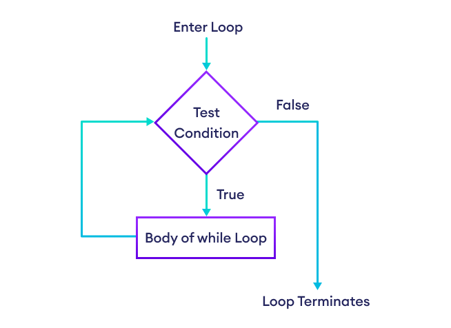
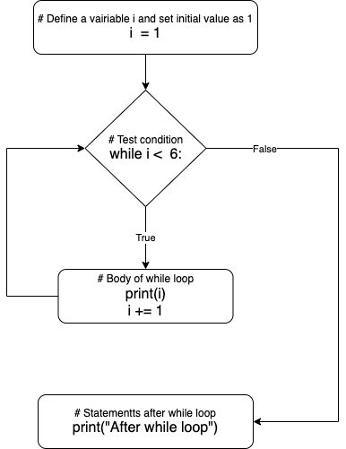
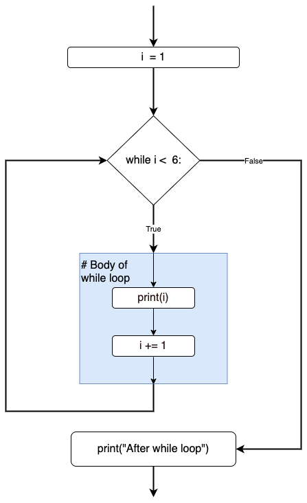

# while loop

### while loop execute a set of statements as long as a condition is true.

```py
while condition:
    # body of while loop
```

1. A while loop evaluates the condition
2. If the condition evaluates to True, the body(the code inside the while loop) is executed.
3. condition is evaluated again.
4. If the condition evaluates to True, the body(the code inside the while loop) is executed again.
5. This process continues until the condition is False.
6. When condition evaluates to False, the loop stops.

## Flowchart of while loop



## Example of while loop

```py
i = 1
while i < 6:
    print(i)
    i += 1
print("After while loop")
```

```py
# Create a variable to control the loop. Set the initial value as 1
i = 1
# Test the condition. if true, enter into while loop. if false, go the the statements after loop.
while i < 6:
    # Body of while loop
    print(i)
    # increase the variable i by 1
    i += 1
# Statement after while loop
print("After while loop")
```



## break

break can stop the loop if the while condition is true.

- Example: Exit the loop when i is 3

```py
i = 1
while i < 6:
    print(i)
    if i == 3:
        break
    i += 1
```


